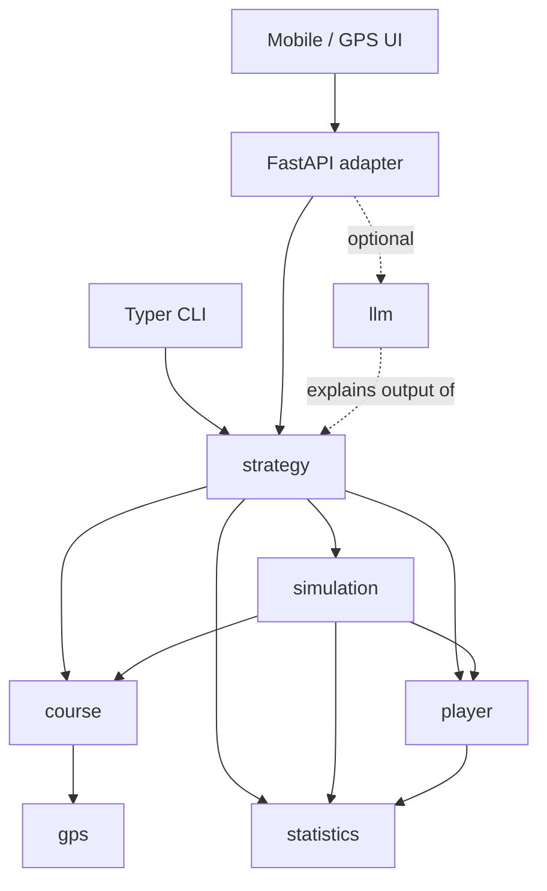

# Architecture

> Status: describes intended target architecture for the full roadmap.
> Implemented so far: `gps`/`course` (M2, complete — see
> [course-engine.md](course-engine.md)); `player`/`statistics` (M3 core
> primitives complete, plus M4's `PlayerShotDistribution`/`PopulationPrior`/
> personalisation pipeline, complete — see [player-model.md](player-model.md),
> [ADR 0006](adr/0006-player-shot-distribution-bivariate-student-t.md), and
> [ADR 0007](adr/0007-population-prior-replaceability.md)); and `simulation`
> (M4, complete for its forward shot-production scope — see
> [M4 forward shot-production pipeline](#m4-forward-shot-production-pipeline)
> below). Course-relative mapping, expected strokes/Strokes Gained, and
> risk/reward strategy selection remain future work (M5+, see the M5
> parent issue #11's prerequisite note). `llm`, `api`, and `cli` do not
> exist yet.

## Guiding principle

CaddAI is a **deterministic decision engine** with optional natural-language
explanation layered on top, never the reverse. See
[adr/0001-deterministic-strategy-engine.md](adr/0001-deterministic-strategy-engine.md).

CaddAI is also **offline-first for an active round**: network connectivity
is optional while a round is in progress. See
[Offline-first active round](#offline-first-active-round) below and
[adr/0005-offline-first-active-round-architecture.md](adr/0005-offline-first-active-round-architecture.md).

## System diagram (target end-state)



Dashed edges: `llm` only ever *reads* a finished recommendation to phrase it
in natural language. It is never on the decision path, and `strategy`/
`simulation` never import it.

This diagram shows the **module dependency graph**, not a deployment
topology. `UI --> API` and `CLI --> STRAT` must not be read as implying `api`
is necessarily a remote network service: for the active-round path, `api`
(or `cli`) may run co-located with, or embedded in, the device performing
the round — see [Offline-first active round](#offline-first-active-round).
Whether/where a network boundary exists in the deployed system is a roadmap
M10 (mobile MVP) decision, not something this diagram settles.

## Offline-first active round

CaddAI must remain usable for its core value proposition — a shot
recommendation — with no network connectivity during a round. This is
recorded in
[adr/0005-offline-first-active-round-architecture.md](adr/0005-offline-first-active-round-architecture.md)
and is a standing constraint, complementary to (not a replacement for) the
deterministic-strategy principle above: that ADR governs *who* decides;
this constraint governs *what network reachability may be assumed*.

**Active-round core functionality** (must remain capable of running with
only locally available device compute, storage, and data, with no network
request on the critical path):

1. Positioning/location acquisition.
2. Course geometry access.
3. Player profile access.
4. Distance calculations.
5. Shot simulation.
6. Strategy/recommendation.
7. Recording player decisions and shot outcomes.

**Connectivity-enhanced functionality** (may use the network and may
degrade gracefully offline, but must never be a prerequisite for the above):
course-data download/updates before a round, player-profile/round-history/
cross-device synchronisation, cloud analytics, account management, weather
refresh, model/software updates, optional cloud-based LLM enhancement, and
optional cloud-based player-model training. If a future LLM explanation
layer (M12) is unreachable, the system degrades to the structured
deterministic recommendation rather than withholding one.

No storage technology, mobile runtime, or infrastructure component is
selected by this constraint — those are future decisions, informed by the
production system architecture & runtime checkpoint (roadmap M6;
see [roadmap.md](roadmap.md)) that precedes committing to the full mobile
MVP (roadmap M10).

Recording a decision/outcome locally (item 7 above) is distinct from
*deriving* operational or recommendation-evaluation analytics from that
record (see [decision-journal.md](decision-journal.md)): the former is
active-round core functionality; the latter is connectivity-enhanced and
may live in a separate component entirely — this diagram does not assume
they share a service, repository, or storage technology.

## Subsystems

| Subsystem | Path | Responsibility |
|---|---|---|
| Course | `src/caddai/course/` | Hole/course geometry, hazards, GeoJSON representation |
| GPS | `src/caddai/gps/` | Coordinates, bearings, GPS distance calculations |
| Player | `src/caddai/player/` | Player and club domain models, tendencies |
| Statistics | `src/caddai/statistics/` | Carry distributions, dispersion, round statistics, the `ClubCategory` taxonomy, and the `PopulationPrior` contract/config |
| Strategy | `src/caddai/strategy/` | Shot candidates, club/target selection, risk, expected strokes, Strokes Gained |
| Simulation | `src/caddai/simulation/` | Deterministic wind/elevation/air-density environment transform of a forward-modelled shot outcome (M4.7); seeded bivariate Student-t intrinsic shot-outcome sampling composed with `player`'s shot distribution (M4.8); course-relative mapping, expected strokes/Strokes Gained, and risk/reward strategy are future work (M5+) |
| LLM | `src/caddai/llm/` | Natural-language explanation of a finished recommendation (M12+) |
| API | `src/caddai/api/` | FastAPI adapter; translates HTTP ↔ domain calls, no business logic |
| CLI | `src/caddai/cli/` | Typer adapter; translates CLI ↔ domain calls, no business logic |

Modules are created when their owning milestone is implemented, not
pre-scaffolded as empty placeholders (see `AGENTS.md` §3).

## M4 forward shot-production pipeline

M4 (`player`/`statistics`/`simulation`) implements a **forward
shot-production pipeline**: it produces a probabilistic shot outcome in
landing/carry-relative space, not a course-relative result.

```
population prior (handicap x club-category, ADR 0007)
        ↓
onboarding personalisation (reported carry, common miss, shot shape)
        ↓
immutable cold-start baseline PlayerShotDistribution (ADR 0006)
        ↓
complete eligible ShotRecord history
        ↓
batch partial-pooling update (recomputed from scratch every call, never incremental)
        ↓
current PlayerShotDistribution (derived; never persisted over the baseline)
        ↓
seeded bivariate Student-t sampling (sample_bivariate_student_t_shot_outcomes)
        ↓
intrinsic ShotOutcome
        ↓
optional deterministic environment transform (apply_environment_transform)
        ↓
environment-adjusted landing/carry-space ShotOutcome
```

`PlayerShotDistribution` (`caddai.statistics`) is authoritative for this
probabilistic pipeline. M3's `CarryDistribution`/`DirectionalDispersion`
remain authoritative, **by convention only, not code-enforced**, for
legacy deterministic `Club.expected_carry_metres`/`strategy.recommend_club()`
behaviour during the M3→M4 transition — the two representations are not
automatically synchronised, and no code keeps them in sync. Full semantics:
[player-model.md](player-model.md), [strategy-engine.md](strategy-engine.md),
[ADR 0006](adr/0006-player-shot-distribution-bivariate-student-t.md), and
[ADR 0007](adr/0007-population-prior-replaceability.md).

This forward pipeline is distinct from, and does not solve, the *inverse*
problem of inferring latent landing/carry from a final observed endpoint
(see [docs/backlog.md](backlog.md)'s carry-from-downrange-distance
estimator item) — that inference, if ever built, must remain separate from
this simulator.

**Not yet produced by M4:** final resting position, terrain/bounce/
rollout, fairway/rough/bunker/green/water/OB classification, resulting
golf state, expected strokes, Strokes Gained, candidate-shot strategy
value, or any other course-relative outcome — see the M5 parent issue
(#11)'s explicit prerequisite note and the M5 entry in
[roadmap.md](roadmap.md).

## Dependency direction

- Adapters (`api`, `cli`, `llm`) depend inward on domain/decision layers.
  Domain/decision layers never depend on adapters.
- `strategy` and `simulation` depend only on `course`, `player`, `statistics`,
  and shared domain types — **never** on `llm`, `api`, `cli`, or UI code,
  directly or transitively. This is enforced by convention and by
  architecture-invariant tests (see
  `.github/instructions/tests.instructions.md`).
- `course`/`gps` and `player`/`statistics` are siblings: neither depends on
  the other. Shared concepts (e.g. a point-in-space type used by both) live
  in a neutral shared-domain module, not duplicated or cross-imported.

## Future hardware/sensor adapters

Roadmap M14 (see [roadmap.md](roadmap.md)) explores dedicated CaddAI
hardware and on-device sensing (camera-based lie assessment, GNSS, IMU,
compass, barometer, other environmental sensors, microphone/voice) as
research only, not committed scope, and not before roadmap M11 validates
the mobile MVP in real rounds. Architecturally, any such
hardware/sensor input system is just another adapter, subject to the same
rule as `api`/`cli`/`llm`: it must produce canonical domain inputs already
defined in [domain-model.md](domain-model.md) — e.g. camera/manual input ->
`Lie`, GNSS -> `Position`, barometer/course data -> elevation,
weather/manual/sensor -> `Wind` — and must never itself contain golf
strategy logic. `strategy`/`simulation` remain the sole source of golf
decisions ([ADR 0001](adr/0001-deterministic-strategy-engine.md)). A
concrete hardware/sensor adapter design (real module boundaries, not
research) is the trigger for a future ADR, or an amendment to ADR 0001
naming this adapter category explicitly, per `AGENTS.md` §13.

## Synthetic validation harness (future)

Roadmap M9 (see [roadmap.md](roadmap.md)) records a future requirement for
an offline synthetic round/scenario validation harness that exercises
`strategy`/`simulation` at scale before broad mobile/field testing. This
harness is not a subsystem and not a new decision path: it is a test-time
*caller* of `strategy`/`simulation`'s existing public interface, in the same
dependency-direction position as `api`/`cli` — it depends inward on
`strategy`/`simulation`, never the reverse, and `strategy`/`simulation` must
never import or become aware of it. Whatever "stable contract" the harness
ultimately calls through (today's Python module surface, a later formal
interface, or a post-Rust-migration binding/CLI boundary) is not decided
here. The harness must invoke the real production engine and must never
duplicate or reimplement `strategy`/`simulation` decision logic — this is
[ADR 0001](adr/0001-deterministic-strategy-engine.md)'s testability
rationale applied at scale, not a change to it. It is also distinct from the
operational-monitoring/recommendation-evaluation architecture described in
[decision-journal.md](decision-journal.md#monitoring-vs-evaluation): the
harness is a controlled, reproducible, high-volume, synthetic-data
capability, while monitoring/evaluation concerns real golfers, real
execution, and real conditions — synthetic run data must not flow into
production telemetry by default. No repository/component ownership,
interface technology, or CI placement is decided by this section.

## Module ownership

See `AGENTS.md` §4 and the [development-workflow.md](development-workflow.md)
for how ownership maps to the agent team.

## API contracts

Not yet defined — no `api`/`cli` module exists. When first introduced, the
contract will be documented here and any breaking change to it afterward
requires an ADR (see `AGENTS.md` §13).

## Units

SI internally; canonical distance is metres. See `AGENTS.md` §5.

## Architectural decisions

Recorded under [adr/](adr/). Start with
[0001-deterministic-strategy-engine.md](adr/0001-deterministic-strategy-engine.md).
