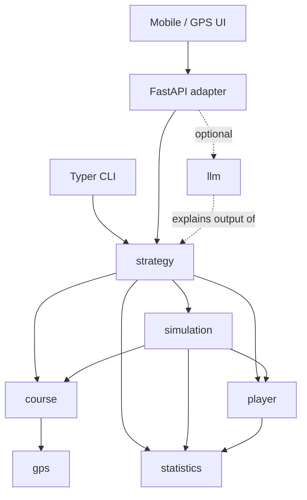

# Architecture

> Status: describes intended architecture for the roadmap. Only the
> bootstrap package (`src/caddai/__init__.py`) currently exists — no
> subsystem below is implemented yet. See [roadmap.md](roadmap.md).

## Guiding principle

CaddAI is a **deterministic decision engine** with optional natural-language
explanation layered on top, never the reverse. See
[adr/0001-deterministic-strategy-engine.md](adr/0001-deterministic-strategy-engine.md).

## System diagram (target end-state)

Dashed edges: `llm` only ever *reads* a finished recommendation to phrase it
in natural language. It is never on the decision path, and `strategy`/
`simulation` never import it.

## Subsystems (planned)

| Subsystem | Path | Responsibility |
|---|---|---|
| Course | `src/caddai/course/` | Hole/course geometry, hazards, GeoJSON representation |
| GPS | `src/caddai/gps/` | Coordinates, bearings, GPS distance calculations |
| Player | `src/caddai/player/` | Player and club domain models, tendencies |
| Statistics | `src/caddai/statistics/` | Carry distributions, dispersion, round statistics |
| Strategy | `src/caddai/strategy/` | Shot candidates, club/target selection, risk, expected strokes |
| Simulation | `src/caddai/simulation/` | Monte Carlo shot-outcome simulation |
| LLM | `src/caddai/llm/` | Natural-language explanation of a finished recommendation (M8+) |
| API | `src/caddai/api/` | FastAPI adapter; translates HTTP ↔ domain calls, no business logic |
| CLI | `src/caddai/cli/` | Typer adapter; translates CLI ↔ domain calls, no business logic |

Modules are created when their owning milestone is implemented, not
pre-scaffolded as empty placeholders (see `AGENTS.md` §3).

## Dependency direction

- Adapters (`api`, `cli`, `llm`) depend inward on domain/decision layers.
  Domain/decision layers never depend on adapters.
- `strategy` and `simulation` depend only on `course`, `player`, `statistics`,
  and shared domain types — **never** on `llm`, `api`, `cli`, or UI code,
  directly or transitively. This is enforced by convention and by
  architecture-invariant tests (see
  `.github/instructions/tests.instructions.md`).
- `course`/`gps` and `player`/`statistics` are siblings: neither depends on
  the other. Shared concepts (e.g. a point-in-space type used by both) live
  in a neutral shared-domain module, not duplicated or cross-imported.

## Module ownership

See `AGENTS.md` §4 and the [development-workflow.md](development-workflow.md)
for how ownership maps to the agent team.

## API contracts

Not yet defined — no `api`/`cli` module exists. When first introduced, the
contract will be documented here and any breaking change to it afterward
requires an ADR (see `AGENTS.md` §13).

## Units

SI internally; canonical distance is metres. See `AGENTS.md` §5.

## Architectural decisions

Recorded under [adr/](adr/). Start with
[0001-deterministic-strategy-engine.md](adr/0001-deterministic-strategy-engine.md).
