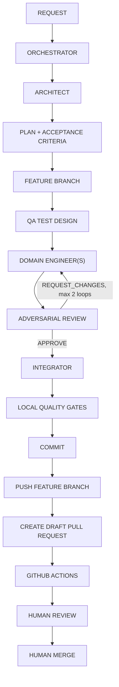

# Development workflow

CaddAI is developed by a coordinated team of VS Code custom agents defined in
[.github/agents/](../.github/agents). Every feature or milestone flows
through this pipeline:



## Steps

1. **REQUEST** — a human describes a milestone or feature to the
   **CaddAI Orchestrator**.
2. **ORCHESTRATOR** — reads `AGENTS.md` and relevant `docs/`, understands the
   request, and identifies whether it needs architectural input.
3. **ARCHITECT** — the read-only **CaddAI Architect** subagent evaluates
   design implications: boundaries, dependency direction, whether an ADR is
   needed.
4. **PLAN + ACCEPTANCE CRITERIA** — the Orchestrator breaks the work into
   small tasks with explicit acceptance criteria and saves the plan under
   `docs/plans/<feature>.plan.md`.
5. **FEATURE BRANCH** — the Orchestrator creates a feature branch from
   `main` (see [Branch naming](#branch-naming)) before any implementation
   work begins.
6. **QA TEST DESIGN** — the **QA Engineer** subagent derives tests from the
   acceptance criteria (including edge cases, invalid input, deterministic
   seeds where relevant).
7. **DOMAIN ENGINEER(S)** — the owning engineer(s) (**Course Engineer**,
   **Player Engineer**, or **Strategy Engineer**) implement the task against
   their owned subsystem, on the feature branch. Independent, non-overlapping
   tasks may run in parallel.
8. **ADVERSARIAL REVIEW** — the read-only **Adversarial Reviewer** subagent
   checks correctness, architecture rules, dependency boundaries, test
   quality, units, and domain assumptions, returning `APPROVE` or
   `REQUEST_CHANGES` with specific, severity-rated evidence.
9. **FIX LOOP IF REQUIRED** — on `REQUEST_CHANGES`, the Orchestrator routes
   specific feedback back to the domain engineer, who updates the same
   feature branch. This implement/review loop repeats **at most twice**; if
   unresolved after that, the Orchestrator escalates to the human instead of
   continuing.
10. **INTEGRATOR** — once approved, the **Integrator** subagent runs the full
    quality gate (`.github/skills/quality-gates/SKILL.md`), checks
    documentation and dependency-boundary consistency, and updates
    `CHANGELOG.md`.
11. **LOCAL QUALITY GATES** — all four gates (`ruff format --check`,
    `ruff check`, `mypy src`, `pytest`) must pass locally before anything is
    committed. A failing gate blocks the remaining steps.
12. **COMMIT** — the Integrator stages the changes and creates one or more
    Conventional Commits (see [Commit convention](#commit-convention)).
13. **PUSH FEATURE BRANCH** — the Integrator pushes the feature branch to
    `origin`. Direct pushes to `main` are never permitted.
14. **CREATE DRAFT PULL REQUEST** — the Integrator opens a **draft** GitHub
    pull request via the GitHub CLI (see
    [Pull request creation](#pull-request-creation)). It is never marked
    ready for review automatically.
15. **GITHUB ACTIONS** — the GitHub Actions workflow
    (`.github/workflows/ci.yml`) runs the same quality gate on the pull
    request. Agents let CI run to completion and never bypass a failing
    check.
16. **HUMAN REVIEW** — a human reviews the diff, plan, and draft pull
    request, and decides when to mark it ready for review.
17. **HUMAN MERGE** — only the human merges a pull request. No agent may
    merge, enable auto-merge, or otherwise bypass this step.

## Git and pull request policy

Only the **CaddAI Orchestrator** and **Integrator** perform Git/GitHub
operations, and only the operations listed below. Full detail:
`AGENTS.md` §15.

**Permitted:** create a feature branch from `main`; stage files; create
Conventional Commits; push the feature branch to `origin`; create a GitHub
**draft** pull request via the GitHub CLI; update the same feature branch in
response to QA/reviewer feedback and push subsequent commits; inspect
GitHub Actions status; report the pull request URL.

**Prohibited (all agents):** pushing directly to `main`; merging a pull
request; enabling auto-merge; force pushing; deleting remote branches;
rewriting published history; changing GitHub repository settings or branch
protection/rulesets; modifying credentials; exposing secrets; `git reset
--hard` against shared/published work; bypassing failing CI. Only a human
merges.

### Branch naming

`agent/<milestone>-<short-description>`, for example:

- `agent/m1-deterministic-vertical-slice`
- `agent/m2-course-geometry`
- `agent/m3-player-dispersion`

### Commit convention

[Conventional Commits](https://www.conventionalcommits.org/), for example:

- `feat(strategy): add deterministic club selection`
- `test(strategy): add wind adjustment edge cases`
- `docs(architecture): document shot state model`

### Pull request creation

Created via the GitHub CLI as a **draft**:

```bash
gh pr create \
  --base main \
  --head <feature-branch> \
  --draft \
  --title "<title>" \
  --body-file <generated-pr-description-file>
```

The generated PR description must include these sections: `## Summary`,
`## Changes`, `## Architecture`, `## Testing`, `## Quality Gates`,
`## Known Limitations`, `## Reviewer Notes`, `## Follow-up Work`. The PR is
never marked ready for review automatically — the human decides when to
promote it out of draft and when to merge.

### Reporting

After creating or updating a pull request, report: the branch name, the
commits made, the PR number, the PR URL, and CI status if available.

## Escalation

At any step, if the work requires a decision listed in `AGENTS.md` §14
(new dependency, public API change, unit change, ownership change,
dependency-direction change, cloud/paid/LLM service, secrets, destructive
Git operations, infra/database choice, privacy implications, an undefined
golf-strategy assumption, conflicting requirements, a change to the
deterministic-strategy principle, or architecture that would make
active-round core functionality depend on a network request), the
Orchestrator stops and outputs `NEEDS_DECISION` with Context, Options,
Recommendation, and Consequences, instead of guessing.

## Parallelism rules

- Only write-capable agents with non-overlapping ownership areas may run in
  parallel (e.g. Course Engineer and Player Engineer on independent tasks).
- Read-only Architect and Reviewer activities may run independently of
  write-capable agents.
- Two agents must never modify the same subsystem simultaneously.
- Nested subagent recursion is not enabled — subagents do not spawn further
  subagents.
- Git/GitHub operations (branch creation, commits, pushes, draft PR
  creation) are never parallelized — only the Orchestrator or Integrator
  performs them, one operation at a time, on the single feature branch for
  the change in progress.
