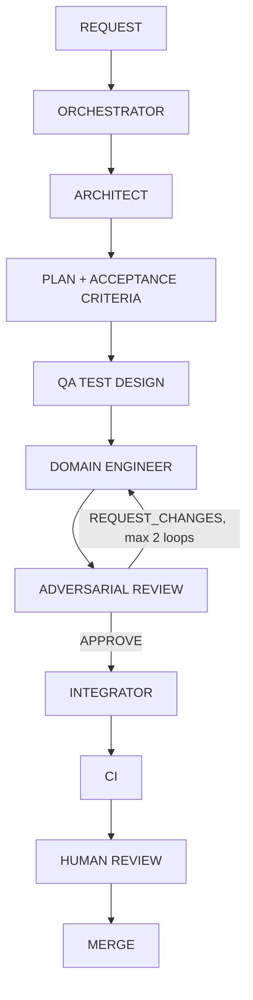

# Development workflow

CaddAI is developed by a coordinated team of VS Code custom agents defined in
[.github/agents/](../.github/agents). Every feature or milestone flows
through this pipeline:

## Steps

1. **REQUEST** — a human describes a milestone or feature to the
   **CaddAI Orchestrator**.
2. **ORCHESTRATOR** — reads `AGENTS.md` and relevant `docs/`, understands the
   request, and identifies whether it needs architectural input.
3. **ARCHITECT** — the read-only **CaddAI Architect** subagent evaluates
   design implications: boundaries, dependency direction, whether an ADR is
   needed.
4. **PLAN + ACCEPTANCE CRITERIA** — the Orchestrator breaks the work into
   small tasks with explicit acceptance criteria and saves the plan under
   `docs/plans/<feature>.plan.md`.
5. **QA TEST DESIGN** — the **QA Engineer** subagent derives tests from the
   acceptance criteria (including edge cases, invalid input, deterministic
   seeds where relevant).
6. **DOMAIN ENGINEER** — the owning engineer (**Course Engineer**,
   **Player Engineer**, or **Strategy Engineer**) implements the task
   against its owned subsystem. Independent, non-overlapping tasks may run
   in parallel.
7. **ADVERSARIAL REVIEW** — the read-only **Adversarial Reviewer** subagent
   checks correctness, architecture rules, dependency boundaries, test
   quality, units, and domain assumptions, returning `APPROVE` or
   `REQUEST_CHANGES` with specific, severity-rated evidence.
8. **FIX LOOP IF REQUIRED** — on `REQUEST_CHANGES`, the Orchestrator routes
   specific feedback back to the domain engineer. This implement/review loop
   repeats **at most twice**; if unresolved after that, the Orchestrator
   escalates to the human instead of continuing.
9. **INTEGRATOR** — once approved, the **Integrator** subagent runs the full
   quality gate (`.github/skills/quality-gates/SKILL.md`), checks
   documentation and dependency-boundary consistency, and updates
   `CHANGELOG.md`.
10. **CI** — the GitHub Actions workflow (`.github/workflows/ci.yml`)
    re-runs the same quality gate on the pull request and on pushes to
    `main`.
11. **HUMAN REVIEW** — a human reviews the diff, plan, and reports on the
    GitHub pull request before merge. The Orchestrator never merges, pushes,
    or opens/approves pull requests on its own.
12. **MERGE** — performed by the human via the GitHub pull request.

## Escalation

At any step, if the work requires a decision listed in `AGENTS.md` §14
(new dependency, public API change, unit change, ownership change,
dependency-direction change, cloud/paid/LLM service, secrets, destructive
Git operations, infra/database choice, privacy implications, an undefined
golf-strategy assumption, conflicting requirements, or a change to the
deterministic-strategy principle), the Orchestrator stops and outputs
`NEEDS_DECISION` with Context, Options, Recommendation, and Consequences,
instead of guessing.

## Parallelism rules

- Only write-capable agents with non-overlapping ownership areas may run in
  parallel (e.g. Course Engineer and Player Engineer on independent tasks).
- Read-only Architect and Reviewer activities may run independently of
  write-capable agents.
- Two agents must never modify the same subsystem simultaneously.
- Nested subagent recursion is not enabled — subagents do not spawn further
  subagents.
