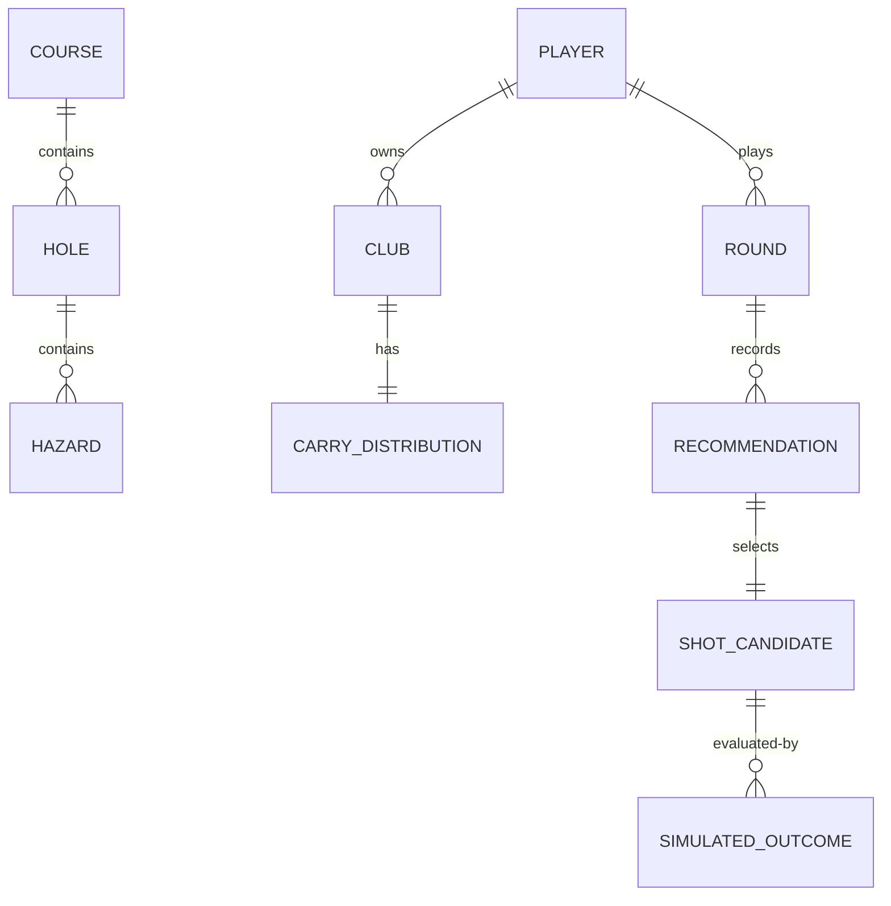

# Domain model

> Status: describes the planned core domain vocabulary for the roadmap
> (starting at M1). `course`, `gps`, `player`, and `statistics` now have
> concrete implemented types (see [course-engine.md](course-engine.md) and
> [player-model.md](player-model.md) for details); `strategy`/`simulation`
> domain types beyond the M1 vertical slice remain planned.

This document defines the shared vocabulary used across `course`, `gps`,
`player`, `statistics`, `strategy`, and `simulation`. Concrete types will be
introduced incrementally as milestones require — this is a conceptual
reference, not an API listing.

## Core concepts

- **Course** — a golf course, composed of holes.
- **Hole** — a single hole: tee(s), fairway, green, hazards, par.
- **Hazard** — bunker, water, out-of-bounds, or other penalising feature,
  represented as geometry with a type.
- **Position** — a location, either in course-local planar coordinates
  (metres) or geographic coordinates (latitude/longitude), depending on
  subsystem. Conversion between the two is a `gps`/`course` responsibility.
- **Lie** — the condition a ball rests in (tee, fairway, rough, bunker,
  green, hazard recovery) and any resulting constraints on the next shot.
- **Player** — a golfer with clubs, a skill profile, and (eventually)
  performance history.
- **Club** — a piece of equipment with an associated carry distribution.
- **Carry distribution** — statistical description of how far and how
  accurately (directionally) a player's shot with a given club travels.
  Distance in metres; directional dispersion in metres or degrees as
  appropriate to the model.
- **Shot candidate** — a proposed combination of club and target considered
  by the strategy engine before selection.
- **Simulated outcome** — a sampled result of playing a shot candidate under
  the dispersion model, used to estimate expected strokes.
- **Recommendation** — the deterministic engine's structured output: target,
  club, intended shot shape, risk assessment, and the rationale that
  produced it. This is the artifact an `llm` explanation layer (M8+) may
  describe in natural language, never generate independently.
- **Round** — a sequence of holes played by a player, eventually recording
  recommendations and outcomes (see [decision-journal.md](decision-journal.md)).

## Units

All distances are in **metres** internally. All directional/bearing values
are documented explicitly (degrees vs. radians) at the point of definition.
See `AGENTS.md` §5.

## Relationships (conceptual)

Concrete field-level schemas will be added to this document (or split into
per-subsystem docs) as each milestone implements them — see
[course-engine.md](course-engine.md), [player-model.md](player-model.md), and
[strategy-engine.md](strategy-engine.md).
