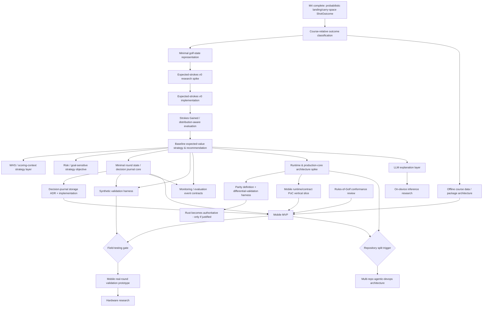

# Post-M4 roadmap reassessment (analysis/proposal, documentation-only)

## Status

**Proposal for human review. Nothing in this document is adopted.** This
task deliberately does **not**: implement production code, create detailed
implementation issues, rewrite `docs/roadmap.md`/`docs/backlog.md`, or
mutate the existing M5–M9 GitHub issue tree. It produces the capability/
dependency/decision analysis and a proposed M5+ roadmap structure for the
human to accept, reject, or amend. A follow-up task updates the durable
roadmap/issues only after explicit approval.

Reviewed by the **CaddAI Architect** subagent (read-only) during drafting;
its findings are folded in throughout, with one open disagreement flagged
explicitly in [§8](#8-needs_decision-items) and [§6](#6-current-roadmap-critique).
See "Human review and decisions" immediately below for how the human
resolved that disagreement and the other open questions this analysis
raised.

---

## Human review and decisions

> **Human review completed 2026-09-01.** The decisions below resolve the
> two `NEEDS_DECISION` items in [§8](#8-needs_decision-items), the
> `GolfState`-ownership suggestion in [§4](#4-course-relative-outcome-model-terrainrollout--assessment),
> the status of the workstream labels in
> [§7](#7-proposed-m5-roadmap-structure-proposal-only), the runtime
> sequencing principle touched on in §5/§9, and the recommended immediate
> next action in [§14](#14-recommended-immediate-next-action-exactly-one).
> They are recorded here as decisions; the original reasoning is left
> intact in each referenced section, with a pointer back to this list, so
> it stays clear *why* each option existed. **This document remains a
> roadmap-analysis artifact, not accepted detailed architecture** —
> `docs/roadmap.md`, `docs/backlog.md`, and the GitHub issue tree remain
> unmodified pending the follow-up roadmap/issue migration task these
> decisions authorise (§14). Research recommendations such as Protobuf,
> Rust, a C ABI, PyO3, `caddai-product`, and Copilot CLI orchestration
> remain hypotheses requiring their own future decisions — nothing below
> adopts any of them.

1. **WHS / scoring-context ([§8](#8-needs_decision-items) item 1): Option 3
   accepted.** Tee-specific WHS-relevant *data* requirements (tee identity,
   par, Course Rating, Slope Rating, Stroke Index) are preserved early and
   should be considered during M5/course-package architecture where
   relevant. WHS *scoring policy*/strategic-objective logic — Course
   Handicap/Playing Handicap arithmetic, gross/net strategic context,
   handicap-aware target-score logic, goal-sensitive "protect my handicap"
   policy — is deferred until after the baseline expected-value/
   Strokes-Gained recommendation path exists. The physical model / value
   model / strategic objective separation is preserved; WHS must not alter
   intrinsic shot physics.
2. **Expected strokes ([§8](#8-needs_decision-items) item 2): Option 1
   accepted**, with one addition: the research spike and its
   implementation are **not** one automatically continuous sub-milestone.
   A human/model decision gate sits between them — research spike → gate →
   implementation — because the research outcome may materially change
   the eventual V1 implementation approach.
3. **`GolfState` ownership.** This document's suggestion in §4 that the
   canonical golf-state/course-relative state belongs in `caddai.simulation`
   is **not adopted**. It is recorded as an unresolved architecture-design
   question for the first M5 design work: `GolfState` will potentially be
   consumed by course-relative mapping, expected strokes, strategy, the
   round model, synthetic validation, the decision journal, and scoring, so
   its canonical ownership and dependency direction must be deliberately
   resolved rather than defaulted to the first plausible-sounding module.
   No new module or ADR is created by this decision. If the first M5
   design work concludes a new foundational module or a new dependency
   direction (e.g. `simulation -> course`) is needed, the Architect must
   explicitly assess whether an ADR is required at that time.
4. **Milestone labels ([§7](#7-proposed-m5-roadmap-structure-proposal-only)).**
   M5.1–M5.4, MR, MC, MV, MO, MRULES, M7a, and M7b are confirmed to be
   **analysis/workstream identifiers only**, not accepted final milestone
   numbering. The follow-up roadmap task must translate the approved
   dependency analysis into a clean, coherent integer milestone structure
   rather than mechanically copying these labels.
5. **Runtime timing.** The following sequencing principle is approved:
   first, implement enough M5 domain/value semantics to establish a
   meaningful reference implementation; then perform the production-
   runtime/Rust-mobile architecture decision; before undertaking
   substantial round/mobile/product implementation that would otherwise
   create immediate rewrite risk. This document does not perform that
   runtime decision — see the revised [§14](#14-recommended-immediate-next-action-exactly-one).
6. **Immediate next action.** Revised — see
   [§14](#14-recommended-immediate-next-action-exactly-one).

---

## 1. Sources reviewed

Repository (`main`, as of the post-M4.9 merge, commit `b10a5bd`):

- `AGENTS.md`, `.github/copilot-instructions.md`
- `docs/prfaq.md`, `docs/roadmap.md` (full), `docs/architecture.md`,
  `docs/backlog.md`, `docs/decision-journal.md`, `docs/player-model.md`,
  `docs/strategy-engine.md`
- `docs/research/m4-probabilistic-golfer-model.md` (via its extensive
  cross-references in `player-model.md`/`backlog.md`/ADR 0006/ADR 0007)
- `docs/research/agentic-development-multi-repo-devops.md` — the newly
  committed agentic-development/multi-repository/DevOps research report
  (exact path confirmed on current `main`; commit `b10a5bd`, "docs: add
  agentic development and multi-repo research")
- `docs/adr/0001-deterministic-strategy-engine.md`,
  `docs/adr/0005-offline-first-active-round-architecture.md`,
  `docs/adr/0006-player-shot-distribution-bivariate-student-t.md`,
  `docs/adr/0007-population-prior-replaceability.md`
- `docs/plans/m4-roadmap-redefinition.plan.md` (precedent for how M4.0 was
  introduced as a documentation-only reassessment)
- GitHub: milestones M1–M9 (`gh api .../milestones`); parent/tracking
  issues #10 (M4, closed), #11 (M5), #12 (M6), #13 (M7), #14 (M8), #15 (M9)
  — read in full via `gh issue view`. **No M5.5 GitHub milestone/issue
  exists** — M5.5 is currently roadmap-doc prose only.

Confirmed directly from issue #11: WHS/scoring-context planning text was
added to it as a deliberate addendum ("M5 planning must also explicitly
cover World Handicap System (WHS)-aware scoring context..."), consistent
with `docs/plans/cross-cutting-monitoring-evaluation-requirement.plan.md`'s
note that issue #11 is "mid-flight." This matters for §6 and §8 below.

---

## 2. Capability gap map

| Capability | Why needed | Dependencies | MVP blocking | Major uncertainty |
|---|---|---|---|---|
| **Course-relative outcome classification** (landing/final position → fairway/rough/bunker/green/water/OB/penalty) | M4 stops at a landing/carry-space `ShotOutcome`; nothing today interprets it against a course | `course` geometry (done, M2), M4 `ShotOutcome` (done) | Yes | How much geometry fidelity is actually available per fixture/course (green/bunker/water polygons exist per M2, but real course packages aren't built yet — §16) |
| **Minimal golf-state representation** (position, distance/geometry context, lie/surface, penalty context, hole/round context) | Expected strokes, Strokes Gained, round progression, and synthetic simulation all need one stable state shape to operate on | Course-relative classification | Yes | Scope creep risk — must stay minimal, not a full round model (see §12 of the request; §12/§14 in this doc) |
- **Expected-strokes model** | Core value function strategy needs to compare candidate outcomes | Golf state | Yes | **Judged the highest uncertainty in the roadmap, pending the M5.1 spike's own literature survey** — no proprietary strokes-gained reference data (ShotLink etc.) is assumed available, and public tour-level baselines are not expected to transfer cleanly to amateur/handicap golfers, but this document has not itself surveyed public amateur-strokes-gained research the way M4.0 surveyed dispersion data — that survey is the spike's first task, same evidence-gap discipline as M4.0 |
| **Strokes Gained / distribution-aware candidate evaluation** | M5's own text already requires this — candidates must carry a distribution, not a collapsed scalar | Expected-strokes model, golf state | Yes | Which summary statistics to standardise on (upside/downside/tail/penalty probability) — a design question, not a research unknown |
| **Terrain / bounce / rollout model** | Real shots are usually observed at final resting position, not true carry | Course-relative classification | Partial | Real physics vs. a simple deterministic offset — see §4 |
| **Risk/reward strategic objective (baseline EV first, richer utility later)** | A trustworthy V1 recommendation only needs "pick the best expected outcome," not full risk personalisation | Strokes Gained | Partial (baseline EV: yes; risk/goal-sensitive layering: no) | None significant — this is a design choice, not evidence-constrained |
| **WHS/scoring context** (Handicap Index, tee sets, Course Rating/Slope/Stroke Index, gross/net) | Needed for a *complete* long-term strategy objective, but not for a first trustworthy shot recommendation | Golf state, baseline strategy, canonical tee/course-rating data | **No** for a first recommendation; **partial** for the full product vision | Whether the human wants this pulled forward or kept per issue #11's existing addendum — flagged as [NEEDS_DECISION](#8-needs_decision-items) |
| **Round/decision model (full lifecycle)** | Full decision journal, round progression, gross/net context | Golf state, baseline strategy | Partial — a *minimal* per-shot golf state is MVP-blocking; full round persistence/lifecycle is not blocking for a mobile *proof-of-concept*, but is blocking for a real mobile *MVP* | Rework risk if built heavy in Python before a runtime decision (§7) |
| **Synthetic validation harness** | Bridges unit tests and real-golfer field testing; release gate before broad field testing | Strategy (M5) producing real recommendations against real-ish course geometry | Yes, before *broad field testing* (M7b/M10); no, before M5 domain coding | Needs strategy/round capability to exist first — can't start meaningfully today |
| **Monitoring / recommendation-evaluation architecture** | Distinguish operational health from "are recommendations good"; decision journal is the data source | Candidate-evaluation shape (M5), decision/outcome shape (M6) | Partial — a *minimal* local event-capture path is MVP-blocking; full analytics/calibration tooling is not | Event contract must not be designed before M5/M6 shapes exist in code (rework risk, §7) |
| **Rules-of-Golf conformance review** | Must not assume "wind disabled == competition legal"; informs casual vs. rules-conforming modes | None (policy review, not code) | Partial — informs product/mode decisions before mobile field testing, not before M5 domain coding | Low — this is a documentation/policy exercise, cheap to do early |
| **Offline course data / packages** | Current course model is fixture-based GeoJSON only; no manifest, versioning, ratings, licensing | `course` (done, M2) | Yes, for real (non-fixture) courses in mobile MVP and broad synthetic validation; no, for M5 domain coding (fixtures remain fine) | Commercial/legal data-source questions (deliberately out of scope here) |
| **Production runtime / possible Rust core** | Mobile packaging, performance, and battery constraints for on-device Python are unmeasured | Enough domain code to benchmark (M5+) | No — a runtime decision is not required to produce a trustworthy recommendation *in Python*; it becomes blocking for the actual mobile MVP | Whether Python-on-mobile is even viable before assuming Rust is required — nothing has been measured yet |
| **Mobile architecture (PoC vs. MVP)** | Distinguish a small runtime/mobile proof-of-concept from the actual mobile MVP | Runtime decision, course package, minimal round state | PoC: no; MVP: yes | Framework choice (Flutter or otherwise) is an explicit human escalation, not decided here |
| **Repository split** | Only relevant once a second language/runtime or a mobile app codebase exists | Runtime decision or mobile app start | No | None — premature today; avoid architecture by symmetry |
| **Multi-repo agentic-development architecture** | Research report's recommendations (Protobuf, PyO3, C ABI, Copilot CLI cross-repo orchestration, Agentic Workflows) | Repository split | No | Entirely hypothesis-stage; no second repo exists to justify any of it yet |

---

## 3. Dependency graph



This graph does **not** match the current milestone numbering 1:1 — that is
deliberate (Level 4 authority; the current sequence is a candidate plan,
not binding).

---

## 4. Course-relative outcome model, terrain/rollout — assessment

**Minimum V1 course-relative state:** fairway / rough / bunker / green /
water / OB / "other penalty area" / recovery(unknown-lie fallback), derived
from existing `course` polygon/boundary geometry (M2, ADR 0003/0004) plus a
landing point. This is enough for a V1 expected-strokes lookup keyed on
(lie category, distance-to-hole-ish measure). Full recovery-shot nuance,
buried-lie severity, and putting-green sub-states can remain coarse for V1.

**Terrain/bounce/rollout:** a real physics rollout model is **not required**
for a useful V1. Recommend a deliberately simple deterministic adjustment
(e.g. a fixed or lie/club-conditioned offset applied to the carry-space
landing point before course-relative classification), explicitly labelled
an approximation — not fake high-precision physics, consistent with the
request's own instruction. The existing `ShotOutcome`/`ShotRecord` contracts
already store a *final* position/lie concept (M4.4 reworked `ShotRecord`
around final-resting-position semantics for exactly this reason), so this
can be deferred/refined later without breaking the observation contract.

**Where it belongs:** classification logic that composes `course` geometry
with M4's `ShotOutcome` does not belong inside `course` itself — `course`
owns geometry only, never shot-outcome semantics (Architect-confirmed, no
ADR required for this narrower ownership call).

> **Superseded by human review (see "Human review and decisions" item 3):**
> this section originally went on to suggest the canonical `GolfState` type
> itself should live in `simulation`. **That suggestion is not adopted.**
> `GolfState`'s canonical owning module and dependency direction — it will
> potentially be consumed by course-relative mapping, expected strokes,
> strategy, the round model, synthetic validation, the decision journal,
> and scoring — is left as an explicit open question for the first M5
> design work, not defaulted to `simulation` here. The still-open backlog
> item to unify `strategy.Wind`/`LieType` with `simulation.WindComponents`/
> `EnvironmentInput` is related context for that future design work, not a
> resolution of it. No new module or ADR is created by this document; the
> first M5 design work, with Architect input, decides whether one is
> needed.

---

## 5. Expected strokes, Strokes Gained, risk/reward — assessment

- **Expected strokes** carries the single largest research uncertainty in
  the post-M4 roadmap — there is no accepted data source or formula
  anywhere in the docs today, and (per ADR 0007's pattern) no proprietary
  strokes-gained dataset is assumed available. This needs its own scoped
  research spike, structured like M4.0: what evidence exists, what's
  usable/licensable, what a defensible V1 approximation looks like, and
  what remains provisional pending CaddAI's own data. **Do not invent the
  implementation in this document** (per instruction) — only recommend the
  spike. **Confirmed by human review ("Human review and decisions" item
  2):** the spike and its implementation are not one automatically
  continuous sub-milestone — a human/model decision gate sits between
  them, since the spike's outcome may materially change the eventual V1
  implementation approach.
- **Strokes Gained** is correctly understood as *the* value framework, not
  one optional strategy among several — issue #11 and `strategy-engine.md`
  already state this clearly, and this document doesn't need to re-argue
  it. It sits directly after expected strokes and before the strategic
  objective layer in the dependency graph.
- **Risk/reward/strategic objective**: a baseline expected-value objective
  is sufficient and testable for a first trustworthy recommendation. Risk
  preference and goal-sensitive/score-sensitive strategy are real, captured
  requirements (Level 3) but are **separable** from the baseline — they can
  land in a later sub-milestone without blocking MVP credibility, provided
  the physical/value/objective separation issue #11 already mandates is
  preserved in the code from the start (so the later layer is additive, not
  a rewrite).

---

## 6. Current roadmap critique

**M5 — Expected-value / expected-strokes strategy model.** Still
conceptually correct (expected strokes + Strokes Gained as the common value
framework), but has organically absorbed at least four different
concerns with different dependency/uncertainty profiles: course-relative
outcome mapping (a domain-modelling task, low research uncertainty),
expected-strokes modelling (high research uncertainty, needs its own
spike), Strokes-Gained/distribution-aware evaluation (a design task),
baseline EV strategy (a design+implementation task), and WHS/scoring
context (a large, separable concern — see below). Recommend splitting into
an ordered sequence rather than one monolithic milestone.

> **Resolved by human review ("Human review and decisions" item 1):** issue
> #11 already contains a deliberate addendum (added recently, per
> `docs/plans/cross-cutting-monitoring-evaluation-requirement.plan.md`'s
> note that the issue is "mid-flight") stating M5 planning "must jointly
> resolve, rather than design as unrelated features," course-relative
> mapping *and* WHS/scoring context together. This document originally
> recommended pulling WHS out wholesale into a later, separate milestone —
> a genuine scope reversal of recently-landed planning text, so it was
> raised as [§8](#8-needs_decision-items)'s `NEEDS_DECISION` rather than
> silently adopted. The human has since accepted Option 3: WHS *data-shape*
> requirements stay with M5/course-package work now; WHS *scoring-policy*
> logic is deferred to a later milestone. The follow-up roadmap task must
> reflect this hybrid outcome, not the original wholesale-deferral framing.

**M5.5 — Runtime & Offline Architecture (research spike).** Has clearly
outgrown ".5" status. Its current prose bundles: runtime/Rust
investigation, mobile/core boundary, repository architecture, course
packages, monitoring/evaluation architecture, Rules-of-Golf conformance,
synthetic validation, cross-language parity/contracts, DevOps/release
strategy, and multi-repo agentic development. These are independently
schedulable work streams with materially different dependencies (e.g. the
Rules-of-Golf review has zero dependency on the Rust runtime question) and
forcing them into one spike risks an unfocused milestone that never
closes. **Answer to the explicit question: yes, M5.5 has outgrown being a
".5" milestone** — recommend splitting it (see §7). No ADR is required to
make this split as a roadmap-documentation change (no new dependency,
public API, unit, ownership, dependency-direction, or principle change) —
consistent with the no-ADR precedent set by the M4.0 roadmap redefinition.

**M6 — Round tracking and decision journal.** Still correctly placed after
strategy, but its scope should narrow once a *minimal* golf-state type
moves earlier (into the M5 sequence, since strategy cannot function at all
without it). M6 then focuses on what's genuinely M6-shaped: full round
lifecycle, the decision-journal record, and the storage-technology ADR
(already correctly flagged as an escalation trigger).

**M7 — GPS/mobile application integration.** Correctly sequenced after
M5/M6 and gated by the synthetic-validation checkpoint, but conflates a
small runtime/mobile *proof-of-concept* (proving the chosen runtime
approach actually works end-to-end on a device) with the actual mobile
*MVP* (full round lifecycle, offline course packages, local event capture,
GPS, UI). Recommend splitting into a PoC phase and an MVP phase with
different entry gates.

**M8 — LLM caddie communication layer.** Still correct — deliberately last
among functional milestones, consistent with ADR 0001. No change
recommended.

**M9 — On-device inference research.** Still correct, still exploratory,
still not committed scope. No change recommended (could conceivably fold
into the runtime spike as a subtopic later, but low priority to change).

---

## 7. Proposed M5+ roadmap structure (proposal only)

Numbering below is illustrative, not a commitment — any coherent numbering
is the human's call. **Confirmed by human review ("Human review and
decisions" item 4):** every label in this table (M5.1–M5.4, MR, MC, MV, MO,
MRULES, M7a, M7b) is an **analysis/workstream identifier only**, not
accepted final milestone numbering — the follow-up roadmap task must
translate this dependency analysis into a clean, coherent integer
milestone structure rather than mechanically copying these labels.

| # | Name | Category | Objective | MVP blocking | Production code? | Repo restructuring? |
|---|---|---|---|---|---|---|
| M5 | Course-relative golf state & outcome mapping | DOMAIN | Classify a simulated outcome against course geometry into a minimal, stable golf state | Yes | Yes | No |
| M5.1 | Expected-strokes v0 — research spike, **human/model decision gate**, then implementation | DOMAIN | Resolve a defensible V1 expected-strokes approach via a scoped evidence spike; per human review, implementation does not start automatically — the spike's outcome must pass a decision gate before implementing behind a stable interface (ADR 0007-style replaceability) | Yes | Yes (post-spike, post-gate) | No |
| M5.2 | Strokes Gained & distribution-aware candidate evaluation | DOMAIN | Turn expected-strokes deltas into a preserved outcome-value distribution per candidate | Yes | Yes | No |
| M5.3 | Baseline expected-value strategy & recommendation assembly | DOMAIN | Produce the first structured, trustworthy `strategy` recommendation | Yes | Yes | No |
| M5.4 | WHS/scoring-context & risk/goal-sensitive strategy layer | DOMAIN / PRODUCT | Layer handicap/scoring context and risk preference on top of M5.3 without touching physical shot modelling | **No** (deferred — see §8) | Yes | No |
| M6 | Round tracking & decision journal | PRODUCT / ROUND | Minimal round lifecycle + immutable decision-time record; storage ADR | Partial (minimal capture: yes; full analytics: no) | Yes | No |
| MR | Runtime & production-core architecture (spike) | ARCHITECTURE | Determine whether/when a non-Python production core is justified; define parity tiers. Per the approved runtime-timing sequencing (human review item 5), this follows enough M5 domain/value semantics to benchmark and precedes substantial round/mobile/product implementation | No (spike itself); informs MVP blocking work | Spike/PoC code only, isolated | Only if it concludes a split is needed |
| MC | Offline course data & package architecture | ARCHITECTURE / PLATFORM | Manifest/versioning/format for real offline course packages | Yes, for real courses | Yes | No |
| MV | Synthetic validation harness | VALIDATION | Repeatable, deterministic large-scale scenario validation of the real `strategy`/`simulation` engine | Yes, before broad field testing | Yes (test-time harness) | No |
| MO | Monitoring & recommendation-evaluation architecture | VALIDATION / PLATFORM | Event contracts distinguishing operational health from recommendation quality | Partial (minimal local capture: yes) | Yes | No |
| MRULES | Rules-of-Golf conformance review | VALIDATION / PRODUCT | Determine casual vs. rules-conforming mode boundaries | Partial (informs product mode, not code architecture) | No (review only) | No |
| M7a | Mobile runtime/contract vertical-slice PoC | MOBILE / ARCHITECTURE | Prove the MR-chosen runtime approach end-to-end on a device with a trivial recommendation request | No | Yes (throwaway/PoC-grade) | Possibly (a mobile PoC checkout) |
| M7b | Mobile MVP | MOBILE | Full offline round: GPS, course package, local engine, recommendation, decision recording | Yes | Yes | Likely (mobile app codebase) |
| M8 | LLM caddie communication layer | AI/LLM | Natural-language explanation of a finished recommendation | No | Yes | No |
| M9 | On-device inference research | AI/LLM | Explore on-device feasibility for M8 | No | No (research) | No |
| M10 | Mobile real-round validation prototype | MOBILE / VALIDATION | Prove the experience on real rounds, gated by MV passing | Post-MVP validation | Yes | No |
| M11 | Hardware / on-device intelligence research | HARDWARE | Explore dedicated hardware, gated by M10 findings | No | No (research) | No |

Deliberately **not scheduled as a milestone**: repository restructuring and
the multi-repo agentic-development architecture from
`docs/research/agentic-development-multi-repo-devops.md`. That report's
*principles* (GitHub Issues/sub-issues/dependencies as durable work state;
a thin orchestrator; deterministic CI; human merge authority) already
describe how this repository's agent team operates today and need no
adoption decision. Its *technology* recommendations (a `caddai-product`
split, Protobuf/Buf, a C ABI, PyO3, Copilot CLI cross-repo orchestration,
GitHub Agentic Workflows) remain unvalidated hypotheses with no second
repository to justify them yet — revisit only when MR or M7b actually
produces a second language/runtime or a mobile app codebase.

---

## 8. NEEDS_DECISION items

> **Resolved by human review 2026-09-01** — see "Human review and
> decisions" items 1 and 2 above. The original `NEEDS_DECISION` text is
> preserved below verbatim so the context/options/consequences reasoning
> remains visible; each block is annotated with its resolution rather than
> rewritten.

```
NEEDS_DECISION [RESOLVED — Option 3 accepted, see "Human review and
decisions" item 1]

Context
Issue #11 (M5 parent) already contains a deliberate addendum stating that
M5 planning "must jointly resolve, rather than design as unrelated
features," course-relative outcome mapping and WHS/scoring context
(Handicap Index, tee sets, Course Rating/Slope/Stroke Index, gross/net
scoring) together. This reassessment's proposed sequence (§7, M5–M5.3)
instead treats WHS/scoring context as a separable, deferrable concern
(M5.4), on the grounds that a first trustworthy recommendation does not
require it and that bundling it in delays the highest-value, most tightly
coupled work (course-relative state -> expected strokes -> Strokes Gained
-> baseline recommendation).

Options
1. Keep WHS/scoring context inside the core M5 sequence as issue #11
   currently specifies, accepting a larger, slower-to-close M5.
2. Approve deferring WHS/scoring context to a later sub-milestone (M5.4),
   re-scoping issue #11 accordingly via a reviewed, documentation-only
   change (same process used for the M4.0 redefinition).
3. Some hybrid: keep the WHS *data-shape* requirement (tee-specific Course
   Rating/Slope/Stroke Index as course data) inside M5/MC's scope now, but
   defer the *scoring-policy* logic (Course/Playing Handicap arithmetic,
   net-scoring strategy objective) to M5.4.

Recommendation
Option 3. It keeps course-data requirements (which the offline course
package work needs anyway) moving in step with M5, while deferring the
higher-uncertainty, more separable handicap-arithmetic and net-scoring
strategy logic until after a baseline expected-value recommendation is
proven — preserving the physical/value/objective separation issue #11
already requires, without slowing the critical path.

Consequences
If accepted, issue #11's scope note needs a reviewed rewrite (not a silent
edit) before M5 implementation planning begins, mirroring the M4.0
precedent. If rejected, the proposed M5 sequence's milestone boundaries in
§7 need to fold WHS/scoring-context planning back into M5.3 rather than
M5.4.
```

```
NEEDS_DECISION [RESOLVED — Option 1 accepted, see "Human review and
decisions" item 2]

Context
No expected-strokes data source, model, or formula is defined anywhere in
CaddAI's documentation today. This is the highest-uncertainty item in the
capability gap map (§2) and is structurally identical to the evidence-gap
problem the M4.0 spike solved for the population-prior model.

Options
1. Run a scoped M5.1 research spike (mirroring M4.0's format and rigour)
   before any expected-strokes implementation.
2. Adopt a simplified, explicitly-provisional placeholder expected-strokes
   function now (e.g. a coarse distance/lie-bucket table) without a formal
   spike, accepting more provisional-parameter debt.
3. Treat expected strokes as out of scope for CaddAI's own logic and defer
   to a future licensed data source/service (would need its own ADR given
   AGENTS.md's dependency/data rules).

Recommendation
Option 1, for the same reasons M4.0 was justified: this is a
correctness-critical, evidence-constrained decision that should not be
guessed into code, and the ADR 0007 replaceability pattern (stable
interface, swappable implementation) applies directly here too. The spike
must, like M4.0, explicitly survey existing public expected-strokes/
strokes-gained research (e.g. published amateur-baseline strokes-gained
work, not just tour-level data) before concluding what is or isn't usable —
the "highest uncertainty in the roadmap" characterisation elsewhere in this
document is this reassessment's judgement pending that survey, not a
finding from one.

Consequences
Adds one more research/architecture milestone before implementation, but
avoids baking an unexamined, possibly-wrong value model into the strategy
engine that "recommendation quality before broad field testing" (a stated
roadmap design principle) explicitly protects against. Per `AGENTS.md` §13,
the concrete expected-strokes interface this spike produces is itself a
likely future ADR trigger (a new public contract other subsystems depend
on, mirroring ADR 0007's `PopulationPrior` precedent) — expected at
implementation time, not created by this document.
```

No other item in this reassessment rises to a formal `NEEDS_DECISION` beyond
what `AGENTS.md` §14 already flags at the relevant future milestone (runtime
language choice, mobile framework choice, decision-journal storage
technology, repository split) — those remain correctly deferred to the
milestone that actually triggers them, not decided now.

---

## 9. Rework-risk analysis

| Risk | Assessment |
|---|---|
| Round state in Python vs. future production runtime | High if over-built now. Recommend implementing only the *minimal* golf-state/round-context types the strategy engine needs to function, treating Python as the reference/spec, not a persistence architecture to be ported wholesale. Full round-lifecycle/decision-journal persistence should wait for the storage ADR (M6) rather than being pre-built. |
| Terrain modelling before state/value semantics stabilise | High if attempted now. A simple deterministic rollout offset (§4) avoids this — sophistication should wait until course-relative state and expected strokes have stabilised against real use. |
| Strategy API before expected-strokes/golf-state design | This is exactly the ordering risk this reassessment addresses — hence proposing golf-state (M5) and expected-strokes-v0 (M5.1) *before* the strategy API/recommendation assembly (M5.3). |
| Telemetry schema before decision-event semantics stabilise | High if MO starts before M5.2/M5.3's candidate-evaluation shape and M6's decision/outcome shape exist in code. MO should follow, not lead, M5/M6. |
| Mobile before offline course-package design | High — a real mobile MVP without a course-package format would either hard-code fixtures or require an emergency redesign. MC must precede M7b. |
| Repository split before DevOps/agent workflow | Low today (no split is imminent). If/when MR or M7b triggers a split, the DevOps/agent-workflow questions should be decided together with it, not retrofitted after. |
| New production language before cross-language parity exists | High — this is precisely the "long-term duplicate strategy authorities" risk the instructions warn against. Rust must not become authoritative before a parity harness (built on MV) proves equivalence against the Python reference for real scenarios. |

> **Approved sequencing ("Human review and decisions" item 5):** implement
> enough M5 domain/value semantics for a meaningful Python reference
> implementation first, then perform the production-runtime/Rust-mobile
> architecture decision, before undertaking substantial round/mobile/
> product implementation that would otherwise create immediate rewrite
> risk. This document does not perform that runtime decision itself — see
> the revised [§14](#14-recommended-immediate-next-action-exactly-one).

---

## 10. MVP readiness gates (candidate, not exhaustive)

- The strategy/value model (M5–M5.3) produces coherent, tested
  recommendations.
- A minimal round/decision lifecycle exists and can record decisions and
  outcomes locally (M6 core, not full analytics).
- The chosen runtime architecture has been proven end-to-end on a real
  device (MR + M7a), not merely designed.
- An offline course package has been proven for at least representative
  pilot courses (MC).
- The synthetic validation harness (MV) shows zero hard-invariant
  failures on a representative scenario set, with behavioural deltas
  understood, not just absent crashes.
- Rules-of-Golf conformance behaviour is explicit and reflected in
  product/mode boundaries (MRULES).
- Local event/evaluation capture works fully offline (MO minimal + M6).
- Fallback/unsupported behaviour is explicit (e.g. today's
  `PopulationPriorUnsupportedCategoryError` for `PUTTER`, missing/poor
  course data, low-confidence GPS).
- The product can complete a representative full round entirely offline,
  end-to-end, as a single integration proof.

No numeric thresholds are assigned to any of these, per instruction.

---

## 11. What can wait until after MVP (aggressive deferral list)

| Item | Why MVP remains credible without it |
|---|---|
| Full cloud platform, account system, automatic sync | Offline-first core value proposition doesn't need any of this; all are explicitly connectivity-enhanced per ADR 0005 |
| Advanced dashboards, extensive analytics/calibration tooling | A minimal local event-capture path is enough to evaluate a pilot; rich analytics is a post-round/cloud concern |
| Advanced LLM caddie | ADR 0001 already places this deliberately last; a structured deterministic recommendation is the trustworthy core |
| Learned/ML population prior | Backlog already defers this pending CaddAI's own calibration data; the config-table `PopulationPrior` (ADR 0007) is replaceable without breaking consumers |
| Severe-miss mixture, lateral-skew model | Backlog already defers both — public evidence doesn't currently support defensible parameters |
| Sophisticated terrain physics | §4 — a simple deterministic rollout offset is enough for V1; real physics is unjustified complexity now |
| Rich putting model | Already deferred behind `PopulationPriorUnsupportedCategoryError`; a distinct future research spike, not MVP-blocking |
| Extensive commercial course-provider integration | A handful of representative/pilot courses are enough to prove the mobile MVP and gate field testing; broad commercial ingestion is a scaling concern, not a trust concern |
| Full autonomous multi-repo agent orchestration | No second repository exists yet to justify it; the current single-repo agent workflow already satisfies today's needs |
| Independent repositories for every logical component | Avoid architecture by symmetry — split only when a second language/runtime or mobile app codebase forces it |
| Dedicated hardware | M10/M11 already correctly sequence this after real-round software validation |
| WHS net-scoring strategy policy (M5.4) | A gross, expected-value recommendation is already a trustworthy, useful caddie; net-scoring/handicap-aware strategy is additive, not foundational — pending the NEEDS_DECISION in §8 |

---

## 12. Existing issue migration plan (proposal, not executed)

| Issue | Milestone | Classification | Notes |
|---|---|---|---|
| #11 | M5 | **KEEP BUT REWRITE SCOPE** | Narrow to the golf-state/expected-strokes/Strokes-Gained/baseline-strategy sequence (§7); WHS/scoring-context addendum is **resolved** (Option 3 accepted, "Human review and decisions" item 1) — data-shape requirements stay with M5/course-package work, scoring-policy logic is deferred to a later milestone; the follow-up roadmap task executes this re-scope |
| #12 | M6 | **KEEP BUT REWRITE SCOPE** | Narrow to round lifecycle + decision journal + storage ADR, now that a minimal golf-state type is proposed to land earlier (in M5) |
| #13 | M7 | **KEEP BUT REWRITE SCOPE** | Split conceptually into M7a (PoC) and M7b (MVP) per §6/§7; still correctly gated by MR/MC/MV |
| #14 | M8 | **KEEP AS-IS** | No change identified |
| #15 | M9 | **KEEP AS-IS** | No change identified; could later fold into MR as a subtopic, but not urgent |
| *(none — doc-only)* | M5.5 | **SUPERSEDE** | No GitHub issue exists for M5.5 yet, so this is a clean documentation-level supersede: replace the single M5.5 roadmap entry with MR / MC / MV / MO / MRULES entries (§7) when the human approves; no issue-tree mutation is required to make this change since M5.5 was never itself an issue |

No issue is closed or edited by this task. This table is input to a future,
separately-approved roadmap/issue-update task.

---

## 13. Top five risks (M4 → MVP)

1. **Expected-strokes/value-model correctness.** No proprietary calibration
   data exists; a wrong or naively-transplanted baseline would make CaddAI
   confidently produce wrong recommendations — the exact failure mode the
   product's trust promise cannot survive. Highest-priority risk.
2. **Production-runtime migration risk (premature or unjustified).**
   Committing to Rust before domain code exists to benchmark, or before a
   parity harness exists, risks exactly the "long-term duplicate strategy
   authorities" problem the instructions warn against — or, conversely,
   staying pure-Python risks discovering a fatal mobile-packaging/
   performance problem too late.
3. **Course-data quality and offline package completeness.** Without a real
   production course-package architecture, CaddAI cannot play a real course
   offline; underestimating this (licensing, geometry accuracy, tee/rating
   data) could silently block the mobile MVP far longer than expected.
4. **Scope/complexity creep across M5+.** M5.5's own accumulation is direct
   evidence this is already happening; without a genuine capability-based
   milestone split, planning risks perpetual reorganisation instead of
   shipped, testable capability.
5. **Synthetic validation harness validity.** If the harness doesn't
   faithfully exercise the real engine, or misses pathological/adversarial
   cases, it creates false confidence immediately before real golfers are
   exposed to the recommendation engine.

(Rules-of-Golf conformance and cross-repository development risk are real
but currently lower-priority given the single-repo, pre-mobile stage of the
project.)

---

## 14. Recommended immediate next action (exactly one)

> **Revised by human review ("Human review and decisions" item 6).** Once
> this PR merges, the immediate next action is a **follow-up roadmap/issue
> migration task**, not the technical golf-state/expected-strokes work this
> section originally recommended — that work now follows the roadmap
> update, as the *second* step.

**Step 1 — follow-up roadmap/issue migration task.** Its purpose is to:

- convert the approved dependency analysis (§2, §3, §7) into the durable
  M5+ roadmap in `docs/roadmap.md`, replacing the illustrative labels in §7
  with a clean, coherent integer milestone structure ("Human review and
  decisions" item 4) — not a mechanical copy of M5.1/M5.2/M5.3/M5.4/MR/MC/
  MV/MO/MRULES/M7a/M7b;
- supersede the overloaded M5.5 structure per §6/§7;
- encode the accepted WHS decision (item 1: data-shape requirements stay
  early, scoring-policy logic is deferred) and the accepted expected-
  strokes decision (item 2: research spike, then a human/model decision
  gate, then implementation — not one continuous sub-milestone) into the
  durable roadmap text;
- migrate/re-scope issues #11–#15 per §12 (rewrite scope text rather than
  close/replace, per that table's classifications), and formally record
  the M5.5 supersession (no GitHub issue exists for M5.5 today, so this is
  a clean documentation-level change, not an issue-tree mutation);
- preserve the runtime-architecture checkpoint (item 5: the runtime
  decision follows enough M5 domain/value semantics to benchmark, and
  precedes substantial round/mobile/product implementation) as a
  roadmap-level gate, without performing that runtime decision itself;
- explicitly stop before detailed M5 implementation issues are created.

**Step 2 — only after Step 1 lands — the original technical recommendation
this section made:**

> Run a scoped M5-equivalent research/design task: course-relative golf
> state design plus an expected-strokes v0 research spike (mirroring the
> M4.0 format) — not general M5 implementation, not a production-runtime
> spike, and not a roadmap/issue rewrite.

Rationale, derived directly from the dependency graph (§3): course-relative
classification and a minimal golf state are the first hard blocking
dependency for literally everything downstream — expected strokes, Strokes
Gained, baseline strategy, the round/decision model, the monitoring event
contracts, and even the runtime spike (which needs real domain code to
benchmark against). Expected strokes carries genuine research uncertainty
identical in kind to M4.0's, and per ADR 0007's precedent deserves the same
scoped, evidence-first treatment, with a human/model decision gate before
implementation begins (item 2). This path requires no infrastructure
decision, no new dependency, and no repository change, preserving
solo-developer productivity while directly unblocking the highest-value
next work — it remains deliberately **not** general M5 implementation
(would risk locking in a golf-state/strategy API before the
expected-strokes research settles, or before `GolfState`'s ownership
question — item 3 — is resolved), **not** a production-runtime spike
(premature — no domain functionality yet exists to benchmark), and **not**
a roadmap/issue rewrite (that is now Step 1, executed before this step
begins, not folded into it).

---

## 15. Explicit non-scope of this task

- No production code was written.
- No implementation issues were created.
- `docs/roadmap.md`, `docs/backlog.md`, and the GitHub issue tree are
  **unmodified** by this task.
- No ADR was written or required for this analysis itself (confirmed by
  the CaddAI Architect review).
- This document itself is the deliverable requiring human review before
  any follow-up task updates the durable roadmap/issues.
- Human review (2026-09-01, see "Human review and decisions") recorded
  **decisions about direction** — accepting/rejecting the `NEEDS_DECISION`
  options, declining the `GolfState`-ownership suggestion, clarifying the
  status of the workstream labels, and re-ordering the recommended next
  action. It did **not** itself edit `docs/roadmap.md`, `docs/backlog.md`,
  or any GitHub issue — that remains the follow-up roadmap/issue migration
  task's job (§14, Step 1).
