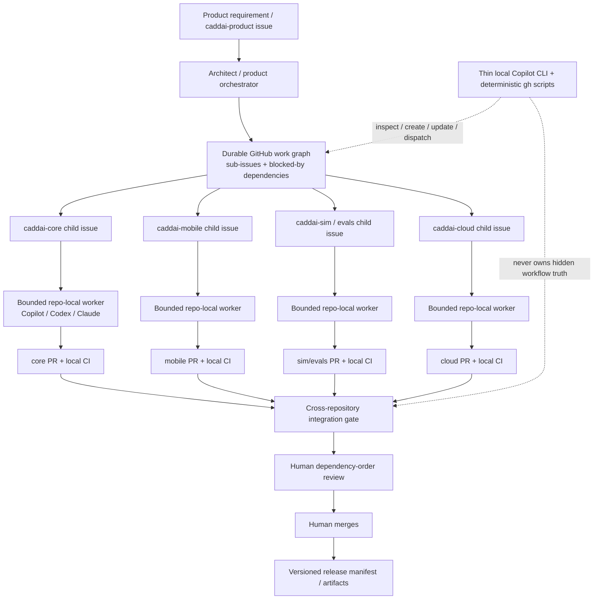

> Status: Research input — not an accepted CaddAI architecture decision.
>
> This report informs the post-M4 roadmap and architecture review.
> Recommendations such as caddai-product, Protocol Buffers, C ABI/PyO3,
> Copilot CLI orchestration and GitHub Agentic Workflows are candidates only
> until validated through CaddAI-specific spikes and/or accepted ADRs.
>
> Research date: 2026-08-30.

# CaddAI Agentic Development and Multi-Repository DevOps Architecture

## Executive summary

CaddAI’s problem is **not primarily “which coding agent is best?”** It is how to preserve a durable, auditable product-level work graph while individual coding agents operate inside increasingly independent repositories. That distinction matters because GitHub’s hosted Copilot coding capability has a firm repository boundary: a Copilot cloud-agent task can modify only the repository selected when the task starts, operates on one branch, and produces exactly one pull request for that assigned task. It cannot make coordinated changes across several repositories in one run. citeturn4search8

The strongest architecture for CaddAI today is therefore a **hybrid GitHub-native control plane with repo-local agents**, rather than a single omnipotent multi-repository agent:

> **GitHub Issues + native sub-issues/dependencies + an organization-level GitHub Project form the durable product work graph; a thin local product orchestrator decomposes and monitors that graph; Copilot/Claude/Codex workers execute bounded repository-local tasks; GitHub Actions performs deterministic verification; a small central integration repository eventually runs cross-repository compatibility gates; only the human developer merges.**

This directly matches CaddAI’s stated priorities of human control, offline-first product architecture, explicit architecture boundaries, reproducibility, and issue-to-release traceability. fileciteturn0file0 GitHub already supports cross-repository sub-issues, native blocking dependencies, Projects containing issues and pull requests from multiple repositories, and organization-level issue fields, so a large custom orchestration database is unnecessary. citeturn5search8turn5search1turn5search13turn5search10

**Copilot Max remains a very good fit, but as a set of workers and a local orchestration assistant—not as the durable multi-repository workflow engine.** Copilot CLI is particularly important: it has a documented non-interactive interface, can add multiple directories to a session with `--add-dir`, supports custom agents/subagents, MCP, granular tool permissions, and can run in GitHub Actions. That makes it capable of seeing several local CaddAI repositories at once even though a Copilot cloud-agent task cannot write across them. citeturn3search11turn3search15turn0search14turn3search14

GitHub Agentic Workflows are the most interesting future GitHub-native control plane. They can use multiple agent engines, are read-only by default, expose validated “safe outputs,” support cross-repository operations, can dispatch workflows into other repositories, and can create Copilot cloud-agent sessions in target repositories. However, **GitHub currently classifies Agentic Workflows as Public Preview**, so I would experiment with them but would not make correctness, release coordination, or recoverability depend on them yet. citeturn2search2turn14search1turn1search0turn1search1

GitHub also now supports **OpenAI Codex and Anthropic Claude as third-party coding agents** on paid Copilot plans. Both GitHub integrations are currently Public Preview, and their sessions consume GitHub AI Credits and GitHub Actions minutes. This means CaddAI can make its *task contract* provider-neutral without building a provider-neutral agent framework: the same child issue can conceptually be handed to Copilot, Codex, or Claude while GitHub remains the source of truth. citeturn14search0turn14search4turn14search13

For the code architecture, I recommend **Protocol Buffers as the default versioned machine contract format**, supplemented by JSON Schema for human-authored manifests/configuration and a deliberately narrow C ABI for Rust↔Flutter FFI. Protocol Buffers currently has official generated-code support for Rust, Dart, and Python and explicit schema-evolution rules; field numbers cannot be reused, old readers can tolerate many additive changes, and generated bindings eliminate a large class of hand-maintained cross-language drift. citeturn18search2turn19search1turn19search2turn19search3 FlatBuffers should remain a profiling-driven alternative rather than the default: while it supports Rust, Dart and Python and offers zero-copy access, its own support matrix shows uneven feature support across languages, making it a poor complexity trade until CaddAI demonstrates a serialization bottleneck. citeturn20search0turn20search3

The production Rust engine should expose the **same core implementation** to Flutter and Python: a narrow FFI layer for Flutter and a PyO3 binding for `caddai-sim`/`caddai-evals`. Dart officially interoperates with native C ABIs through `dart:ffi`, while PyO3 is specifically designed to expose Rust code as native Python modules. This lets the simulation harness exercise the actual production Rust engine rather than silently rebuilding strategy logic in Python. citeturn18search0turn23search0

The key recommendation is consequently conservative:

**Do not build Temporal, LangGraph, an agent bus, an agent registry, or a generalized orchestration service now.** Temporal is compelling if CaddAI eventually needs genuinely durable multi-day workflow execution with complex compensation and external side effects, but GitHub Issues already provide the durable state CaddAI needs at its present scale. LangGraph offers durable execution and human-in-the-loop agent graphs, but introducing it now would create a second source of workflow state beside GitHub. citeturn13search7turn12search7turn12search1

The first decision should be validated by a two-repository spike before any real repository split: `agent-spike-core` and `agent-spike-client`, with a parent task “Add `strategy_version` to Recommendation,” separate core/client PRs, a deliberately broken core CI run, an early consumer run against an unavailable contract, a rejected breaking change, and a deliberately abandoned agent session. The architecture passes only if the entire state of the operation can be reconstructed and safely resumed from GitHub without hidden agent memory.

## Research frame, evidence model, and current platform landscape

### Research questions and scope priorities

Although the CaddAI brief spans many technologies, seven focused research tracks determine the architectural decision. They can also be treated as independent scope options for follow-on investigations.

| Priority | Focused research question | Why it matters to the decision |
|---|---|---|
| Critical | **What are the hard repository/write boundaries of GitHub-hosted coding agents?** | Determines whether GitHub can itself be the multi-repository execution engine. |
| Critical | **Can GitHub represent a durable cross-repository dependency graph without custom workflow storage?** | Determines whether CaddAI needs a bespoke control plane. |
| Critical | **Can a local or Actions-hosted CLI coordinate several repositories safely?** | Determines the simplest viable product-level orchestrator. |
| High | **What provider-neutral abstraction is actually useful?** | Avoids either unnecessary Copilot lock-in or unnecessary abstraction. |
| High | **How should Rust, Dart and Python share contracts and production-engine behavior?** | Repository boundaries will become expensive if contracts drift. |
| High | **Where should cross-repository CI and synthetic validation live?** | Determines whether changes can be integrated before release rather than discovered by users. |
| High | **How should security, cost limits and failed agent runs be bounded?** | Agent autonomy is useful only if failure is safe and observable. |

The research method prioritized current first-party documentation for product capabilities, preview status, authentication, billing and workflow semantics. For open-source orchestration projects, project-maintained documentation/repositories were treated as primary sources. Original specifications were preferred for serialization/versioning decisions. Marketing pages were used only where they expose current plan/pricing data, not as evidence that an orchestration capability works in production. This is especially important because several relevant GitHub agent features are currently in preview. citeturn15search3turn2search2turn14search4turn14search13

A repeatable search plan for future re-validation should prioritize queries such as `Copilot cloud agent multiple repositories limitations`, `Copilot CLI --add-dir programmatic`, `GitHub Agentic Workflows cross-repository safe outputs`, `GitHub sub-issues dependencies Projects`, `GitHub third-party coding agents Codex Claude`, `protobuf Rust Dart Python compatibility`, and `GitHub App cross-repository Actions`. Product capability claims should be included only where current official documentation describes them; feature requests, demonstrations and announcements should be excluded from the “supported today” category until current docs confirm availability.

For empirical questions that documentation cannot answer—for example, *which agent produces the fewest incorrect Rust FFI changes*—the right next evidence source is a controlled CaddAI PoC rather than generic coding benchmarks. Original empirical software-engineering studies can supplement those tests, but they should not override current product documentation for questions such as permissions, repository scope or billing.

### Data extraction template

For future platform re-evaluations, I would record each capability in a compact machine-readable record:

```yaml
capability_id:
product:
feature:
evidence_date:
source_type: official-docs | official-spec | original-project
status: stable | public-preview | experimental | unsupported | not-documented

execution_scope:
  repository_read:
  repository_write:
  branch_scope:
  pull_requests_per_task:
  cross_repo:

orchestration:
  triggers:
  child_tasks:
  dependency_waiting:
  durable_state:
  retry_semantics:

security:
  token_type:
  minimum_permissions:
  secrets_visible:
  sandbox:

operations:
  ci_feedback:
  human_gate:
  audit_events:
  usage_meter:

decision:
  caddai_role:
  unresolved_test:
```

That distinction between **unsupported** and **not documented** is important. In this report, for example, Copilot cloud-agent multi-repository modification is documented as unsupported by its task scope; in contrast, I do not assume that every undocumented higher-level scheduling behavior is impossible—I treat it as unavailable for architecture purposes until documented.

### Evidence/source comparison

| Primary source/platform | Authority | Current maturity relevant here | Multi-repo primitive | Permission boundary | Durable workflow state | Cost signal | Main CaddAI implication |
|---|---|---|---|---|---|---|---|
| GitHub Copilot cloud agent docs citeturn4search8turn4search7 | Product owner | Supported product; some delegation surfaces are preview | **No multi-repo writes per task** | Target repo/branch | PR + issue | AI Credits + Actions | Excellent bounded worker |
| Copilot CLI docs citeturn3search11turn3search5turn3search9 | Product owner | Supported | Multiple local directories via `--add-dir` | Local user/token permissions | None inherently | AI Credits | Best current local coordinator candidate |
| GitHub Agentic Workflows citeturn2search2turn1search0turn1search1 | Product owner/project | **Public Preview** | Cross-repo safe outputs, workflow dispatch, agent-session creation | Read-only default + explicit outputs/auth | Actions run + GitHub artifacts/issues | Agent/model + Actions usage | Strong future control-plane candidate |
| GitHub Issues/Projects citeturn5search8turn5search1turn5search13 | Product owner | Mature | Cross-repo subissues/dependencies/project views | GitHub repository/org permissions | **Yes** | No agent inference cost | Best durable work graph |
| OpenAI Codex citeturn6search3turn6search0turn14search4 | Product owner | Codex product GA; **GitHub third-party integration Public Preview** | Parallel project agents exist; no evidence used here for atomic multi-repo GitHub task | Product sandbox/GitHub agent integration | Provider sessions + GitHub PR when integrated | Plan/token dependent | Credible alternative worker, not necessary as orchestrator |
| Anthropic Claude Code citeturn10search2turn10search0turn14search13 | Product owner | Claude Code supported; **GitHub agent integration Public Preview** | Powerful local subagents; no native product-level GitHub dependency graph | Tool permissions + sandbox | Session state | Subscription/API dependent | Strong local/alternate worker |
| OpenHands citeturn11search3turn11search7 | Project owner | Mature open-source project, evolving agent stack | GitHub resolver focuses principally on one issue/task | Deployment-defined | Deployment/workspace | Model + compute | Useful open worker, but does not remove orchestration problem |
| Temporal citeturn13search7turn13search3 | Product/project owner | Mature durable-workflow platform | Arbitrary workflow graph | Application-defined | **Excellent durable execution** | Infra/service dependent | Upgrade path if GitHub state becomes insufficient |
| LangGraph citeturn12search7turn12search1 | Project owner | Stable core | Arbitrary agent graph | Application-defined | Checkpoint/persistence layer | Model + runtime | Technically capable but duplicate workflow state for CaddAI |

The resulting evidence map points toward a deliberately split responsibility: **GitHub stores truth; deterministic automation enforces gates; LLM agents produce proposed changes.** No individual LLM session needs to be trusted with the overall lifecycle.

## GitHub Copilot Max capabilities and hard multi-repository limits

### What Copilot can do today

The most important terminology distinction is between the **hosted/cloud coding agent**, **IDE/local agent behavior**, and **Copilot CLI**. They share Copilot branding but have materially different security and repository scopes.

| Capability | Current status | What it means for CaddAI |
|---|---|---|
| Hosted Copilot/cloud coding agent | **Supported** | Can take a repository-local task, create a branch and PR, work on feedback and address failures. citeturn4search0turn4search8 |
| Assign GitHub issue to cloud agent | **Public Preview on the documented issue-assignment surface** | Useful for child issues, but parent product issue should not rely on this as orchestration state. citeturn4search0 |
| One task modifying several repositories | **Unsupported by documented task model** | A task can change only the selected repository. citeturn4search8 |
| Several PRs from one cloud-agent task | **Unsupported by documented task model** | An assigned task produces exactly one PR. citeturn4search8 |
| Broader cross-repo context | **Configurable in some circumstances; write scope remains single-repo** | Read context must not be confused with permission to modify several repos. citeturn4search8turn4search7 |
| Fix failing CI on its own PR | **Supported** | Valuable bounded retry worker inside a child task. citeturn4search0 |
| Learn new instructions from original issue comments after assignment | **Do not rely on it** | GitHub specifically directs steering through the PR after assignment rather than assuming later issue comments update the session. citeturn4search0 |
| Custom agents | **Supported in cloud agent/CLI; IDE availability varies by surface** | Keep specialist profiles such as QA or adversarial review, but do not mistake them for a durable multi-repo scheduler. citeturn0search10turn0search17 |
| CLI subagents | **Supported** | Custom agents can operate as subagents with separate context windows/tool sets. citeturn3search15 |
| `AGENTS.md` | **Supported** | Nested repository instructions can be used, with closer files taking precedence for relevant working directories. citeturn3search0turn3search1 |
| `.github/copilot-instructions.md` and path-specific instructions | **Supported** | Useful for Copilot-specific guidance where generic `AGENTS.md` is insufficient. citeturn3search0 |
| Copilot CLI interactive use | **Supported** | Good local implementation/review assistant. citeturn3search4 |
| Copilot CLI non-interactive `-p/--prompt` | **Supported** | Makes thin scripted orchestration realistic. citeturn3search4turn3search11 |
| Multiple directories with CLI `--add-dir` | **Supported** | One local coordinator can inspect several CaddAI checkouts. citeturn3search11 |
| MCP | **Supported** | CLI has GitHub MCP capabilities and can add MCP servers. citeturn0search14 |
| Hooks | **Supported, with runtime-specific differences** | Useful for guardrails/validation; some hook behavior differs between CLI and cloud, and policy hooks are CLI-specific. citeturn0search11turn0search18turn0search19 |
| Copilot CLI in GitHub Actions | **Supported** | Requires appropriate `copilot-requests` permission; potentially useful for bounded analysis/status automation. citeturn3search14 |
| GitHub Agentic Workflows | **Public Preview** | Promising cross-repository orchestration, but not yet a foundation for release correctness. citeturn2search2 |
| OpenAI Codex agent within GitHub | **Public Preview** | Credible alternate worker using paid Copilot entitlement. citeturn14search4 |
| Anthropic Claude agent within GitHub | **Public Preview** | Same architectural role as alternate worker. citeturn14search13 |

### The hard multi-repository answer

For the questions in the CaddAI brief:

**Can one Copilot coding-agent task modify several repositories?**  
No. GitHub explicitly documents that the cloud agent can make changes only in the repository specified when the task starts. citeturn4search8

**Can that task produce several coordinated PRs?**  
No. The documented model is one branch and exactly one pull request per assigned task. citeturn4search8

**Can a parent task natively spawn several ordinary cloud-agent tasks across repositories?**  
Not as a capability I would treat as generally available in the ordinary cloud-agent task model. However, **GitHub Agentic Workflows can create agent sessions as validated safe outputs, including sessions targeting other allowed repositories**—which is materially close to that architecture but is currently a Public Preview capability. citeturn1search0turn2search2

**Can dependency ordering be represented?**  
Yes, independently of agents. GitHub Issues now supports native “blocked by” and “blocking” relationships, including CLI access, and these relationships appear in Projects. Cross-repository sub-issues are also supported. citeturn5search1turn5search8

**Can a cloud agent sit dormant until another repository’s PR merges and then continue?**  
I found no current primary documentation establishing that the ordinary Copilot cloud-agent task is a durable multi-day cross-repository scheduler. CaddAI should therefore model such waiting as **GitHub work state**, not agent session state. A merge or release should cause a deterministic Action/controller to unblock or dispatch the downstream work.

**Can cross-repo CI failures automatically route to the right worker?**  
A Copilot cloud agent can respond to failures associated with its own target PR, but a whole multi-repository dependency graph is not automatically routed by the basic coding-agent task model. citeturn4search0turn4search8 A small controller or Agentic Workflow can implement cross-repo routing; the latter has documented cross-repository safe outputs and workflow dispatch but remains preview. citeturn1search0turn1search1

**Can GitHub Projects represent the overall workflow?**  
Yes. Projects can include issues and PRs across repositories, native issue dependencies can appear in project views, cross-repository sub-issues are supported, and organization issue fields can provide common metadata across repositories. citeturn5search13turn5search1turn5search8turn5search10 That is enough for CaddAI’s product work graph without Jira-like additional infrastructure.

### Copilot CLI is much more interesting for orchestration

Copilot CLI has the strongest current fit for CaddAI’s **local product coordinator** because its programmatic reference documents both non-interactive prompting and multiple added directories. This is fundamentally different from the cloud-agent one-repository limit. citeturn3search11

A local layout can therefore be:

```text
~/src/caddai/
    caddai-product/
    caddai-core/
    caddai-mobile/
    caddai-sim/
    caddai-evals/
```

with a coordinator allowed to **read** all of them while using GitHub Issues as the actual state machine. It need not directly modify all five repositories. In fact, I recommend that it normally does not: its job is to inspect architecture, create/update child issues, calculate readiness, dispatch workers, inspect PR/check status, and report the product-level state.

Copilot CLI also has granular allow/deny controls for tools, while its documentation warns that blanket automatic approval effectively grants the agent the user’s access. citeturn3search9turn3search4 For CaddAI, that means a local coordinator should explicitly deny merge commands and dangerous administrative operations even though branch protection is the ultimate enforcement layer.

For CI/headless use, GitHub recommends environment-based authentication, and fine-grained credentials can be restricted to selected repositories. citeturn3search5 In GitHub Actions, however, the ordinary `GITHUB_TOKEN` remains repository-scoped, so a cross-repository orchestrator should use a deliberately restricted GitHub App installation token rather than quietly escalating a repository workflow token. citeturn16search0turn17search2

### GitHub Agentic Workflows: technically compelling, operationally premature

GitHub Agentic Workflows are unusually well aligned with CaddAI’s desired architecture. They compile declarative Markdown/frontmatter workflows into GitHub Actions, support multiple agent engines including Copilot, Claude, Codex and Gemini, operate read-only by default, and route write operations through declared safe outputs. citeturn14search1

Their cross-repository capabilities are materially stronger than Copilot cloud-agent tasks. GitHub documents cross-repository checkouts, restricted `allowed-repos`, additional authentication for private external repositories, cross-repository issue/PR safe outputs, workflow dispatch into another repository, and creation of agent sessions in target repositories. citeturn1search1turn1search0

That can express something close to:

```text
product issue changed
      ↓
agentic workflow analyses scope
      ↓
safe output: create core issue/session
safe output: create mobile issue/session
safe output: create sim issue/session
      ↓
repository-local PRs
```

This is **not** the same as one agent atomically editing all repositories. It is a higher-level workflow spawning separately bounded operations—which is exactly the right conceptual model.

Nevertheless, GitHub currently labels the overall capability Public Preview. citeturn2search2 GitHub itself also recommends continuing to use deterministic Actions for deterministic operations such as build/test/lint/deployment rather than turning those into agentic work. citeturn2search2

Accordingly:

> **Use Agentic Workflows in experiments for decomposition, status synthesis, issue creation and worker dispatch. Do not make a production release, migration gate, or dependency invariant depend exclusively on them until the feature is stable.**

## Architecture options and comparison scorecard

Five realistic architectures were evaluated. A score of **5 is most favorable for CaddAI**. For “setup complexity” and “maintenance burden,” 5 means *simplest/lowest burden*, not “most complex.”

**Architecture A — GitHub-native hierarchy.** Product issue → cross-repository child issues/dependencies → one repository-local coding-agent PR each → deterministic integration → human merges.

**Architecture B — Copilot CLI hybrid.** Architecture A plus a local or controlled Actions-hosted Copilot CLI coordinator that can inspect multiple repositories and manipulate the GitHub work graph.

**Architecture C — GitHub Agentic Workflows.** A GitHub-hosted agentic workflow becomes the decomposition/dispatch layer and creates safe outputs, workflows and/or repo-local agent sessions.

**Architecture D — custom provider-neutral controller.** A small Python service/CLI speaks GitHub APIs and invokes Copilot/Codex/Claude/OpenHands through adapters.

**Architecture E — durable workflow platform.** Temporal coordinates repo tasks, approvals, retries and GitHub side effects as explicit workflow activities.

| Criterion | A: GitHub hierarchy | B: CLI hybrid | C: Agentic Workflows | D: Custom neutral | E: Temporal |
|---|---:|---:|---:|---:|---:|
| Multi-repository coordination | 3 | **5** | **5** | **5** | **5** |
| Dependency management | 4 | 4 | 4 | **5** | **5** |
| Agent isolation | **5** | 3 | **5** | 4 | 4 |
| Human approval/control | **5** | **5** | **5** | **5** | **5** |
| GitHub integration | **5** | **5** | **5** | 4 | 3 |
| CI feedback handling | 4 | **5** | **5** | **5** | **5** |
| Failure recovery | 4 | 4 | 4 | 4 | **5** |
| Auditability | **5** | 4 | **5** | 4 | **5** |
| Local development | 3 | **5** | 2 | **5** | 3 |
| Parallelism | 4 | 4 | **5** | **5** | **5** |
| Contract/version management | 3 | 4 | 4 | **5** | **5** |
| Rust/Flutter/Python compatibility | **5** | **5** | **5** | **5** | **5** |
| Extensibility | 3 | 4 | **5** | **5** | **5** |
| Provider portability | 4 | 2 | **5** | **5** | **5** |
| Security | **5** | 3 | **5** | 3 | 4 |
| Setup simplicity | **5** | 4 | 3 | 2 | 1 |
| Low maintenance burden | **5** | 4 | 3 | 2 | 1 |
| Cost efficiency | **5** | 4 | 4 | 3 | 2 |
| Solo-developer suitability | **5** | **5** | 3 | 2 | 1 |
| Maturity/stability | 4 | 4 | 2 | 3 | **5** |

These scores are intentionally not averaged into a spurious “76/100” ranking; the trade-offs matter more than a total.

**Architecture A scores highest on control, security, auditability and simplicity** because GitHub’s existing issue and repository permission boundaries do most of the work. Cross-repository subissues/dependencies give it surprisingly good product-level dependency management. Its weakness is execution automation: the coding-agent task remains repository-local, so a human or controller must transition the graph. citeturn5search8turn5search1turn4search8

**Architecture B is the best current fit for a solo founder.** Copilot CLI can inspect multiple working directories and is scriptable, which removes A’s main coordination weakness without introducing another workflow database. citeturn3search11 Its lower isolation/security score is deliberate: a local CLI agent may inherit much broader filesystem and credential access than GitHub’s repository-scoped cloud worker, and GitHub explicitly cautions against indiscriminate automatic tool approval. citeturn3search4turn3search9 This is why B should coordinate rather than become an unconstrained multi-repo super-agent.

**Architecture C is arguably the best conceptual architecture but not the best production dependency today.** It has explicit safe outputs, read-only defaults, cross-repo capabilities, and multiple model engines. citeturn14search1turn1search1 The maturity score of 2 is not a criticism of its design; it follows directly from its current Public Preview status. citeturn2search2

**Architecture D can solve almost anything but forces CaddAI to become an agent-platform project.** The provider ecosystems make it technically realistic: Claude Code exposes non-interactive/SDK interfaces and subagents, Codex offers its own agent tooling, and OpenHands provides composable/open agent components. citeturn9search3turn10search2turn6search0turn11search3 But every retry policy, credential boundary, API change, observability schema and provider adapter becomes CaddAI maintenance. GitHub now supporting Claude and Codex directly makes that burden even harder to justify. citeturn14search0

**Architecture E is the wrong answer for now precisely because Temporal is good at what it does.** Temporal provides durable execution designed to recover workflow progress after process/network/infrastructure failure and naturally supports long-lived activities and human approval signals. citeturn13search7turn13search3 CaddAI does not yet have enough workflow complexity to justify moving task truth out of—or duplicating it alongside—GitHub. It should be reconsidered only when there is concrete evidence that issue-based state plus Actions cannot reliably model real workflows.

### External agents: where they actually fit

**OpenAI Codex.** OpenAI made Codex generally available as a product and provides local/cloud agent surfaces, while GitHub’s direct Codex coding-agent integration is now available on paid Copilot plans but is explicitly Public Preview. citeturn6search3turn14search4 Codex is therefore a credible *worker substitute*. I found no primary evidence sufficient to assert that one GitHub Codex task should be used as an atomic cross-repository PR coordinator, so CaddAI should keep the GitHub work graph above it.

**Claude Code.** Claude Code’s custom subagents, hooks and sandbox/permission system make it particularly attractive for local specialist work and adversarial review. citeturn10search2turn10search3turn10search0 GitHub’s direct Claude coding-agent integration is also Public Preview. citeturn14search13 Again, it is a worker option rather than a reason to replace the GitHub control plane.

**OpenHands.** OpenHands provides a provider-neutral/open software-agent stack and GitHub integration, but its GitHub resolver documentation is centered on resolving one issue at a time and creating a branch/draft PR. citeturn11search3turn11search7 That is useful but does not solve the product dependency graph above the issue.

**LangGraph.** LangGraph’s stable core supports persistent/durable agent execution, custom workflows and human-in-the-loop pauses. citeturn12search7turn12search1 That is useful when the workflow’s *agent conversation* is the important state. In CaddAI, the important state is “core contract PR 71 is blocked; mobile 44 consumes candidate contract X; integration run Y failed.” GitHub already models that domain more transparently.

### The right amount of provider neutrality

CaddAI should absolutely be **task-contract neutral**, but it should not yet be **runtime-framework neutral**.

A repo-local work item should contain the same fields regardless of worker:

```yaml
product_issue: caddai-product#203
repository: caddai-core
base_ref: <known SHA or main>
depends_on:
  - caddai-core#70

objective:
  Add strategy_version to Recommendation.

acceptance_criteria:
  - schema compatibility check passes
  - Rust tests pass
  - golden fixture updated
  - no mobile/cloud code modified

allowed_scope:
  - contracts/**
  - src/recommendation/**
  - tests/**

forbidden:
  - merge pull request
  - modify branch protection
  - alter CI permissions
  - change unrelated public contracts

required_result:
  - branch
  - commits
  - pull request
  - test summary
  - compatibility-impact summary
```

That gives meaningful portability. A child issue can later be assigned to Copilot, Codex, Claude, a human, or an OpenHands worker without changing the product-state representation. GitHub’s current direct support for Claude and Codex means the first three can already share a large portion of the surrounding GitHub lifecycle, although those third-party integrations remain preview. citeturn14search0turn14search4turn14search13

Building a common `WorkerProvider.execute(TaskContract) -> Result` framework now would mostly add complexity before CaddAI knows which provider differences genuinely matter.

## Recommended CaddAI agent, issue, repository, and instruction architecture

### Recommended control plane

The recommended system is **Architecture A plus the smallest useful part of Architecture B**, with Architecture C run experimentally beside it.



The **LLM orchestrator proposes** a decomposition; a **deterministic controller validates and records** it. That is an important safety distinction. An LLM can decide that a feature probably needs changes in core/mobile/sim. It should not be the only place that remembers those dependencies.

A simple `gh`/Python helper can enforce invariants such as:

```text
parent cannot complete while sub-issues are open
consumer PR cannot be release-ready while contract dependency is unresolved
integration gate always records exact repository SHAs
agent-created PR cannot be merged by the automation identity
```

This is the only bespoke orchestration code I would build initially.

### Product issue architecture

Once CaddAI has more than one production repository, create a small **`caddai-product`** repository. It need not contain application code. It should contain:

- product-level issues/epics;
- system ADRs;
- system compatibility/release manifests;
- eventually a small set of cross-repository integration workflows and fixtures.

That is one extra repository with a clear purpose, not a generic “platform” repository.

A feature should look like:

```text
caddai-product #203
Add strategy_version to recommendations

├── caddai-core #71
│   change canonical contract + engine output
│
├── caddai-mobile #44
│   consume/display new field
│   blocked by: core #71 contract availability
│
├── caddai-sim #12
│   preserve/validate field in simulation
│
└── caddai-cloud #18
    ingest field if connected telemetry uses it
```

GitHub’s native sub-issue system supports cross-repository children and exposes parent progress, while native issue dependencies provide blocked-by/blocking relationships that Projects can display. citeturn5search8turn5search1

Use **one organization-level Project** as the product planning view. Projects can contain items from multiple repositories, and organization issue fields can give all child issues common fields such as `Area`, `Product state`, `Target release`, `Contract impact`, and `Risk`. citeturn5search13turn5search10turn5search12

The Project is a *view*. Issues are the durable work records.

For a solo founder, avoid elaborate Scrum fields. I would use only:

| Field | Purpose |
|---|---|
| Product state | Backlog / Ready / Active / Blocked / Integration / Done |
| Area | Core / Mobile / Cloud / Sim / Evals / System |
| Target | Optional milestone/release identifier |
| Contract impact | None / Additive / Breaking |
| Human decision | None / Required / Approved / Rejected |

Dependency relationships themselves belong in native issue dependencies rather than a text field.

### How dependency execution should work

A downstream agent does **not necessarily need to wait for the upstream PR to merge before coding**.

For example, the mobile worker can develop against a candidate core schema/commit. What it must not do is claim release compatibility until an immutable compatible core release exists.

A safe progression is:

```text
core contract PR created
        ↓
candidate contract SHA becomes available
        ↓
mobile/sim implementation may begin against candidate
        ↓
cross-repo candidate-SHA integration runs
        ↓
core approved + merged
        ↓
core/contract version released
        ↓
consumer pin updated from candidate SHA to release
        ↓
final integration
        ↓
consumer merge
```

This avoids serializing all development while preserving release ordering.

### Repository split

Do not create all proposed repositories at once. Split only where an independently testable/releasable boundary exists.

The likely steady-state structure is sound:

```text
caddai-product     product issues, ADRs, system compatibility
caddai-core        Rust production golf engine
caddai-mobile      Flutter app + native engine packaging
caddai-sim         closed-loop synthetic simulation
caddai-evals       calibration/statistical analysis
caddai-cloud       connected-only services, when actually needed
```

I would **not initially create `caddai-contracts`**. The contracts that define the golf engine should first live under something like `caddai-core/contracts/`, where ownership is unambiguous. Publish their version/descriptor as an artifact alongside the core. A separate contracts repository becomes justified only when the contracts demonstrably acquire an independent lifecycle across several producers, rather than merely several consumers.

Likewise, do not create `caddai-cloud` until an actual connected feature requires it. The product requirement that active-round decisions remain offline means there is no architectural reason to manufacture a cloud repository early.

### Repository instructions and agent hierarchy

Use `AGENTS.md` as the **provider-neutral behavioral contract**. GitHub supports `AGENTS.md`, including nested instruction files where closer instructions can take precedence for relevant paths. citeturn3search0turn3search1

Recommended hierarchy:

```text
caddai-core/
    AGENTS.md
    contracts/
        AGENTS.md        # only if contract-specific rules justify it
    src/
    .github/
        copilot-instructions.md
        agents/
            architect.md
            rust-engineer.md
            qa.md
            adversarial-reviewer.md
            integrator.md
```

The root `AGENTS.md` should contain rules that must survive provider replacement:

```text
Architecture:
- core cannot depend on mobile/cloud
- LLMs never make golf decisions at runtime
- all stochastic APIs accept explicit seed/config
- public contracts require compatibility analysis

Workflow:
- issue is required
- never merge
- never bypass required checks
- link PR to product/child issue
- run listed validation commands

Testing:
- deterministic fixtures
- invariants
- differential tests where applicable

Boundaries:
- do not modify generated artifacts without schema source
- do not alter another repository
- flag contract breakage explicitly
```

Keep `.github/copilot-instructions.md` **thin and Copilot-specific** rather than duplicating architectural truth. GitHub supports both repository-wide and path-specific custom instructions, but duplicating the same rules in several provider-specific files invites drift. citeturn3search0

Custom agent definitions belong in `.github/agents/*.md` when they are repo-specific. GitHub also supports broader organizational agent definitions, so genuinely universal agents such as “adversarial reviewer” can eventually be shared centrally. citeturn0search10turn0search17

Your existing architect → QA → specialist → adversarial reviewer → integrator model should also become **conditional rather than mandatory for every trivial change**. Separate context windows/subagents are useful, but every additional agent pass consumes inference budget and creates more opportunity for conflicting advice. Copilot CLI explicitly supports custom agents as subagents with separate contexts, making this workflow practical for higher-risk issues. citeturn3search15

A sensible rule is:

```text
small/local change
    implementer → CI → human

contract or engine change
    architect → implementer → QA → adversarial review → CI → human

cross-repo/high-risk change
    architect → repo workers → integration gate → adversarial system review → human
```

## Contracts, DevOps, releases, synthetic validation, and Rust migration

### Shared contract strategy

The contract decision should separate three problems that are often incorrectly collapsed into one:

1. **domain/wire schema** between repositories and persisted data;
2. **native ABI** between Flutter and Rust;
3. **human-authored configuration/manifests**.

They need not use the same technology.

| Approach | Rust | Dart | Python | Evolution | Offline/mobile characteristics | Agent/change safety | CaddAI verdict |
|---|---|---|---|---|---|---|---|
| JSON Schema | Natural JSON ecosystem | Natural JSON | Natural JSON | Validation-oriented; compatibility policy is external | Inspectable but verbose | Easy to review, weaker generated type discipline | Use for manifests/config |
| Protocol Buffers | Official generated support citeturn19search1 | Official generated support citeturn19search2 | Official generated support citeturn19search3 | Strong documented binary evolution rules citeturn18search2 | Compact binary, no network dependency | Schema source + generated code + breaking checks | **Default machine contract** |
| FlatBuffers | Supported | Supported | Supported | Forward/backward evolution with explicit rules citeturn18search13 | Excellent read-performance/zero-copy use cases | More specialized, uneven language feature support citeturn20search0 | Benchmark-driven alternative |
| Hand-maintained types | Excellent native ergonomics | Excellent | Excellent | Manual | Depends on serializer | High drift risk under multi-agent edits | Avoid as cross-repo source of truth |
| C ABI structs | Good native boundary | `dart:ffi` directly supports C interoperability citeturn18search0 | Can bind, but not ideal schema mechanism | ABI evolution is delicate | Fast/simple narrow calls | High risk if broad object graph exposed | Use only as thin FFI surface |

**Recommendation: Protocol Buffers for CaddAI’s canonical machine contracts.**

A message such as:

```protobuf
message Recommendation {
  ...
  string strategy_version = 12;
}
```

can generate Rust, Dart and Python representations from the same source. Protobuf explicitly warns that field numbers identify fields on the wire and must never be reused; removed numbers should be reserved. It also defines which message changes are wire-safe, conditionally safe or unsafe. citeturn18search2

Use **Buf’s breaking-change checker** as a CI guard around the schema. `buf breaking` compares a proposed schema against a previous version and can enforce source- or wire-compatibility categories. citeturn19search0 This is a particularly good fit for agent-generated changes because compatibility becomes an automated invariant rather than something an agent merely promises in a PR description.

The useful hybrid is:

```text
Protocol Buffers
    Recommendation
    RecommendationRequest
    DecisionEvent
    ShotObservation
    SimulationScenario
    PlayerProfile
    etc.

JSON Schema / JSON
    release manifests
    strategy/model configuration metadata
    course-package manifest
    research run manifest

C ABI
    tiny Flutter ↔ Rust call surface
```

JSON Schema’s current published specification is 2020-12 and separates core schema mechanics from validation vocabularies, making it well suited to validating human-readable configuration artifacts. citeturn18search11

FlatBuffers should be reconsidered only after profiling shows that Protobuf parsing/allocation materially harms round-time or package-loading performance. FlatBuffers’ zero-copy design is real, but its support matrix currently shows language-specific differences in features such as mutation, verification and optional scalars. citeturn20search0turn20search3 CaddAI’s contract simplicity and evolution safety currently matter more.

### Rust↔Flutter FFI

Do **not** expose Rust structs or Rust ABI details directly to Dart.

Dart’s official native interoperability is through the C ABI using `dart:ffi`, and its tooling can generate Dart bindings from C headers. citeturn18search0 A stable C-facing wrapper should therefore expose a deliberately narrow API, conceptually:

```c
caddai_engine_t* caddai_engine_create(...);
void caddai_engine_destroy(caddai_engine_t*);

caddai_buffer_t caddai_recommend(
    caddai_engine_t*,
    const uint8_t* request_proto,
    size_t request_len
);

void caddai_buffer_free(caddai_buffer_t);
```

The request/response payload can be serialized canonical messages. That means the mobile bridge is mostly responsible for memory ownership, lifecycle, threading/error translation and byte movement—not duplicating the entire golf domain as fragile FFI structs.

This design also isolates future language changes: Flutter depends on the C-facing ABI + contract version, while the Rust internals remain free to evolve.

### Python should call Rust, not duplicate Rust

`caddai-sim` and `caddai-evals` should use **PyO3** to call the production Rust core. PyO3 officially supports building Rust-native Python modules, with `maturin` as a low-configuration build path. citeturn23search0turn23search1

The architecture becomes:

```text
                      caddai-core Rust domain
                     /                    \
              thin C ABI                PyO3
                 ↓                        ↓
          Flutter mobile             Python API
                                     /         \
                              caddai-sim    caddai-evals
```

This has a major architectural benefit: there is **one strategy engine**.

`caddai-sim` should own:

- synthetic golfer behavior;
- environment/scenario progression;
- canonical course-package loading;
- deterministic seeds;
- closed-loop round execution;
- invariant/metamorphic scenarios;
- pathological/adversarial test cases;
- engine-version comparison runs.

`caddai-evals` should own:

- calibration;
- statistical summaries;
- model comparison;
- confidence intervals/effect analysis;
- report generation;
- research notebooks/scripts;
- evaluation dataset/version management.

The system integration repository should run a **small smoke subset** of those scenarios. It should not become a third home for simulation logic.

### Python→Rust migration validation

The Python implementation should become a **reference oracle with a planned retirement path**, not a permanent competing production implementation.

The migration sequence should be:

```text
freeze Python behavior for selected reference domains
          ↓
define language-neutral canonical inputs/outputs
          ↓
implement corresponding Rust component
          ↓
call Rust from Python through PyO3
          ↓
differential test both implementations
          ↓
run closed-loop synthetic regression
          ↓
establish parity gate
          ↓
make Rust authoritative
          ↓
freeze/remove duplicated Python production logic
```

Use the same Protobuf or canonical JSON fixture envelopes for both implementations. Protobuf’s cross-language generated-code support makes it suitable for these language-neutral fixtures. citeturn19search1turn19search3

**Exact or near-exact parity should be required** for behaviors whose specification is discrete and deterministic: schema interpretation, unit conversions, geometry predicates, eligibility filters, rule application, deterministic candidate enumeration, IDs/version propagation, hard safety constraints and deliberately specified tie-breaks.

**Tolerance-based parity** is appropriate for floating-point outputs where architecture/compiler variation is not semantically important.

**Statistical/semantic parity should be used** for stochastic behavior, Monte Carlo estimates, shot dispersion, probabilistic utilities and recommendation ranking where several options are effectively tied. The gate should compare distributions, expected values, ranking stability and business-level invariants rather than requiring bit-for-bit output unless CaddAI deliberately standardizes the RNG and numerical behavior.

Crucially, once the Rust engine becomes authoritative, the Python reference should not continue independently receiving strategy improvements. Otherwise “differential testing” eventually degenerates into testing two different products.

### Repository CI

**`caddai-core`.** Every PR should run formatting, Clippy with warnings treated as errors, unit tests, contract compatibility, deterministic golden tests and a bounded synthetic regression subset. Rust’s own Clippy documentation recommends using the same toolchain as compilation and documents `-D warnings` for CI enforcement. citeturn23search5 Higher-cost property/fuzz and large simulation suites can run on schedule/release rather than every edit.

Release CI should build the native targets required by mobile, record the source SHA and contract version, and publish immutable release artifacts.

**`caddai-mobile`.** Every PR should run Dart/Flutter analysis and tests, then a native-plugin integration test against its pinned core version. Flutter currently supports Android and iOS as first-class deployment platforms, including Arm64 mobile targets. citeturn23search4 Android and iOS build validation should therefore be explicit release gates rather than assuming a shared Dart test proves native packaging works.

**`caddai-cloud`.** Keep conventional CI deterministic: application tests, API-contract checks, container build, dependency/security analysis, IaC validation, staging deployment and post-deployment checks. Production deployment should require a human-controlled gate and should obtain cloud credentials through OIDC where the target provider supports it, avoiding stored long-lived cloud credentials. GitHub explicitly documents OIDC as a mechanism for obtaining short-lived cloud access without storing long-lived provider credentials as GitHub secrets. citeturn17search10

**`caddai-sim` / `caddai-evals`.** Use reproducible Python environments, lint/type/test checks, explicit seeds, immutable input manifests and generated run reports. Large runs should record at minimum the engine SHA/version, contract version, course-package hash, model/config digest, simulation code SHA and seed/range.

### Cross-repository CI/CD

Use **reusable GitHub Actions workflows** for repeated mechanics, but keep each repository’s actual quality gate locally understandable. GitHub allows private repositories to consume reusable workflows from private repositories when access is configured, and current reusable-workflow support permits nested reuse while preventing nested workflows from escalating `GITHUB_TOKEN` permissions beyond those granted by the caller. citeturn14search2

A central integration workflow should operate on exact commit coordinates:

```yaml
core:
  repo: caddai-core
  sha: 8f...
mobile:
  repo: caddai-mobile
  sha: 6a...
sim:
  repo: caddai-sim
  sha: 23...
contracts:
  version: 0.7.0-rc.1
```

Then:

```text
repo PR CI
   ↓
candidate SHA
   ↓
central compatibility workflow
   ├─ checkout exact core SHA
   ├─ checkout exact consumer SHA
   ├─ build production Rust core
   ├─ run consumer compatibility
   └─ run synthetic smoke scenarios
   ↓
status linked to parent product task
```

For explicit cross-repository triggering, `repository_dispatch` is preferable to implicit choreography: GitHub documents it as a workflow trigger for events originating outside that repository. citeturn14search12

Do not assume the ordinary repository `GITHUB_TOKEN` can reach the other private repositories. GitHub explicitly scopes that token to the workflow repository. citeturn16search0 For the central integration controller, install a dedicated GitHub App only on the participating CaddAI repositories. GitHub App installation tokens can be restricted to particular repositories and a subset of the app’s permissions and expire after one hour. citeturn17search4

This is superior to a founder-wide PAT sitting in a repository secret.

### Release/version architecture

Semantic Versioning is appropriate where there is a defined public compatibility contract: SemVer requires a declared public API and assigns major/minor/patch meaning to incompatible, compatible-feature and compatible-fix changes. citeturn23search8

Use it selectively:

| Artifact | Recommended identity |
|---|---|
| Rust core API/library | SemVer once API boundary is intentional; pre-1.0 during rapid evolution |
| Contract bundle | SemVer + immutable schema source SHA |
| Flutter app | Independent app version/build number |
| Cloud API | Explicit API compatibility version + deployment SHA |
| Course package schema | Independent schema version; packages include exact version |
| Course package instance | Package version + content digest |
| Strategy configuration | Human version + immutable content digest |
| Expected-strokes/model configuration | Model ID/version + training/calibration data digest |
| Simulation scenario schema | SemVer where externally consumed |
| Evaluation output schema | SemVer |
| Deployment | Git commit/image digest, not a manually invented SemVer for every deployment |

A mobile build should embed a machine-readable release manifest such as:

```json
{
  "app_version": "2.3.0",
  "core_version": "1.4.2",
  "contract_version": "1.7.0",
  "course_schema_compatibility": ">=3.1 <4.0",
  "strategy_config_digest": "sha256:...",
  "expected_strokes_model": "es-2026-08-17+sha256:...",
  "source_sha": "..."
}
```

This is more useful for reproducibility than trying to force every scientific/configuration artifact into SemVer.

Rollback then has an objective meaning: restore a known mobile build/core/contract/config manifest rather than “put the old code back.”

## Security, permissions, cost, local/cloud execution, and failure recovery

### Security model

The ultimate control boundary must be GitHub permissions and branch rules, **not an instruction saying “please do not merge.”**

Configure the default branch so that changes require a pull request, required status checks, and no force pushes. GitHub branch protection can require PR reviews, status checks and conversation resolution and can prohibit bypassing those restrictions. citeturn16search10turn16search14 Rulesets additionally support required PRs/status checks and explicit bypass actors. citeturn16search11

One important entitlement caveat: **Copilot Max is not the same product entitlement as the underlying GitHub repository plan**. GitHub documents private-repository protected branches for GitHub Pro/Team/Enterprise-class repository plans, so verify the account/repository plan separately rather than assuming Copilot Max grants every private-repository protection capability. citeturn16search9

Recommended identities:

```text
Human founder
    repository admin
    only actor allowed to make merge/release decisions

Repo-local coding agent
    target repo only
    branch/content write as required
    issue/PR interaction
    CI read
    no administration
    no production deployment identity

CaddAI orchestration GitHub App
    installed only on CaddAI repos
    Issues: read/write
    Pull requests: read/write where needed
    Contents: minimum necessary
    Actions/checks: read + narrowly required dispatch ability
    Administration: none

Production deployment
    GitHub Actions protected workflow
    OIDC short-lived cloud identity
    no agent-accessible production credential
```

GitHub explicitly recommends the built-in `GITHUB_TOKEN` for same-repository Actions automation and a GitHub App where another repository or organization resource must be accessed. citeturn17search2turn17search11

Copilot’s cloud-agent environment is also intentionally separated from ordinary Actions secrets; GitHub documents agent-specific secrets and constrained repository access rather than granting the agent unrestricted repository/organization credentials. citeturn4search3turn4search6 That should be preserved.

For production cloud deployment, use OIDC rather than giving coding agents or general CI a static AWS/GCP/Azure-style credential. citeturn17search10

Environment-required reviewers can provide a strong deployment gate, but GitHub’s availability rules matter: required reviewers for protected environments on private repositories are not available on every GitHub repository plan. citeturn16search1 If CaddAI’s private-repository plan does not provide that capability, a human-only manual release dispatch/tagging operation is preferable to weakening the principle.

### Local versus cloud agents

**Local coordination is the right default for the product-level view.** Copilot CLI can see multiple explicitly added directories, use local development tools, access a local GitHub CLI, and run non-interactively. citeturn3search11 That is especially attractive on your Apple Silicon Mac because the same machine can inspect Rust, Flutter, Python and local/native integration state.

Its weakness is blast radius. A local agent can potentially act with the user’s filesystem and authenticated GitHub privileges, and GitHub warns that broad automatic approval gives the CLI essentially the user’s access. citeturn3search4turn3search9 Therefore:

> **Local agent = broad read, narrow control-plane writes.  
> Cloud agent = narrow repository write worker.**

Use separate working directories/worktrees, avoid production credentials in the shell environment, and deny merge/admin tooling at both the CLI-policy and GitHub-ruleset levels.

**Cloud workers are better for implementation isolation.** The Copilot cloud agent is explicitly restricted to the task repository/branch and one PR, giving precisely the kind of accidental-blast-radius reduction CaddAI wants. citeturn4search8turn4search7 Parallel repo work is then achieved by running several independent sessions, not widening one agent’s permissions.

The recommended hybrid is therefore exactly the pattern proposed in the brief:

```text
local product orchestrator
          ↓
GitHub parent/child issues
          ↓
repo-local cloud workers
          ↓
PRs
          ↓
deterministic GitHub CI
          ↓
central compatibility gate
          ↓
human review and merge
```

That is practical with current tooling.

### Failure recovery

The defining requirement should be:

> **Killing every running agent must not destroy CaddAI’s understanding of what work exists or why it exists.**

| Failure | Safe handling |
|---|---|
| Agent writes incorrect implementation | CI + adversarial review fail the PR; child issue stays open; human never merges. |
| Repo CI fails | Give the same bounded worker a fix attempt; Copilot can work on failures associated with its PR. citeturn4search0 |
| Agent stops midway | Branch/commits/PR remain; issue remains authoritative; start a fresh worker from current Git state rather than hidden session memory. |
| PR becomes stale | Required status checks/rebase compatibility block merge; rerun only that child/integration matrix. |
| Dependency PR rejected | Parent remains open; blocked downstream issues remain blocked or are replanned. No compensation code is needed merely to “undo” an issue graph. |
| Consumer starts before contract merge | Allow implementation against candidate SHA, but prevent release-ready state until immutable contract/core version exists. |
| Breaking schema edit | Protobuf/Buf compatibility gate fails before merge. citeturn18search2turn19search0 |
| Two agents conflict in same repo | Separate branches; serialize hotspot changes with native dependencies; required checks against current base catch integration breakage. |
| Partial multi-repo rollout | Release manifest records the compatible tuple; additive/backward-compatible contracts allow staged rollout where appropriate. |
| Agent provider unavailable | Leave issue unchanged and assign the same task contract to another provider/human. GitHub currently supports Copilot plus preview Codex/Claude workers. citeturn14search0 |
| Quota exhausted | Work graph remains intact; no production state depends on live agent session. Bound retries/CLI credits and resume later with any permitted worker. |

This is materially simpler than implementing workflow compensation/state recovery in an external orchestrator.

### GitHub Actions edge cases

The default `GITHUB_TOKEN` is intentionally repository-scoped, and most events generated with it do not recursively create workflow runs. `workflow_dispatch` and `repository_dispatch` are documented exceptions. GitHub also notes that if automated PR creation must trigger workflows without manual approval, a GitHub App installation token or PAT can be used instead. citeturn16search0

That matters for agent-created PRs. CaddAI should explicitly test during the PoC which actor creates each PR and whether expected CI is triggered. Do not discover after repository splitting that an automation-generated commit silently skipped an integration workflow.

### Cost and usage as of August 30, 2026

GitHub’s current billing model should be described in **AI Credits**, not designed around the older “premium request” model. GitHub’s current billing documentation says Copilot usage is measured in AI Credits at a nominal meter of 1 AI Credit = $0.01, and Copilot Chat, CLI, cloud agent and third-party coding agents consume credits. citeturn15search2turn15search8

For current individual plans, GitHub documents:

| Tool/plan | Current pricing/usage fact | CaddAI implication |
|---|---|---|
| **Copilot Max** | $100/month; 10,000 base + 10,000 flex = **20,000 monthly AI Credits** in the current plan table. citeturn15search3 | Already a substantial agent budget; use before purchasing another coding stack. |
| Copilot CLI | Consumes AI Credits; supports per-run `--max-ai-credits`. citeturn3search2turn15search8 | Put a cap on unattended coordinator/reviewer runs. |
| Copilot cloud agent | Consumes AI Credits; agent sessions also involve Actions execution. citeturn15search8turn14search0 | Large task/retry loops have real marginal usage. |
| GitHub Claude/Codex agents | Consume GitHub AI Credits and Actions minutes. citeturn14search0 | Provider experiments can be evaluated inside existing Copilot economics. |
| Direct Claude | Current Claude plans are listed at $20/month Pro, $100/month Max 5x and $200/month Max 20x; Claude Code usage shares plan limits and parallel/large-codebase use reaches them faster. citeturn22search9turn22search7 | Buy separately only if direct Claude Code proves materially useful. |
| Direct OpenAI Codex | Current official pricing is token/credit and plan dependent; OpenAI publishes current token-based rate cards for Codex activity. citeturn21search0turn21search1 | Benchmark actual CaddAI tasks rather than comparing nominal subscriptions. |
| OpenHands | Open agent stack, but you still pay/operate underlying model and compute resources. citeturn11search3 | “Open source” does not mean zero operational cost. |
| Temporal/custom orchestration | Adds runtime/infrastructure/maintenance in addition to model usage. | Not justified by present CaddAI workflow complexity. |

One notable benefit of current Copilot Max is therefore that **provider diversification does not immediately require building your own agent gateway**: paid Copilot plans now expose GitHub Codex and Claude coding agents, though both integrations are Public Preview. citeturn14search0turn14search4turn14search13

Do not optimize the workflow around minimizing individual inference calls. Optimize for failed-change avoidance. A £/$-equivalent few extra review calls are cheap compared with a subtle broken recommendation engine, mobile ABI mismatch, or corrupted course schema.

A useful usage policy would be:

```text
simple change:
    one implementation worker

engine/contract change:
    implementation + one adversarial review

cross-repo change:
    repo workers + one product-level synthesis/review

retries:
    bounded automatically
    then needs-human
```

That prevents an innocuous issue from automatically invoking architect + QA + specialist + adversary + integrator + several fix loops when the risk does not warrant it.

## Proof-of-concept plan, implementation sequence, ADRs, and final decision

### Proof-of-concept experiments

The experiments should evaluate **architecture behavior**, not which model writes the prettiest code.

#### Cross-repository contract spike

Create:

```text
agent-spike-core
agent-spike-client
```

Canonical product issue:

```text
Add strategy_version to Recommendation.
```

Expected graph:

```text
parent product task
   ↓
core child issue
   ↓
schema + core implementation PR
   ↓
candidate contract available
   ↓
client child issue
   ↓
client PR
   ↓
cross-repo compatibility run
   ↓
human review
   ↓
dependency-order merge
   ↓
parent complete
```

Run the experiment through three control styles:

1. native GitHub issue hierarchy + manual assignment;
2. Copilot CLI coordinating the same GitHub graph;
3. a GitHub Agentic Workflow creating/dispatching child work.

The third path is explicitly experimental because Agentic Workflows are currently Public Preview. citeturn2search2

Then deliberately inject failures:

**Core CI failure.** The worker should fix only the core PR; client state should remain understandable.

**Client begins before core release.** It may work against a candidate SHA, but the integration/release gate must refuse to mark the graph complete.

**Breaking contract change.** `buf breaking` should reject it. citeturn19search0

**Stuck agent.** Terminate it. Start a fresh worker without manually reconstructing hidden prompts. If the newcomer cannot understand the task from issue/PR/branch state, the architecture has failed.

**Rejected core PR.** The client child must remain blocked/replan-able rather than requiring restoration of some lost orchestrator session.

**CI event routing.** Verify whether an agent-created PR triggers every expected workflow under the actual token/app identity; GitHub’s `GITHUB_TOKEN` event semantics make this worth explicit testing. citeturn16search0

**Pass evidence:** complete issue→worker→PR→CI→integration→human history is visible on GitHub; each child can be retried independently; no worker has merge/admin rights; coordinator death is harmless.

**Reject evidence:** the design needs all-repository write/admin credentials, loses dependency state when a session expires, requires a particular model’s hidden conversation to recover, cannot retry one repository independently, or requires a preview capability for correctness.

#### Local multi-repository coordinator spike

Clone the two spike repositories side by side and give Copilot CLI both directories through documented `--add-dir` support. citeturn3search11

Its task is **not** “edit everything.” Its task is:

```text
read parent issue
inspect both repos
propose dependency graph
create/update child issues
check PR/CI status
identify next executable task
produce concise integration status
```

Deny merge tooling. Use a token/App with only the repositories needed.

The experiment passes if the local coordinator is useful while the authoritative state remains entirely understandable without it.

#### Provider-substitution spike

Give the same small repo-local task contract independently to:

- GitHub Copilot cloud agent;
- GitHub’s Codex coding agent;
- GitHub’s Claude coding agent.

The latter two are currently Public Preview, so the experiment should assess reliability rather than silently standardize on them. citeturn14search4turn14search13

Record:

```text
successful first-pass CI?
unnecessary file changes?
architecture-rule violations?
review findings?
repair attempts?
AI Credits / Actions usage?
time requiring human intervention?
```

Do not select the winner based on subjective prose quality.

#### Rust/Flutter/Python boundary spike

Before committing to the full Rust migration, implement one tiny production-grade path:

```text
.proto RecommendationRequest/Recommendation
              ↓
        Rust caddai-core
         /           \
      C ABI          PyO3
       ↓              ↓
 Flutter test      Python test
```

Dart’s C FFI and PyO3 are both directly supported integration mechanisms. citeturn18search0turn23search0

Have both clients execute the same golden request against the same Rust implementation. Add `strategy_version`, regenerate bindings, and prove that:

- old compatible fixture still reads;
- new field reaches Dart;
- new field reaches Python;
- schema compatibility CI works;
- no strategy algorithm exists in either binding layer.

This experiment should happen **before** a large Rust rewrite.

### Engineering effort and deliverables

The following are planning estimates in person-days for one experienced developer and exclude rewriting the golf engine itself.

| Deliverable | Estimated effort | Evidence produced |
|---|---:|---|
| Cross-repo orchestration spike | 2–3 person-days | Native vs CLI vs Agentic Workflow comparison |
| Provider substitution + failure tests | 1–2 person-days | Quality/usage/recovery measurements |
| Rust/Dart/Python FFI/contract spike | 2–4 person-days | Validated runtime boundary |
| Harden current repo instructions/rules/task template | 1–2 person-days | Reusable agent contract |
| Establish `caddai-product` + Project/dependency conventions | 1–2 person-days | Durable product work graph |
| Extract first real repository boundary | 3–6 person-days plus code-specific refactoring | First production multi-repo flow |
| Cross-repo integration controller/workflow | 2–4 person-days | Exact-SHA system compatibility gate |
| Synthetic harness wired to Rust via PyO3 | 4–8 person-days for foundation | Actual production-engine closed-loop tests |
| Migration differential-test framework | 3–6 person-days | Python↔Rust parity dashboard/gates |
| Cloud release/security setup | Defer until cloud exists | Deployment/OIDC/environment model |

A realistic **architecture-validation investment is roughly 6–10 person-days before the real repository split**. The full platform scaffolding through the first production split and integration gate is more like 12–20 person-days, highly dependent on how entangled the present Python code is. Those estimates deliberately exclude rewriting CaddAI’s strategy engine in Rust.

### Proposed staged implementation sequence

**Stage zero — make the present monorepo reproducible.**  
Standardize `AGENTS.md`, task/PR templates, acceptance criteria, branch protection, version metadata and deterministic test commands. There is little benefit in distributing inconsistent conventions across several repositories.

**Stage one — run the four spikes.**  
Do the cross-repo feature, failure injection, provider comparison and FFI test before a production split. Record results in ADR candidates rather than committing to a workflow based only on documentation.

**Stage two — establish the product control plane.**  
Create `caddai-product`, an organization Project, common issue fields and the parent/subissue/dependency convention. Add a small deterministic `caddai` or `scripts/orchestrate.py` helper only for graph validation/status/dispatch. The GitHub API remains the state store.

**Stage three — make `caddai-core` the first real split.**  
A core engine has the strongest independent boundary and is the natural place to establish contract/version/release discipline. Do not simultaneously create mobile/cloud/sim/evals repositories merely because the target diagram eventually contains them.

**Stage four — establish contracts and candidate compatibility.**  
Put canonical engine-domain `.proto` files under core ownership, generate bindings, add breaking-change CI and create the exact-SHA central integration gate.

**Stage five — introduce the Rust core incrementally.**  
Add PyO3 and the Flutter C ABI early. Port deterministic components behind differential tests. Keep Python as a frozen reference where useful until parity criteria are met.

**Stage six — split simulation from evaluation when their lifecycles diverge.**  
`caddai-sim` becomes the closed-loop production-engine driver; `caddai-evals` remains research/statistics. Do not split them merely to create architectural symmetry.

**Stage seven — add cloud only for a real connected capability.**  
When cloud exists, establish OIDC deployment identities, staging/production boundaries and backward-compatible event/API contracts without putting any active-round decision dependency there.

**Stage eight — reconsider orchestration sophistication using evidence.**  
If GitHub Agentic Workflows have become stable and the PoC demonstrates reliable behavior, move deterministic portions of the local coordinator into them. If workflows become truly long-running and compensation-heavy beyond GitHub’s natural issue model, evaluate Temporal. Otherwise stop.

### ADRs CaddAI should create

The eventual ADR set should cover these decisions:

| ADR | Decision |
|---|---|
| Repository boundaries | Why/when core, mobile, sim, evals and cloud split |
| Product work graph | GitHub Issues/subissues/dependencies as durable orchestration state |
| Agent execution model | Repo-local workers, no autonomous merge |
| Provider portability | Provider-neutral issue contract, no custom provider abstraction initially |
| Agentic Workflows policy | Preview-only experimentation until stability criteria are met |
| Canonical contracts | Protobuf vs alternatives and schema ownership |
| Flutter/Rust ABI | C ABI + serialized contract boundary |
| Python/Rust integration | PyO3 and prohibition on strategy reimplementation |
| Simulation/evaluation split | Closed-loop sim versus statistical evaluation responsibilities |
| Python→Rust parity | Exact/tolerant/statistical migration gates |
| Cross-repository CI | Exact-SHA central integration workflow and dispatch model |
| Version/release manifest | Compatibility tuple and rollback semantics |
| Automation identity | GitHub App permission model |
| Production deployment | Human gate + OIDC credentials |
| Preview-feature adoption | What evidence is required before preview technology becomes critical infrastructure |

### What not to build yet

| Do not build now | Why |
|---|---|
| General-purpose CaddAI agent orchestration service | GitHub already provides durable issues, dependencies, PRs and Projects. |
| Temporal control plane | Excellent technology, unjustified workflow complexity today. citeturn13search7 |
| LangGraph agent-state machine | Duplicates the GitHub work graph without a demonstrated need. citeturn12search7 |
| Custom Copilot/Codex/Claude adapter framework | GitHub already exposes alternative coding agents, and task-contract neutrality gets most of the benefit. citeturn14search0 |
| Autonomous merging | Violates the desired safety model and is unnecessary for useful autonomy. |
| Autonomous production deployment | Same; deployment is a human business decision. |
| `caddai-contracts` repository immediately | Schema ownership can begin in core; split only with an independent lifecycle. |
| All five production repositories immediately | Repository count should follow real independent boundaries. |
| FlatBuffers by default | Performance advantage has not yet been shown necessary, while cross-language complexity is higher. citeturn20search0turn20search3 |
| Duplicate Python strategy engine after Rust migration | Creates two authorities and invalidates the purpose of production-engine simulation. |
| Bespoke serialization format | Protobuf/JSON Schema already cover the requirements with mature tooling. citeturn18search2turn18search11 |
| Custom package registry | Standard GitHub releases/container/package mechanisms and immutable SHAs are sufficient initially. |
| Heavy enterprise platform engineering | CaddAI has one human developer; every control-plane component must justify its own maintenance. |

### Limitations and unresolved risks

The fastest-changing part of this recommendation is the agent platform layer. GitHub Agentic Workflows, GitHub Codex integration and GitHub Claude integration are all currently preview capabilities, so their status and semantics should be rechecked immediately before making one of them production-critical. citeturn2search2turn14search4turn14search13

Documentation also cannot tell us how well an agent will obey CaddAI-specific architecture constraints in practice. That is why the provider comparison and failure-injection PoCs are more valuable than generic coding benchmarks.

The contract recommendation is high confidence, but the exact Rust↔Flutter packaging/build mechanics still need the proposed native spike. Dart’s C FFI is stable and PyO3 provides an established Python path, but CaddAI-specific performance, threading, lifecycle and mobile build requirements must be measured in the real project. citeturn18search0turn23search0

Likewise, Protocol Buffers is the best default contract choice based on current requirements; this is not a claim that it will always beat FlatBuffers. If real course packages become extremely large and direct-access latency or memory allocation becomes a measured mobile bottleneck, FlatBuffers deserves a benchmark-driven re-evaluation. citeturn20search3

Finally, GitHub plan entitlements should be checked before relying on particular private-repository protection/environment features. Copilot Max’s AI entitlement and GitHub’s repository/security plan entitlements are separate concerns. citeturn15search3turn16search9turn16search1

### Final decision

```text
Recommended architecture:
GitHub-native durable work graph + thin local Copilot CLI/deterministic
product orchestrator + isolated repo-local coding agents + deterministic
GitHub Actions CI + a small central cross-repository integration gate.

Keep GitHub Issues/sub-issues/dependencies as the durable workflow state.
Use an organization-level GitHub Project as the cross-repository planning view.
Add caddai-product when the first real repository split occurs.

Why:
A single Copilot cloud-agent task is explicitly limited to one repository,
one branch, and one PR, so it is the wrong unit for product-level
multi-repository orchestration.

GitHub already provides the durable primitives CaddAI needs—cross-repository
sub-issues, blocking dependencies, Projects, PRs, CI and auditable identities.
Copilot CLI can see multiple local repositories and act as the higher-level
assistant without requiring a second workflow database.

This yields simple + reliable + observable rather than autonomous + opaque.

Use GitHub Copilot Max for:
Local product/architecture analysis through Copilot CLI.
Repo-local implementation workers.
Custom specialist/subagents for architecture, QA and adversarial review.
CI-failure repair on bounded PR tasks.
Routine GitHub-aware development.
Experiments with GitHub-hosted Codex/Claude workers while those integrations
remain Public Preview.

Use other tools for:
OpenAI Codex or Claude as alternative workers when experiments show a
task-specific quality advantage.
Claude Code or Codex locally for independent adversarial review where useful.
PyO3 for Python access to the production Rust engine.
Protocol Buffers + Buf for cross-language contracts and compatibility gates.
Temporal only later if empirical workflow complexity exceeds GitHub's
issue/dependency model.

Build ourselves:
A very thin deterministic orchestration helper that validates the GitHub
work graph, creates/updates child work, checks dependency readiness, dispatches
cross-repo integration, and records exact release-component SHAs.

A central integration workflow/repository once multiple production repositories
actually exist.

CaddAI-specific synthetic simulation, migration parity gates and release
compatibility manifests.

Do not build:
A general agent framework.
A provider abstraction SDK.
A bespoke durable-workflow service.
A LangGraph control plane.
A Temporal deployment today.
Autonomous merge or autonomous production deployment.
A bespoke contract format.
A separate contracts repository before its lifecycle warrants one.
All proposed repositories at once.
A second Python implementation of the production strategy after Rust becomes
authoritative.
FlatBuffers until profiling demonstrates a need.

First proof-of-concept:
Create agent-spike-core and agent-spike-client.

Parent task:
"Add strategy_version to Recommendation."

Execute separate core and client agent tasks and PRs, run exact-SHA
cross-repository compatibility validation, and deliberately test:

- core CI failure
- consumer starting before the contract is released
- a breaking schema change
- a terminated/stuck agent
- rejected upstream PR
- automated PR/CI trigger behavior
- provider substitution between Copilot, Codex and Claude

Reject any candidate architecture if killing the active orchestrator makes
the workflow unrecoverable from GitHub state alone, if it requires merge/admin
credentials, or if a Public Preview capability is required for correctness.

Most important unresolved risk:
Whether the repo-local-agent + GitHub dependency graph handoff is reliable
enough in real CaddAI multi-repository changes—especially around candidate
contract versions and automated CI feedback—or whether a slightly more durable
controller will eventually be justified.

Confidence:
High
```