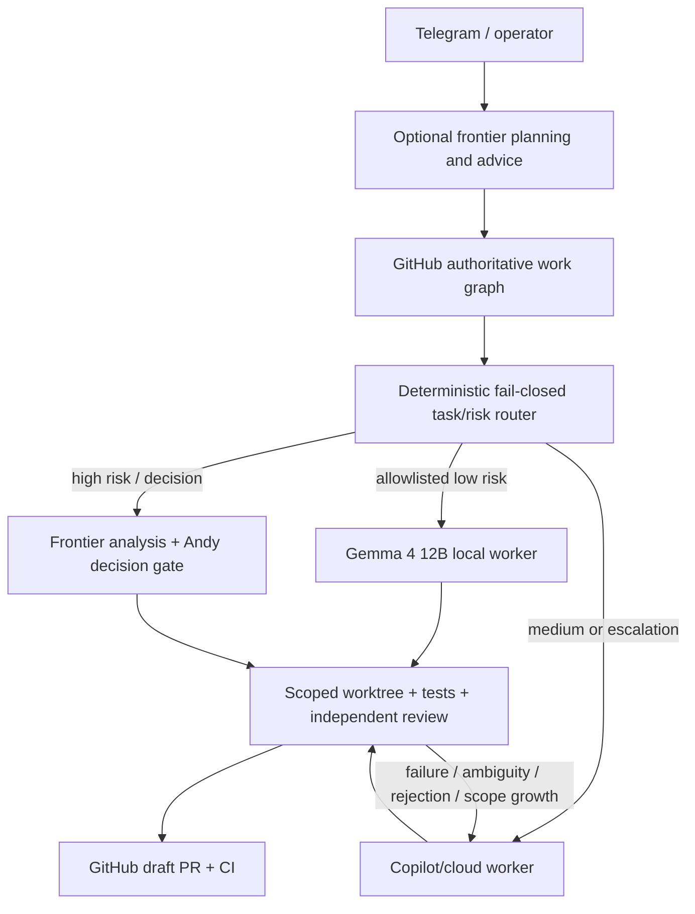

# Development orchestration architecture

> Status: Research input and proof-of-concept proposal only. This document
> does not adopt OpenClaw, GitHub Agentic Workflows, a repository topology, or
> any development orchestration architecture. Phase 2 requires separate human
> approval, and binding adoption requires the architecture process in
> `AGENTS.md`.
>
> Research date: 2026-09-03. Product and preview status, model catalogues,
> pricing, and command-line behavior must be rechecked before a PoC.

## 1. Executive conclusion

CaddAI should test, not adopt, a **GitHub-first hybrid** in Phase 2. GitHub
Issues and Projects, branches, commits, draft pull requests, checks, ADRs, and
explicit human decision records remain authoritative. OpenClaw is a disposable
interactive coordinator and local execution adapter. GitHub Agentic Workflows
is tested only for bounded event-driven work while it remains in Public
Preview.

The execution comparison should include a replaceable local open-weight worker,
not only cloud routes. The first candidate is **Gemma 4 12B**, appropriately
quantized, on Andy's 2024 M3 MacBook Pro with 18 GB unified memory. This is a
hardware-and-quality hypothesis for bounded low-risk work, not a validated fit,
an orchestrator, an authority, or an adoption decision.

The recommendation is conditional. The first experiment is an ablation: run
the same task through the current manual baseline and a GitHub Agentic
Workflows-first path. If the GitHub-native path meets the operator, recovery,
model-routing, and authority requirements with less complexity, reject the
hybrid. OpenClaw has not yet proved that it earns a permanent place.

The strongest alternative is **Option C, GitHub Agentic Workflows-first**. The
reliable fallback is **Option A, the current manual workflow**. No dedicated
orchestration repository or hardware purchase is recommended by this research.

## 2. Decision question

The question is not which coding model is best. It is:

> What development orchestration architecture should CaddAI use so specialist
> agents can autonomously execute bounded engineering work while GitHub remains
> the durable source of truth and Andy retains merge and architecture-decision
> authority?

The development control plane is separate from CaddAI's production runtime.
This spike does not change deterministic golf strategy, offline-first active
round behavior, module ownership, canonical units, or M5 issue #82.

## 3. Current CaddAI baseline

The current workflow is human-directed:

1. Andy establishes product intent and scope.
2. The Orchestrator verifies GitHub state, plans, and delegates.
3. The Architect reviews boundaries and ADR need.
4. QA derives behavioral tests.
5. A domain engineer implements within its owned subsystem.
6. The Adversarial Reviewer challenges the result.
7. The Integrator runs quality gates and prepares a draft pull request.
8. Andy alone decides whether to merge and whether to accept binding
   architecture changes.

GitHub already holds durable issues, Project metadata, branches, pull requests,
reviews, checks, and history. The main weakness is manual transfer of context
and status between specialist sessions. Any replacement must reduce that work
without turning a local chat transcript or orchestration database into the only
usable work graph.

At the start of this spike, branch `agent/platform-spike-dev-orchestration`
matched `origin/main` at `ed603de`; ADR 0008 had merged in PR #96; issue #97 was
open; and issue #82 remained `Backlog`. This document does not start #82.

## 4. Research method and evidence labels

Current first-party documentation and release records were preferred. Project
maintainer documentation is treated as first-party evidence for OpenClaw and
`github/gh-aw`. Third-party reports may identify questions but do not establish
supported behavior.

Claims use these labels:

- **SUPPORTED**: current first-party documentation describes the behavior.
- **PUBLIC PREVIEW**: available, explicitly subject to change.
- **EXPERIMENTAL**: exposed but not a stable dependency.
- **UNKNOWN**: evidence was not found or is insufficient.
- **REQUIRES POC**: documentation cannot prove the CaddAI-specific outcome.

Configuration acceptance is not execution proof. A configured model name,
reasoning level, token, permission, or recovery setting is evidence only that a
control was accepted. Phase 2 must observe the resulting behavior.

### Claim-to-source ledger

All sources were retrieved on 2026-09-03. Versioned project links freeze the
evidence reviewed; live product documentation must still be checked before a
PoC.

| Material claim | Evidence owner | Status | Exact first-party source | CaddAI conclusion |
|---|---|---|---|---|
| OpenClaw `v2026.8.2` was the stable release reviewed | OpenClaw | SUPPORTED release record | [OpenClaw v2026.8.2](https://github.com/openclaw/openclaw/releases/tag/v2026.8.2) | Pinning and upgrade safety REQUIRES POC |
| Nested subagents, depth, and resolved child metadata exist | OpenClaw | OpenClaw-documented | [Subagents at v2026.8.2](https://github.com/openclaw/openclaw/blob/v2026.8.2/docs/tools/subagents.md) | Bounded CaddAI delegation REQUIRES POC |
| Managed worktrees and snapshot/restore exist | OpenClaw | OpenClaw-documented | [Managed worktrees at v2026.8.2](https://github.com/openclaw/openclaw/blob/v2026.8.2/docs/concepts/managed-worktrees.md) | Disposable-worktree recovery REQUIRES POC |
| Sessions persist local state | OpenClaw | OpenClaw-documented | [Session state at v2026.8.2](https://github.com/openclaw/openclaw/blob/v2026.8.2/docs/concepts/session-state.md) | Clean-machine recovery remains unproved |
| Native and Copilot SDK runtimes exist | OpenClaw | OpenClaw-documented | [Agent runtimes](https://github.com/openclaw/openclaw/blob/v2026.8.2/docs/concepts/agent-runtimes.md), [Copilot plugin](https://github.com/openclaw/openclaw/blob/v2026.8.2/docs/plugins/copilot.md) | Actual routing and Max accounting REQUIRE POC |
| ACP/acpx workers exist | OpenClaw | OpenClaw-documented | [acpx reference at v2026.8.2](https://github.com/openclaw/openclaw/blob/v2026.8.2/docs/plugins/reference/acpx.md) | Per-adapter model/reasoning support REQUIRES POC |
| Telegram supports DM/group policy and pairing | OpenClaw | OpenClaw-documented | [Telegram channel at v2026.8.2](https://github.com/openclaw/openclaw/blob/v2026.8.2/docs/channels/telegram.md) | Andy-only proposal/notification flow REQUIRES POC; no production-readiness claim is made |
| Config/state paths and split config exist | OpenClaw | OpenClaw-documented | [Configuration reference at v2026.8.2](https://github.com/openclaw/openclaw/blob/v2026.8.2/docs/gateway/configuration-reference.md) | Clean config rendering REQUIRES POC |
| `gh-aw` `v0.88.2` was reviewed | GitHub | PUBLIC PREVIEW release | [`gh-aw` v0.88.2](https://github.com/github/gh-aw/releases/tag/v0.88.2) | Stability REQUIRES POC |
| Agentic Workflows supports engines, models, and version pins | GitHub | PUBLIC PREVIEW | [Engine reference at v0.88.2](https://github.com/github/gh-aw/blob/v0.88.2/docs/src/content/docs/reference/engines.md) | CaddAI routing REQUIRES POC |
| Read-only agents use permissioned safe outputs | GitHub | PUBLIC PREVIEW | [Safe outputs at v0.88.2](https://github.com/github/gh-aw/blob/v0.88.2/docs/src/content/docs/reference/safe-outputs.md) | Least-privilege workflow REQUIRES POC |
| Cross-repository operations need explicit access | GitHub | PUBLIC PREVIEW | [Cross-repository reference at v0.88.2](https://github.com/github/gh-aw/blob/v0.88.2/docs/src/content/docs/reference/cross-repository.md) | Two-repository flow REQUIRES POC |
| Sandboxing and threat detection exist | GitHub | PUBLIC PREVIEW | [Sandbox](https://github.com/github/gh-aw/blob/v0.88.2/docs/src/content/docs/reference/sandbox.md), [threat detection](https://github.com/github/gh-aw/blob/v0.88.2/docs/src/content/docs/reference/threat-detection.md) | Injection containment REQUIRES POC |
| `gh aw` exposes best-effort usage/AIC metrics | GitHub | PUBLIC PREVIEW; estimate | [Cost management at v0.88.2](https://github.com/github/gh-aw/blob/v0.88.2/docs/src/content/docs/reference/cost-management.md) | Billing reconciliation REQUIRES POC |
| Copilot CLI supports model/reasoning controls and per-model usage | GitHub | SUPPORTED product docs | [CLI command reference](https://docs.github.com/en/copilot/reference/copilot-cli-reference/cli-command-reference), [programmatic reference](https://docs.github.com/en/copilot/reference/copilot-cli-reference/cli-programmatic-reference) | Effective reasoning telemetry may remain UNKNOWN |
| Gemma 4 12B is an 11.95B dense model with coding, function calling, and a maximum 256K context | Google | SUPPORTED model card | [Gemma 4 model card](https://ai.google.dev/gemma/docs/core/model_card_4) | Bounded coding quality and usable local context REQUIRE POC |
| Google publishes an instruction-tuned Gemma 4 12B QAT Q4 GGUF | Google | SUPPORTED artifact; runtime fit unproved | [`google/gemma-4-12B-it-qat-q4_0-gguf` at revision `29d0977`](https://huggingface.co/google/gemma-4-12B-it-qat-q4_0-gguf/tree/29d097773436b69ff9feafd636ab4cf873786537) | 18 GB M3 fit, backend support, speed, and quality REQUIRE POC |
| App installation tokens are scoped and expire after one hour | GitHub | SUPPORTED product docs | [App installation authentication](https://docs.github.com/en/apps/creating-github-apps/authenticating-with-a-github-app/authenticating-as-a-github-app-installation) | Exact PoC permissions still require negative tests |
| Rulesets can require PRs/checks and restrict updates | GitHub | SUPPORTED subject to repository plan | [Ruleset rules](https://docs.github.com/en/repositories/configuring-branches-and-merges-in-your-repository/managing-rulesets/available-rules-for-rulesets) | Andy-only update enforcement REQUIRES POC |

## 5. Non-negotiable invariants

Any candidate must preserve all of the following:

- GitHub contains enough state to reconstruct what is happening, why, what is
  blocked, what was attempted, and what a new process should do next.
- Local sessions, hidden memory, queues, workboards, caches, clones, worktrees,
  and Telegram pairing state are disposable.
- Every dispatch has a durable task contract, correlation ID, and idempotency
  key. Duplicate delivery must not create duplicate pull requests or decisions.
- Agents may propose architecture choices. Only an explicit human GitHub record
  can authorize one.
- Automation can create branches, commits, and draft pull requests but cannot
  merge, enable auto-merge, bypass protection, or administer repositories.
- Deterministic checks remain deterministic. LLMs do not replace build, lint,
  type, test, dependency, or branch-protection gates.
- Secrets remain outside Git and are freshly supplied on each machine.
- Phase 2 fixture repositories cannot imply approval of an M6 product split.
- Removing an orchestration framework must leave understandable GitHub state
  and a viable manual continuation path.

## 6. Option A: current manual workflow

Andy continues to pass bounded prompts between ChatGPT, VS Code/Copilot custom
agents, and GitHub. Existing repository instructions and role boundaries remain
the orchestration definition.

**Evidence in favor:** this is working now, has no new runtime or credential
surface, keeps decisions legible, and is recoverable from GitHub plus the
repository. It is the control group and fallback.

**Disconfirming evidence to seek:** measure operator interventions, time spent
reconstructing state, repeated prompt preparation, and idle time between roles.
If those costs are small for representative work, additional orchestration is
not justified.

**Principal limit:** autonomy ends at session boundaries. Andy carries too much
of the work graph in working memory and manually routes review/fix cycles.

## 7. Option B: OpenClaw-first local orchestrator

OpenClaw owns interactive coordination, creates isolated local worktrees,
delegates to role agents or external coding harnesses, and reports through
Telegram. GitHub receives durable tasks and outputs.

**Evidence in favor:** OpenClaw documents native subagents, bounded nesting,
per-agent and per-run model controls, visible sessions, managed worktrees,
persistent Gateway state, ACP workers, Skills, `AGENTS.md` support, and a mature
Telegram adapter. These directly address interactive coordination.

**Disconfirming evidence to seek:** stop the Gateway, lose its state directory,
and rebuild on a clean machine from GitHub. If work cannot be understood and
safely continued, this option fails. It also fails if OpenClaw adds no measured
operator benefit over GitHub-native execution.

**Principal limit:** its SQLite databases, session records, task queues, and
managed worktrees create a tempting second source of truth. Broad local
filesystem and user credential access can exceed a repository-scoped worker's
blast radius.

## 8. Option C: GitHub Agentic Workflows-first

GitHub events invoke Agentic Workflows. Markdown workflows compile to locked
Actions YAML; the agent is read-only by default; declared safe outputs perform
permission-controlled writes such as issue, pull-request, branch, Project, or
cross-repository operations.

**Evidence in favor:** GitHub holds workflow inputs, run records, safe outputs,
pull requests, checks, and durable status. The runtime is sandboxed and
firewalled. The platform supports Copilot, Claude, Codex, Gemini, and Pi engines,
cross-repository access controls, cost limits, and engine pinning.

**Disconfirming evidence to seek:** test whether the platform can handle a
review rejection, durable human pause, duplicate event, interruption, and
multi-repository fixture without hidden manual repair. It fails as a foundation
if Public Preview churn or repository-event ergonomics makes those flows
unreliable.

**Principal limit:** the platform is currently **PUBLIC PREVIEW**. It is less
suited to an ongoing mobile conversation and local long-running coordination,
and Actions plus inference add cost to each run.

## 9. Option D: GitHub-first hybrid

GitHub is the control plane. OpenClaw handles interactive, Telegram, and local
long-running coordination. Agentic Workflows handles only bounded GitHub-event
tasks. Deterministic Actions retain validation and enforcement.

**Evidence in favor:** it can combine durable GitHub records with local
worktrees, persistent interactive coordination, heterogeneous coding harnesses,
and an operator surface that does not require a laptop to be open.

**Disconfirming evidence to seek:** remove OpenClaw and repeat the fixture with
GitHub-native tools. If outcomes and operator effort are equivalent, the hybrid
is unnecessary. Also measure conflicting retries, duplicate dispatches, state
reconciliation, configuration burden, and credential exposure introduced by two
orchestration surfaces.

**Principal limit:** overlap. Without strict ownership, both OpenClaw and
Agentic Workflows may believe they should dispatch, retry, update status, or
resume a task. The hybrid is acceptable only if both runtimes submit durable
intent and one deterministic GitHub Actions dispatcher is the sole writer of
orchestration transitions and worker dispatches.

## 10. Qualitative comparison matrix

Ratings are evidence judgments, not numeric scores. `REQUIRES POC` means the
platform capability exists but the CaddAI outcome is not established.

| Criterion | A: Manual | B: OpenClaw-first | C: Agentic Workflows-first | D: Hybrid |
|---|---|---|---|---|
| Reduces Andy's coordination effort | WEAK | REQUIRES POC | REQUIRES POC | REQUIRES POC |
| Bounded agent autonomy | MODERATE | STRONG | STRONG | STRONG |
| GitHub as durable truth | STRONG | MODERATE | STRONG | STRONG if invariant holds |
| Human architecture authority | STRONG | MODERATE | STRONG | STRONG |
| Technical Andy-only merge | UNKNOWN currently; REQUIRES POC | UNKNOWN currently; REQUIRES POC | UNKNOWN currently; REQUIRES POC | UNKNOWN currently; REQUIRES POC |
| Interactive/mobile operation | WEAK | STRONG | WEAK | STRONG |
| Recovery after local loss | STRONG | WEAK without GitHub discipline | STRONG | STRONG if local state is disposable |
| Clean-machine portability | MODERATE | REQUIRES POC | STRONG | REQUIRES POC |
| Multi-repository readiness | WEAK | MODERATE | STRONG | STRONG |
| Model and harness flexibility | MODERATE | STRONG | STRONG | STRONG |
| Actual routing observability | MODERATE | REQUIRES POC | MODERATE | REQUIRES POC |
| Cost controls | MODERATE | MODERATE | STRONG | MODERATE |
| Least-privilege isolation | STRONG | WEAK to MODERATE | STRONG | MODERATE |
| Prompt-injection containment | MODERATE | WEAK to MODERATE | STRONG | MODERATE |
| Setup simplicity | STRONG | WEAK | MODERATE | WEAK |
| Maintenance burden | STRONG | MODERATE | MODERATE while preview | WEAK |
| Vendor/framework lock-in | MODERATE | MODERATE | WEAK to MODERATE | MODERATE |
| Mature/stable foundation | STRONG | MODERATE | WEAK while preview | MODERATE |
| Deterministic quality gates | STRONG | STRONG if external | STRONG | STRONG |
| Framework-removal path | STRONG | REQUIRES POC | MODERATE | REQUIRES POC |

The matrix does not establish a winner. Option D offers the broadest capability
and the highest complexity. Option C is the cleanest architectural challenger.
Option A may remain rational if measured coordination savings are modest.

## 11. Why the hybrid must not be presumed to win

OpenClaw is attractive because it visibly covers many requested features. That
is also the largest source of confirmation bias in this spike. Feature coverage
does not prove reduced operator effort, reliable recovery, lower cost, or safer
execution.

Phase 2 must therefore execute in this order with the same fixture oracle:

1. Measure the manual baseline.
2. Run the fixture through Agentic Workflows-first.
3. Run an OpenClaw-first arm with Agentic Workflows disabled.
4. Run the constrained hybrid only after recording which gaps it is expected to
  address.
5. Remove Agentic Workflows from the hybrid and compare it with OpenClaw-first;
  then remove OpenClaw and compare it with GitHub-first.
6. Verify that work remains resumable after each removal.

The hybrid is rejected if its unique gains are limited to a nicer notification
surface, if it increases intervention count, if recovery needs local databases,
or if its single-writer boundary cannot prevent racing intents. Option B is
rejected if it cannot recover without local state or if Option C meets the same
oracle with lower effort. Option C is rejected if preview instability or missing
interactive behavior breaches a hard gate.

## 12. OpenClaw release, status, and fit

The current stable release found during research was `v2026.8.2`, published
2026-09-01. Phase 2 must pin an exact tested version, record checksums or package
lock data where available, disable unreviewed automatic upgrades, and run the
fixture suite before advancing the pin.

OpenClaw is a local Gateway and agent runtime, not a durable project-management
system. Its strongest potential CaddAI roles are:

- interactive coordinator;
- bounded role delegation;
- local worktree manager;
- adapter to Copilot or other coding harnesses;
- Telegram interaction surface;
- resumable executor when the same local state still exists.

It should not own accepted scope, dependency truth, human decisions, merge
authority, or the sole record of completed actions.

## 13. OpenClaw agents, workspaces, worktrees, and Skills

OpenClaw documents nested subagents with configurable depth. The default spawn
depth is one; depth two supports main to orchestrator to worker. The documented
range extends further, but CaddAI should cap depth at two and reject recursive
worker delegation. More depth makes authority, cost, and failure attribution
harder to inspect.

Per-run model and thinking overrides are available, and child completion data
includes resolved provider/model metadata. That metadata is useful but remains
insufficient proof of billing attribution or reasoning propagation.

Agent workspaces hold instructions and context. Skills package reusable
behavior. `AGENTS.md` should remain the provider-neutral repository rulebook;
OpenClaw-specific configuration should reference it rather than duplicate
CaddAI's durable architecture rules.

Managed worktrees use OpenClaw-owned state and `openclaw/<name>` branches, with
snapshot/restore bookkeeping in local SQLite. They are useful isolation, but
must be treated as disposable clones. Every useful change must reach a named
Git branch and every task transition must reach GitHub before the worktree can
be considered recoverable.

## 14. OpenClaw sessions, restart recovery, and hidden state

OpenClaw persists sessions, subagent records, task queues, and cron state in
SQLite and can recover them after a Gateway restart. Terminal PTYs and
background process handles do not survive. Recovery from an intact local state
directory is therefore stronger than process restart but weaker than
clean-machine recovery.

The following are explicitly non-authoritative:

- `~/.openclaw` and any relocated `OPENCLAW_STATE_DIR`;
- local SQLite databases;
- pairing records and Telegram offsets;
- local auth sessions and cached credentials;
- transcripts, hidden memory, queues, and cron state;
- managed worktree registrations and snapshots;
- terminal processes and unpushed changes.

The Phase 2 M3 bootstrap must not copy any of them. If the new machine cannot
reconstruct current work from GitHub and repository configuration, the design
fails.

## 15. GitHub Agentic Workflows capabilities and limits

`github/gh-aw` release `v0.88.2`, published 2026-09-03, was current during this
research. The platform remains **PUBLIC PREVIEW**.

Relevant supported design features include:

- Markdown/frontmatter source compiled to generated lock YAML;
- read-only agent behavior by default;
- declared safe outputs executed in separate permission-controlled jobs;
- sandboxing, network firewalling, threat detection, and secret isolation from
  the agent runtime;
- Copilot, Claude, Codex, Gemini, and Pi engines;
- engine model/version selection and custom Copilot agents;
- repository allowlists, cross-repository checkout, safe outputs, dispatch,
  and target-repository agent sessions with additional credentials;
- `max-turns`, `max-ai-credits`, timeouts, and optional daily credit caps;
- `gh aw logs` and `gh aw audit` metrics and best-effort cost estimates.

Agentic Workflows also exposes an experimental merge-pull-request safe output.
CaddAI must omit it. Workflow permissions and credentials must deny merge and
administration even if a prompt requests them.

GitHub documents side-repository and central-control-repository patterns, but
these are advanced patterns rather than evidence that CaddAI needs a permanent
orchestration repository.

## 16. Copilot Max, models, and AI credits

At the research date, Copilot Max cost USD 100 per month and included 10,000
base plus 10,000 flex AI credits, for 20,000 included credits per calendar
month. One AI credit corresponds to USD 0.01 for additional-use accounting.
Usage is token- and model-weighted, resets at 00:00 UTC on the first day of the
month, does not roll over, and is shared across IDE, CLI, GitHub, cloud-agent,
and supported third-party-agent surfaces.

The live Max model catalogue included models from Anthropic, Google, OpenAI,
xAI, Moonshot AI, Microsoft, and GitHub. The catalogue is dynamic. A durable
task contract must request a capability class, not assume a model remains
available forever.

Account-level metrics may aggregate usage across surfaces and may not provide
the per-task, per-feature, or per-model attribution needed by the PoC. Cost
claims therefore require controlled before/after readings plus runtime logs.

## 17. Three Copilot access routes

### Route 1: OpenClaw native GitHub Copilot provider

OpenClaw owns the reasoning and tool loop while using Copilot as the model
provider. It supports device login or token import, live account-specific model
discovery, model-specific transport, and thinking levels exposed by the live
catalogue.

This route best tests OpenClaw-native orchestration. It may not behave like the
Copilot coding agent and does not by itself prove exact GitHub AI-credit
attribution. **REQUIRES POC.**

### Route 2: OpenClaw Copilot SDK harness

The `@openclaw/copilot` harness lets the Copilot SDK/CLI own the coding loop and
compaction while OpenClaw coordinates the task. Copilot SDK sessions support
explicit IDs, persisted events, and resume across process or client restarts;
resume controls can include model, provider, reasoning effort, tools, working
directory, custom agents, Skills, and MCP servers.

This route most closely preserves Copilot coding-agent behavior, but creates two
session layers whose recovery and observability must be correlated.
**REQUIRES POC.**

### Route 3: ACP/acpx external worker

OpenClaw can delegate to an ACP-compatible harness through `acpx`, including
Copilot CLI and other coding agents. This is the strongest portability route.
Model forcing and reasoning controls depend on each adapter and cannot be
assumed uniformly. **REQUIRES POC.**

No route should be selected solely because authentication succeeds.

## 18. Proving actual provider, model, and reasoning use

Copilot CLI supports `--model`, `COPILOT_MODEL`, and persisted settings. Custom
agent model configuration has higher precedence than the CLI flag. It also
supports `--reasoning-effort`/`--effort` values `low`, `medium`, `high`, `xhigh`,
and Anthropic-specific `max`, where the chosen model supports them. `/model`
changes session/repository/global selection; `/usage` reports per-model token
totals. Non-silent programmatic output identifies the model used.

Agentic Workflows supports `engine.model`; logs and audits expose token and
best-effort AI-credit data, while telemetry can include
`gen_ai.request.model`. Dynamic selectors such as `auto` are accounted against
the concrete model reported by the response, with a conservative fallback when
metadata is missing.

Each routing test must collect:

1. requested provider, engine/harness, model, and reasoning level;
2. resolved provider/model reported by the runtime;
3. Copilot CLI or engine event/log metadata;
4. per-model tokens where available;
5. account credit reading before and after the isolated run;
6. a control run using a deliberately different available model;
7. explicit `UNKNOWN` for reasoning when no runtime evidence distinguishes it.

A successful response, accepted config, model-like prose, or latency difference
does not prove routing. Any silent fallback is a failed test.

## 19. Capability and model policy

Durable task contracts should name a role, risk, and capability class. A
replaceable runtime policy resolves those to a provider, harness, current model,
and reasoning level. It may also resolve an eligible task to a local open-weight
worker. Task contracts must not name Gemma or depend on one inference backend.

The controlling risk classification is deterministic, versioned, and
fail-closed. Rules derived from `AGENTS.md` identify architecture, public
contract, dependency, unit, ownership, security, infrastructure, privacy,
repository-topology, and other human-decision triggers. A model may recommend a
classification but cannot classify its own work, downgrade risk, broaden its
allowlist, or authorize dispatch. Unknown, conflicting, or ambiguous cases route
to cloud reasoning or pause for Andy.

| Role/task | Default capability | Initial PoC policy | Escalation |
|---|---|---|---|
| Deterministic metadata/status | No model | Script or safe output | Never use a model when deterministic logic suffices |
| Triage and summaries | Fast/low-cost | Gemma 4 12B local when allowlisted; economical Copilot otherwise | Escalate on ambiguity only |
| Planning/orchestration | Strong reasoning | Current frontier Copilot model, high reasoning | Human decision on architecture ambiguity |
| Bounded implementation | Scoped coding worker | Gemma 4 12B local for allowlisted low-risk fixtures; Copilot coding harness otherwise | Tests, review, and cloud escalation |
| Domain implementation | Strong coding harness | Copilot SDK/CLI worker, high reasoning | Specialist plus review; local route denied when risk is not low |
| First-pass QA | Bounded review | Gemma 4 12B local for allowlisted fixtures | Independent stronger review on rejection or ambiguity |
| Final QA test design | Strong reasoning, read/write tests | Independent cloud role/model where practical | Human on disputed acceptance criteria |
| Adversarial review | Strong independent review | Different session and preferably different model family | Human accepts residual risk |
| Integration | Deterministic first | Scripts, CI, restricted summarizer | No model may override a failed gate |

Candidate local tasks are small isolated code changes, straightforward unit
tests, documentation updates, mechanical refactors, CI/test-output diagnosis,
issue and diff summaries, first-pass QA, and simple implementation corrections.
The initial local route is denied ADR and architecture decisions, foundational
public contracts, high-risk probabilistic/statistical model changes, final
adversarial review, human-decision interpretation, integration/merge authority,
and repository security or permissions.

**Local-first execution does not imply local-model authority.** The expected
flow is policy classification, local execution in a bounded worktree,
deterministic tests and stronger review, then continuation on success or cloud
escalation on risk, ambiguity, failure, rejection, or scope growth. Copilot Max
remains the principal cloud escalation route: an economical current model for
medium work, Sol or the strongest suitable available model for high-risk
reasoning, and a specialist frontier coding harness for difficult implementation
where justified. These assignments are Phase 2 measurements, not fixed model
architecture.

Escalation triggers are:

- risk above the configured low-risk threshold;
- architecture, public-contract, or other `AGENTS.md` decision trigger;
- observable model uncertainty or ambiguous output;
- tool-call or deterministic test failure;
- repeated fix-loop failure or reviewer rejection;
- unexpected file, dependency, permission, or scope expansion;
- context-window, memory, backend, or other resource failure;
- an unsupported task category; or
- explicit human escalation.

The policy should support four measured strategies:

- **A - Frontier cloud everywhere:** strongest suitable cloud model for each
  role.
- **B - Role-optimized cloud:** different Copilot models and reasoning levels
  by role.
- **C - Cheap-cloud first:** economical cloud worker with stronger cloud
  escalation.
- **D - Local-first:** Gemma 4 12B for eligible work with Copilot/cloud
  escalation.

Strategy D is not presumed to win. Model identifiers are versioned runtime data,
not architecture.

## 20. Cost measurement plan

Use one frozen task fixture, base SHAs, acceptance criteria, repository state,
tool permissions, and output rubric. Run strategies in randomized or rotating
order to reduce learning effects. Run at least three context-isolated trials per
strategy and do not reuse model session context between runs. The versioned
fixture manifest must define exact base SHAs, permitted paths, expected changed
files and outputs, deterministic checks, forbidden side effects, and an
intervention-event schema. Setup time is recorded separately from task time.

An intervention is any human action needed after dispatch other than the one
predeclared approval used by every path. Count prompt repair, status lookup,
manual retry, credential repair, conflict resolution, hidden-state recovery,
and correction of an unauthorized action. Before running the experiment, set
the acceptable reduction or non-inferiority threshold for interventions and
operator minutes. Do not choose the threshold after seeing results.

For each run record:

- start/end account AI-credit balance or usage reading;
- CLI `/usage`, SDK events, or `gh aw logs --json` per-model tokens;
- `gh aw audit` AIC estimate and Actions duration where applicable;
- orchestrator and worker turns, retries, continuations, and tool calls;
- wall time, human interventions, review findings, CI attempts, and final
  acceptance result;
- all concurrent Copilot use during the measurement window.

For Strategy D also record local oracle pass rate, test results, reviewer
findings, fix-loop iterations, escalation and human-correction rates, end-to-end
latency, local resource use, and cloud credits consumed after escalation. Local
inference with no cloud token charge is not cheaper if defects, retries, review,
or machine contention move cost downstream.

`gh-aw` estimates use catalogue pricing and may not match billing. Account
before/after is also noisy when other sessions run. A valid comparison requires
an otherwise quiet account, confirmation that no other Copilot surface was used,
timestamped readings after the documented settlement interval, at least three
trials per strategy in rotated order, and reconciliation of runtime and account
sources against a predeclared tolerance. Missing, delayed, zero, or
irreconcilable account data makes the credit comparison inconclusive, not
passing. Report ranges and anomalies, not false precision.

Set low per-run caps during the PoC. Copilot CLI's `--max-ai-credits` is a soft
per-response limit; Agentic Workflows' top-level `max-ai-credits` is its run
guardrail. Their semantics are not interchangeable.

## 21. Durable state ownership and recovery

| State | Owner | Source of truth | Recovery method |
|---|---|---|---|
| Product intent and acceptance criteria | Human/product issue | GitHub Issue | Read issue history and linked docs |
| Task decomposition and dependencies | Orchestrator, human-approved where needed | GitHub parent/sub-issues and dependencies | Query GitHub graph |
| Project status, area, priority | Project workflow/human | GitHub Project | Rebuild view from issue metadata |
| Architecture constraint | Human | `AGENTS.md` and accepted ADR in Git | Fresh clone |
| Human decision request | Orchestrator | GitHub issue/PR comment plus state label/field | Query unresolved decision records |
| Human decision answer | Andy | Explicit GitHub comment/review by Andy | Verify actor, decision ID, and current head SHA |
| Task contract | Orchestrator | GitHub issue plus versioned plan/config | Fresh clone and issue query |
| Correlation/idempotency ID | Dispatcher | GitHub issue/dispatch record | Recompute or query existing record |
| Dispatch intent | OpenClaw or Agentic Workflow | GitHub request record keyed by task and operation | Query pending/handled intent records |
| Orchestration transition/dispatch receipt | Deterministic Actions dispatcher | GitHub comment/check keyed by idempotency ID | Serialize by task, reconcile target before retry |
| Branch and proposed changes | Engineer | Git remote branch and commits | Fresh clone/fetch |
| Review findings and verdict | Reviewer | GitHub PR review/comment | Query PR timeline |
| CI result | GitHub Actions | Checks and run artifacts | Rerun from exact SHA |
| Draft pull request | Integrator | GitHub PR | Query by branch/idempotency ID |
| Merge decision | Andy | Protected-branch merge event | Git history and audit log |
| Agent instructions | Repository owner | Versioned files in Git | Fresh clone |
| Runtime/model policy | Platform owner | Versioned declarative PoC config | Fresh clone and resolve live catalogue |
| Secrets | Andy/platform | OS keychain or approved secret store | Fresh authentication; never recover from Git |
| OpenClaw session/queue | OpenClaw | Local disposable state | Recreate from GitHub; never required |
| OpenClaw worktree/snapshot | OpenClaw | Local disposable state | Reclone branch from GitHub |
| Copilot SDK/CLI session | Copilot runtime | Local disposable state | Resume if available, otherwise restart from task contract |
| Telegram pairing/update offset | Telegram adapter | Local disposable state | Re-pair/reconfigure from fresh secret |
| Actions runner filesystem | GitHub Actions | Ephemeral | Re-run workflow |

The table's pass condition is simple: deleting every row marked local or
ephemeral must not erase an accepted decision or make GitHub work ambiguous.

### Single-writer dispatch protocol

OpenClaw and Agentic Workflows never dispatch the same worker directly. They may
submit an immutable intent containing task ID, operation, expected state/version,
target repository, base SHA, and idempotency key. One deterministic GitHub
Actions workflow owns validation, state transitions, and dispatch. A concurrency
group keyed by task serializes its jobs; `cancel-in-progress` is false.

Before acting, the dispatcher verifies the expected GitHub state and searches
the target for the idempotency marker. It writes a durable receipt after a
successful side effect. If it dies after the side effect but before the receipt,
the next run reconciles the target and records the existing result rather than
repeating it. A monotonically increasing GitHub state version fences stale jobs.
The dispatcher token exists only in its protected job. Local runtimes cannot
acquire it or write transitions directly.

This avoids a distributed lease between SQLite and Actions. The PoC must still
race both intent producers, kill the dispatcher before validation, after
validation, after the side effect, and during reconciliation, and submit a stale
state version. Exactly one side effect and one accepted transition may result.

## 22. Risk-sensitive workflows

### Low risk

Examples: issue classification, status summaries, typo-only documentation, or
read-only research. A bounded agent may act automatically through declared safe
outputs. Deterministic validation and an auditable GitHub result are required.
Only explicit low-risk categories are eligible for a local open-weight worker;
unknown categories fail closed to cloud escalation or human review.

### Medium risk

Examples: isolated implementation under an accepted plan, test additions, or
non-contract refactoring. Require a task contract, owned scope, isolated branch,
QA expectations, adversarial review, full quality gate, and draft PR. Automatic
review/fix loops are capped at two.

### High risk

Examples: public APIs, dependencies, units, ownership, dependency direction,
cloud/paid services, credentials, privacy, infrastructure, repository topology,
or golf-strategy assumptions. Automation must create `HUMAN DECISION REQUIRED`
and stop before implementation or mutation. Only Andy's durable GitHub decision
can resume the correlated task.

No risk tier grants merge permission.

## 23. Durable human-decision gate

Telegram can notify and collect a proposed answer, but cannot be authoritative.
The state machine is:

```text
RUNNING
  -> HUMAN_DECISION_REQUIRED(decision_id, task_id, head_sha, options)
  -> PAUSED
  -> GitHub decision record written by/attributed to Andy
  -> deterministic validator checks actor, decision_id, task_id, head_sha,
     permitted answer, and that the request is still current
  -> APPROVED or REJECTED
  -> one idempotent resume dispatch, or terminal stop
```

The request and answer live on the issue or pull request and include the exact
decision, options, recommendation, consequences, correlation ID, and relevant
SHA. Andy supplies the answer through a separately authenticated GitHub web,
mobile, or CLI session. No Telegram/OpenClaw bridge holds an Andy-attributed PAT,
session, cookie, or signing credential. A new commit or superseding request
invalidates stale approval. Restarting OpenClaw, losing Telegram, or switching
machines cannot skip the validator.

The validator, not an LLM prompt, controls the transition. Missing, ambiguous,
edited, bot-authored, wrong-actor, stale-SHA, or duplicated answers keep the task
paused.

## 24. Technical human-only merge enforcement

Prompt instructions are defense in depth, not enforcement. The Phase 1 API check
returned no current repository ruleset for CaddAI, so Andy-only merge is not
claimed as implemented. Phase 2 must use disposable fixture repositories to
verify that the available GitHub plan can combine:

- a default-branch ruleset with **Restrict updates** enabled and only Andy in
  the bypass/update actor set;
- a required pull request and approving review by Andy;
- dismissal of stale approvals or approval after the latest push;
- required status checks from expected GitHub Apps;
- blocked force pushes and branch deletion;
- no automation or other human actor in the ruleset bypass list;
- automation credentials without administration permission;
- omission of merge and auto-merge tools, including the Agentic Workflows
  merge-pull-request safe output;
- explicit denial of `gh pr merge`, Copilot `/pr automerge`, and equivalent
  tools at the harness layer.

A GitHub App is preferred for long-lived or multi-repository automation. GitHub
recommends Apps for long-lived integrations; installation tokens are attributed
to the App, can be limited to selected repositories and permissions, and expire
after one hour. Fine-grained PATs are acceptable only for a short-lived PoC when
an App would dominate setup, and must be repository-scoped, minimally permitted,
and promptly expired.

The PoC must attempt direct push to the protected default branch, REST/GraphQL
merge, `gh pr merge`, auto-merge, merge queue if enabled, ruleset bypass, and
branch administration using the automation identity both before and after valid
approval. It must repeat applicable attempts with a non-Andy human test identity
approved for the disposable fixture. Every attempt must be denied by GitHub even
if local tool restrictions are removed; Andy must then be able to merge manually.
If the repository plan cannot express or enforce the restricted-update actor
set, or a second identity cannot be tested, Andy-only merge remains unsupported
or inconclusive and the architecture fails this hard gate.

## 25. Telegram as an interaction surface

Telegram is an optional operator adapter, not a state store, authentication
authority, or trust root. OpenClaw documents direct-message and group controls;
their CaddAI fitness requires the PoC. The safest initial mode is:

- one dedicated bot;
- direct messages only;
- `dmPolicy=allowlist` with Andy's numeric Telegram user ID;
- `commands.ownerAllowFrom` set independently to that same owner;
- groups disabled/fail-closed;
- no broad shell, filesystem, merge, admin, or secret-reading tools exposed to
  Telegram-originated messages;
- short summaries and proposed answers with links that open the authoritative
  GitHub record for separately authenticated action.

Default pairing is not sufficient for a one-owner control bot. Usernames and
display names are not identity. Bot token and owner ID are supplied outside Git.
Any Mini App must verify Telegram-signed `initData` and the numeric owner.

A Telegram reply is only an untrusted proposal. The bridge may display or stage
it as bot-authored context, but it cannot write an approver-attributed decision
or resume work. Andy follows the link and authenticates separately to GitHub.
Bot-authored records must fail the actor check. Loss or compromise of Telegram
must be recoverable by disabling the adapter without changing project truth.

## 26. Security, prompt injection, and secrets

Untrusted inputs include issue bodies, comments, pull-request diffs, repository
files, web pages, tool output, logs, commit messages, dependency metadata, and
Telegram messages. Any may contain instructions intended to expand scope,
exfiltrate secrets, alter permissions, or merge code.

Controls are layered:

- treat fetched content as data, never policy;
- load policy from reviewed, versioned repository files;
- minimize tool, path, URL, repository, and network allowlists per role;
- separate read/reason roles from mutation roles;
- isolate worktrees and do not expose unrelated home directories;
- keep secrets out of agent context when the platform supports secret-isolated
  safe-output jobs;
- redact sensitive environment variables and prevent transcript publication;
- use sandbox/firewall controls, but assume they can fail;
- prohibit agents from modifying workflows, rulesets, credentials, or their own
  permission definitions in ordinary tasks;
- inspect generated Agentic Workflow lock files and pin third-party actions;
- log attempted denied operations and stop on privilege ambiguity.

A local model starts with a narrower boundary than a frontier worker: one
disposable worktree; only task-specific read/write paths; allowlisted shell
commands; resource limits; no secrets, keychain, unrelated home-directory, or
default-branch access; no merge, settings, policy, workflow, or human-decision
tools; and external/web access denied unless a fixture explicitly requires it.
Where the inference backend exposes a service, bind it to loopback only. Forced
negative probes attempt secret and policy reads, out-of-scope writes, network
egress, a high-risk task, default-branch update, and merge. Deterministic tests
and an independent stronger reviewer remain the safety boundary because a local
model may be less robust to prompt injection and tool misuse.

OpenClaw supports environment, file, exec, and store SecretRefs. Its shared
store is SQLite protected by filesystem permissions rather than strong at-rest
encryption. Prefer the macOS Keychain or an established password manager/secret
command, with the OpenClaw config referring to retrieval rather than containing
the value. Never copy credentials between Macs as part of bootstrap.

### Proposed permission matrix

These are maximum PoC permissions, not a request to create credentials in Phase
1. Every identity is installed only on the two disposable fixture repositories
or the one repository holding its request record.

| Identity/route | Required repository permissions | Explicitly absent | Lifetime and negative probes |
|---|---|---|---|
| OpenClaw coordinator | Metadata read; Contents read; Issues write; Pull requests read; Actions/checks read | Contents write, Pull requests write, Workflows, Administration, Actions secrets, Environments, Members | Short-lived App token; fail writes to code, workflow, ruleset, secret, and non-selected repo |
| Agentic Workflow agent job | `contents: read`, `issues: read`, `pull-requests: read`, `copilot-requests: write` | All repository writes and secret access in agent runtime | Per-run token; firewall denial and expired-token probe |
| Safe-output intent job | Issues write only in the request repository | Contents, Workflows, Administration, secrets, direct worker dispatch | Job-scoped token; fail code and cross-repo writes |
| Deterministic dispatcher | Issues write; Actions write only if dispatch is required; selected-repo metadata | Contents write, Pull requests write, Workflows, Administration, secrets read | Protected job, task concurrency; fail stale state and non-selected repo |
| Implementation worker | Metadata read; Contents write; Pull requests write; Issues write; Actions/checks read in one selected fixture repo | Workflows, Administration, Actions secrets, Environments, Members, ruleset bypass | One-hour App installation token; verify revocation/expiry and protected-default-branch denial |
| Telegram bridge | No GitHub credential by default; optionally bot-attributed Issues write in request repo only | Every Andy-attributed credential, Contents, Pull requests, Actions, Workflows, Administration, secrets | Disable/revoke independently; bot decision and non-selected repo probes fail |

If an operation needs a permission not listed, stop and review the matrix rather
than broadening a token dynamically. GitHub App private keys remain outside the
agent runtime; installation tokens are minted for the selected repositories and
reduced permission set.

## 27. Configuration, two-machine portability, and hardware

OpenClaw's default config is `~/.openclaw/openclaw.json`.
`OPENCLAW_CONFIG_PATH`, `OPENCLAW_STATE_DIR`, and `OPENCLAW_WORKSPACE_DIR` can
relocate configuration, state, and workspace. The active config must be a real
file. OpenClaw may atomically replace it, so a symlinked active config is not a
safe configuration-as-code strategy. `$include` can split configuration but has
confinement and write-through limits.

The PoC should version sanitized templates, role definitions, policy, bootstrap
instructions, and verification scripts. Machine-local rendered config and
secrets remain ignored. Reproducibility means rendering a fresh real config from
reviewed inputs, not linking a live home-directory file into Git.

Local-worker configuration must declare role/purpose, provider kind, model
identifier, source, immutable revision/hash where feasible, license, quantization,
inference backend and version, context settings, tool/resource policy, and
escalation policy. Model weights, caches, runtime databases, and machine-specific
paths are not committed to Git.

The old Mac can host the first disposable experiment. The target 2024 M3 must be
bootstrapped from a fresh clone, pinned prerequisites, declarative templates,
and fresh authentication. Do not copy `~/.openclaw`, `~/.copilot`, SQLite,
pairing, sessions, memory, caches, worktrees, keychains, or hidden dotfiles.

This research machine is an M1 Pro with eight CPU cores and 16 GB RAM; it is not
the validation machine and is only a baseline. The target is Andy's 2024 M3
MacBook Pro with 18 GB unified memory.

Two hardware questions must remain separate:

1. **Does OpenClaw itself need more powerful hardware?** Probably not: it is a
  coordinator around remote services and local tools, but Phase 2 must verify
  its measured overhead.
2. **Could more memory become economically useful because it enables better
  local models and reduces cloud usage?** This remains an empirical Phase 2 or
  future capacity question.

Gemma 4 12B is the first local candidate because Google documents coding and
function-calling capability, publishes a QAT Q4 GGUF intended to reduce load
memory, and positions the 12B class for consumer workstations. That makes an
appropriately quantized artifact a plausible middle ground for 18 GB: more
capable than a small utility model while avoiding the still less plausible
memory/quality trade of starting with a 30B-class dense model alongside normal
development workloads. Neither fit nor coding quality has been validated on
this Mac.

For the exact artifact, Phase 2 records source revision and checksum, license,
backend/version, quantization, model and total process residency, usable rather
than advertised context, time to first token, generation speed, peak unified
memory, memory pressure, swap growth, CPU/GPU utilization where observable,
thermal/power behavior where available, machine responsiveness, and end-to-end
task time. It runs local inference alone, with OpenClaw, with tests/builds, and
within the one/two/four-worker experiment. Distinguish multiple harnesses sharing
one model service from multiple loaded model instances.

No hardware purchase follows from parameter count. A future higher-memory Mac
mini or desktop could expand the feasible model class, but no model, Mac, memory
size, or purchase timing should be selected unless local routing proves useful,
18 GB materially constrains that value, and measured cloud-cost or delivery-time
savings justify the machine.

## 28. Multi-repository, failure, and removal design

Use two disposable fixture repositories, for example a producer and consumer.
The producer publishes a tiny versioned contract; the consumer pins it. A parent
GitHub issue links repository-local child issues and exact base SHAs. Test an
additive change, a deliberately incompatible change, consumer execution against
the wrong SHA, one rejected review, and cross-repository status recovery.

Cross-repository credentials must be explicit. The default Actions token is
repository-scoped. For a future durable integration, use a selected-repository
GitHub App with the minimum issue/content/pull-request permissions needed. Do not
create `andywrussell/caddai-dev-orchestrator` during this spike. Defer a dedicated
repository until evidence shows a durable ownership or security boundary that
cannot live with disposable fixture/config material.

Failure handling follows one rule: publish state before side effects and make
side effects idempotent. Scenarios include Gateway death, worker death, terminal
loss, duplicate webhook, API timeout after a successful write, expired token,
rate limit, model unavailability, credit cap, CI failure, reviewer rejection,
stale approval, offline laptop, Telegram outage, and partial cross-repository
dispatch. Recovery queries GitHub by correlation ID before retrying.

The framework-removal test deletes or disables OpenClaw and Agentic Workflow
configuration after a mid-task checkpoint. A fresh operator must understand the
task from GitHub, continue manually or with ordinary Copilot tooling, run checks,
and produce the draft PR without reconstructing hidden framework state. Failure
means unacceptable lock-in.

## 29. Phase 2 PoC, decision criteria, and sources

Phase 2 is not authorized by this document. If Andy authorizes it, use one
frozen, versioned fixture manifest and execute these tests. Before execution,
record the comparison thresholds in that manifest. All implementation-path and
cost comparisons use at least three context-isolated runs in rotated order.

The local-worker evaluation is one execution-route experiment, not a fifth
orchestration architecture. The task path remains:



The optional frontier layer may propose plans and risk classifications, but the
versioned router and GitHub dispatcher control transitions. It is not a second
control plane.

| Test | Evidence | Pass condition |
|---|---|---|
| A. Manual baseline | Manifest oracle, timeline, intervention events, prompts, checks | Every run meets the same deterministic oracle; human minutes and interventions are counted by the predeclared schema |
| B. GitHub-native arm | Same oracle, Agentic Workflow runs, GitHub records, audit | Every run meets the oracle with no hidden repair and meets the predeclared effort threshold; a gap is a failure or inconclusive result |
| C. OpenClaw-first arm | Same oracle with Agentic Workflows disabled, local and GitHub logs | Every run meets the oracle and recovery gates; compare effort/cost symmetrically with B |
| D. Constrained hybrid arm | Same oracle, both intent producers, single-writer receipts | Every run meets the oracle and predeclared effort threshold; removing either framework identifies a measured unique contribution |
| E. Reviewer rejection/fix | Seeded defects, deterministic failing checks, findings, attempt ledger | Each fix changes the targeted check; a forced rejection after attempt two creates one durable escalation and no third dispatch, including after duplicate delivery |
| F. Human decision by Telegram | Decision records and validator logs for positive and negative cases | Only separately authenticated, fresh Andy GitHub approval for the current SHA resumes once; Telegram-only, bot-authored, wrong-actor, stale, edited, ambiguous, duplicate, and rejected inputs never resume |
| G. Interruption and dispatch race | Correlation ledger at named kill points plus concurrent OpenClaw/Agentic intents | Before validation, after validation, after side effect/before receipt, and during reconciliation yield one transition/side effect; stale state is fenced and local SQLite can be deleted at every point |
| H. Clean M3 deployment | Fresh/isolated macOS home inventory, exact clone SHA, pinned install and auth log | Old state paths are unavailable; fresh auth completes the full fixture through expected checks and draft PR using only declared inputs |
| I. Routing and cost | Route-specific provider response/events, resolved model, effective reasoning evidence, tokens, settled account delta | Distinct model/reasoning controls and negative fallbacks are proved per route; unknown effective reasoning fails that route; three cost trials per strategy reconcile within tolerance |
| J. One/two/four workers | Same fixed independent batch, three rotated trials each, local/provider metrics | Only oracle-passing tasks count; predeclared throughput, failure, pressure, swap, responsiveness, duration, and remote-throttle limits determine pass/fail |
| K. Multi-repo, merge denial, and removal | Independently reported K1/K2/K3 gates | K1 exact-SHA flow/recovery passes; K2 GitHub denies every default-branch update route for automation and non-Andy actor before/after approval, then allows Andy; K3 second operator completes after both frameworks/runtime state are removed |
| L. Local open-weight worker | Exact Gemma artifact/backend evidence, tiered eval, resource/security probes, cloud comparison | A useful allowlisted subset meets predeclared quality, review, escalation, tool, responsiveness, and total-cost thresholds without authority expansion or silent cloud fallback |

Hardware sampling should capture `powermetrics` where permitted, Activity
Monitor or `memory_pressure`, process RSS/CPU, swap, disk free space, Actions and
task duration, tool failures, UI responsiveness, and accepted tasks per hour.
One, two, and four workers must perform the same fixed batch of real fixture
tasks in at least three rotated trials. Before execution, define the minimum
accepted-tasks-per-hour improvement and maximum task failure, memory-pressure,
swap-growth, responsiveness-latency, and duration regression. CPU utilization
alone is not a success measure.

The fixed batch must contain at least eight mutually independent, equal-rubric
tasks so four workers can remain active without dependency serialization. A
worker is one concurrent implementation harness; the orchestrator is measured
separately. Keep total work, scheduler, model policy, base state, and thermal
starting band fixed. Record warm/cold cache state. Provider rate limits, Actions
queue time, and network latency are reported separately from local CPU, memory,
disk, and responsiveness so remote throttling is not misdiagnosed as M3 capacity.

K1 uses only two disposable fixture repositories and asserts that no CaddAI
product topology or permanent orchestration repository was created. K3 removes
both OpenClaw and Agentic Workflow configuration and runtime state at a named
mid-task checkpoint. A second operator receives only GitHub URLs and a fresh
clone, and passes only by completing the remaining deterministic checks and
draft pull request without undisclosed help.

For I, effective reasoning requires route-specific runtime or provider-response
metadata that states the applied level. An accepted argument, echoed request,
configuration file, latency, or apparent answer quality is insufficient. If a
route exposes no such evidence, its reasoning-control result is inconclusive and
it cannot satisfy a policy that requires verified reasoning selection.

### Local task-evaluation tiers

The local set contains representative CaddAI-shaped fixtures at increasing
difficulty, each with exact expected outputs and deterministic checks:

| Tier | Fixtures | Purpose |
|---|---|---|
| 1 - Mechanical | Summarize CI output; extract issue dependencies; recommend a risk class for policy validation; produce a structured diff summary | Establish structured accuracy without code authority |
| 2 - Bounded engineering | Add straightforward unit tests; make a small isolated refactor; align documentation with code; implement a trivial helper | Identify the initial eligible coding subset |
| 3 - Moderate reasoning | Diagnose a bounded failing test; review against acceptance criteria; fix a small bug after reviewer feedback | Measure escalation, fix loops, and downstream review cost |
| 4 - High-risk control | ADR review; foundational public API change; probabilistic/statistical model design | Must be rejected by the router, not solved by the local worker |

The strongest simple first proof is one harmless fixture containing a small
deterministic helper, unit tests, and documentation. Run the same exact task with
Gemma 4 12B and the selected cloud coding worker. Compare oracle correctness,
latency, review findings and time, interventions, local resources, escalation,
and cloud credits. Installation or a plausible-looking patch is not success.

Strategy D is promising only if it demonstrates an allowlisted task subset with
acceptable correctness and reviewer burden, bounded escalation, stable tools,
acceptable M3 responsiveness, and a measurable reduction in cloud credits after
all escalation and rework. Reject or narrow it when reviewer failures/retries
erase savings, memory pressure harms development, tools are unreliable, security
exposure is disproportionate, or nearly every meaningful coding task escalates.
Predeclare numeric thresholds in the fixture manifest before execution.

Adopt neither Option C nor D unless all hard gates pass: GitHub-only
reconstruction, technical merge denial, durable human pause, clean-M3 bootstrap,
bounded cost, no silent model fallback, idempotent recovery, two-repository
coordination, and framework removal. Prefer C if it matches D's outcomes with
less operator effort or complexity. Prefer A if neither materially improves the
baseline. A binding adoption decision requires a later ADR and human approval.

Unresolved questions for the PoC are:

- whether OpenClaw's native Copilot route is charged and attributed exactly as
  expected under Andy's live Max account;
- whether each route propagates and reports reasoning effort reliably;
- how stable Agentic Workflows proves under current Public Preview changes;
- whether Telegram adds meaningful control rather than notifications only;
- whether two orchestration surfaces can avoid duplicate dispatch ownership;
- whether the target M3's actual memory configuration sustains useful four-
  worker throughput;
- whether a GitHub App is worth creating for the disposable PoC or a tightly
  scoped, short-lived fine-grained PAT is sufficient.
- whether Gemma 4 12B at a tested quantization has sufficient quality, stable
  tool use, usable context, and memory headroom on the M3/18 GB machine;
- whether local-first escalation reduces total cloud credits after reviewer,
  retry, latency, and hardware contention costs are counted.

Primary sources consulted, current on the research date:

- [CaddAI engineering handbook](../../AGENTS.md)
- [CaddAI development workflow](../development-workflow.md)
- [Prior multi-repository research](agentic-development-multi-repo-devops.md)
- [OpenClaw repository and releases](https://github.com/openclaw/openclaw)
- [OpenClaw documentation](https://docs.openclaw.ai/)
- [GitHub Agentic Workflows repository and releases](https://github.com/github/gh-aw)
- [GitHub Agentic Workflows engine reference](https://github.github.com/gh-aw/reference/engines/)
- [GitHub Agentic Workflows cost management](https://github.github.com/gh-aw/reference/cost-management/)
- [GitHub Copilot CLI reference](https://docs.github.com/en/copilot/reference/copilot-cli-reference/cli-command-reference)
- [GitHub Copilot CLI programmatic reference](https://docs.github.com/en/copilot/reference/copilot-cli-reference/cli-programmatic-reference)
- [GitHub Copilot plans](https://docs.github.com/en/copilot/get-started/plans-for-github-copilot)
- [GitHub Copilot model comparison](https://docs.github.com/en/copilot/reference/ai-models/model-comparison)
- [Google Gemma 4 model card](https://ai.google.dev/gemma/docs/core/model_card_4)
- [Google Gemma 4 12B instruction model](https://huggingface.co/google/gemma-4-12B-it/tree/707f0a3b8a3c7ad586ed01e27eafbad8a27dd0f7)
- [Google Gemma 4 12B QAT Q4 GGUF](https://huggingface.co/google/gemma-4-12B-it-qat-q4_0-gguf/tree/29d097773436b69ff9feafd636ab4cf873786537)
- [GitHub ruleset rules](https://docs.github.com/en/repositories/configuring-branches-and-merges-in-your-repository/managing-rulesets/available-rules-for-rulesets)
- [Deciding when to build a GitHub App](https://docs.github.com/en/apps/creating-github-apps/about-creating-github-apps/deciding-when-to-build-a-github-app)
- [GitHub App installation authentication](https://docs.github.com/en/apps/creating-github-apps/authenticating-with-a-github-app/authenticating-as-a-github-app-installation)
- [GitHub App security practices](https://docs.github.com/en/apps/creating-github-apps/about-creating-github-apps/best-practices-for-creating-a-github-app)

The controlling falsifiable hypothesis remains: a replaceable GitHub-first
control plane reduces Andy's coordination burden without weakening security,
recovery, quality, model flexibility, cost visibility, or human authority. The
Phase 2 evidence, not this report, decides whether that hypothesis survives.