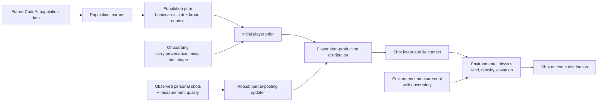

# CaddAI Probabilistic Golfer Model: Evidence, Data Audit, and V1 Recommendation

## Executive conclusion and research scope

This report addresses the modeling problem defined in the CaddAI research brief: initialize a useful probabilistic golfer from handicap and a small amount of onboarding information, then progressively replace population assumptions with that golfer’s own evidence. fileciteturn0file0 The dataset and licensing audit is current to **August 23, 2026**.

**The central conclusion is that CaddAI can build an evidence-backed cold-start model, but not an evidence-complete one.** The literature supports using handicap as a predictor of consistency/variability, most clearly for driver mechanics and outcomes, and supports treating clubs differently rather than applying one universal dispersion multiplier. It does **not** currently provide a sufficiently complete public matrix of handicap × club × carry dispersion × lateral dispersion × correlation × tail behavior from which defensible numerical priors for the whole bag can simply be read. Betzler et al.’s 285-golfer driver study is particularly important: lower-handicap golfers had significantly lower shot-to-shot variability in clubhead speed, impact efficiency, impact location, attack angle, club path, and face angle. A companion study reports handicap-category and gender-specific medians and variability for driver launch and shot outcomes. citeturn27search3turn17search8

The requested answers are therefore:

| Question | Conclusion |
|---|---|
| **Can CaddAI build an evidence-backed cold-start player model?** | **Yes, with qualification.** The *structure* is defensible: reported carry anchors location; handicap and club inform prior uncertainty; reported miss direction weakly informs directional bias; tails should be heavier than a simple Gaussian assumption. Exact full-bag dispersion numbers still require CaddAI calibration data or licensed data. |
| **Can a comprehensive population model be trained from public raw data today?** | **Partially.** Small useful raw datasets exist, notably CaddieSet, but no verified public dataset found in this audit combines a representative golfer population, handicap, multiple clubs, carry, lateral outcome, lie, environment, and enough repeated shots per golfer. citeturn16view0turn15view0turn22search0 |
| **Should V1 use ML?** | **No.** A hierarchical statistical model/interpolated prior is better matched to the quantity and quality of currently available data. Neural networks, boosted trees, and mixture-density networks would add estimation freedom without solving the missing-label and population-representativeness problem. |
| **What probability representation is best for V1?** | **A hierarchical bivariate Student-t distribution over carry error and lateral error, per club/club category, with learnable correlation and heavy tails.** It is only modestly more complex than a Gaussian, avoids pretending severe misses are Gaussian, and can be updated incrementally. A separate severe-miss mixture should be added once CaddAI has enough data to estimate its rate and shape rather than inventing those parameters. |
| **How should personal learning work?** | Use **partial pooling / hierarchical Bayesian or empirical-Bayes updating**. Population priors dominate initially; individual mean/bias learn relatively quickly; variances take more observations; correlation takes still more; rare-tail behavior should remain strongly pooled for much longer. Hierarchical models are specifically designed to estimate individual parameters as draws from a population and shrink poorly observed individuals toward that population. citeturn26search2turn26search9 |
| **Should pressure receive a generic penalty?** | **No. Choose B: record context for possible future individual learning.** Controlled and observational studies disagree, and individual golfers can choke, improve, or show little response. citeturn11search3turn11search6turn11search12 |
| **How should weather be handled?** | Primarily as a **physical transformation of a produced shot**, not as golfer dispersion. Wind and atmospheric density belong in the trajectory layer; uncertainty about the wind belongs in an environmental measurement distribution. Golf-ball drag and lift explicitly depend on relative air velocity and air density. citeturn28view3turn13search0 |

**Scope assumptions.** For V1, “shot distribution” should mean an intended **stock full swing**, represented in coordinates aligned to the intended target line: downrange carry and lateral displacement at carry/landing. Total distance should remain a separate variable because rollout is highly surface-dependent. Pitches, chips, recovery punches, bunker explosions, and putting are behaviorally different shot regimes and should not initially be pooled with stock full swings. A “fade” describes intended curvature and should **not** automatically be interpreted as a right miss; “common miss = right” is the more relevant onboarding observation for endpoint bias.

The evidence supports several hypotheses but rejects or weakens others. Handicap appears useful as a prior predictor of consistency, although it is not a pure ball-striking variable. Self-reported carry is useful information, but the literature does not justify a universal numerical trust weight for ordinary golfers. A single independent Gaussian is too restrictive because real lateral patterns can be skewed/heavy-tailed and carry/lateral dependence can be nonzero. Broadie’s amateur work also emphasizes that a relatively small number of very poor shots are important contributors to high scores. citeturn27search3turn28view1turn0search1
## Architecture review outcome and final CaddAI recommendation (M4.0)

> This section records the outcome of the CaddAI Architect's review of this
> report (issue [#47](https://github.com/andywrussell/caddai/issues/47)) and
> is the authoritative M4.0 conclusion for the remainder of M4. It classifies
> every provisional conclusion below into one of four categories, per the
> M4.0 deliverable requirement:
>
> - **Evidence-backed** — directly supported by cited primary research.
> - **Statistical inference** — a defensible inference from cited evidence,
>   but not itself directly measured (e.g. combining two related findings).
> - **Provisional CaddAI assumption** — a modelling choice the evidence is
>   consistent with but does not itself establish; must be visibly
>   provisional/configurable, not presented as validated fact.
> - **Unresolved evidence gap** — a quantity CaddAI cannot currently
>   defend numerically and must not invent; requires CaddAI's own
>   calibration data before being treated as authoritative.

### Classification of key conclusions

| Conclusion | Classification | Notes |
|---|---|---|
| Handicap predicts shot-to-shot production variability (esp. driver) | **Evidence-backed** | Betzler et al. 2012/2014. citeturn27search3turn17search8 |
| Full-bag handicap × club numeric dispersion surface | **Unresolved evidence gap** | No public source combines handicap, all clubs, and 2-D dispersion at adequate sample size. |
| Club-category (not one universal scale) should differentiate dispersion | **Statistical inference** | Inferred from clubs being studied and reported separately, not from a single cross-club comparison. |
| Self-reported carry strongly anchors expected carry | **Provisional CaddAI assumption**, informed by evidence | Robertson & Burnett support accurate self-report only for a small, elite (≈+2.8 handicap) sample. citeturn28view1 |
| Uncertainty should depend on report provenance (measured/GPS/personal) | **Provisional CaddAI assumption** | Statistically motivated (measured data should have lower noise); no study gives calibrated trust weights per provenance category. |
| Common miss weakly informs directional bias; shot shape ≠ endpoint bias | **Statistical inference / product-modelling distinction** | Not a direct empirical finding; a defensible interpretation given the sign-convention and onboarding-field design already used for `DirectionalDispersion`. |
| Bivariate (correlated) rather than independent carry/lateral | **Evidence-backed (exploratory) + statistical inference** | CaddieSet exploratory correlations (−0.34 to +0.56, sign varies); n=8 unlabeled golfers, so treated as falsification evidence against independence, not a fitted population correlation. citeturn15view0 |
| Heavier-than-Gaussian tails (Student-t) | **Evidence-backed (exploratory) + statistical inference** | 10/11 tested CaddieSet cells rejected lateral normality; Broadie's amateur-scoring work supports tail importance independently. citeturn15view0turn0search1 |
| No severe-miss mixture in V1 | **Deliberate simplification (evidence-justified)** | Correctly declines to invent a miss-probability parameter unsupported by public evidence. |
| Numeric ν, covariance scale, correlation-shrinkage strength | **Unresolved evidence gap** | Must ship as configuration, explicitly provisional, pending CaddAI's own calibration study. |
| Partial-pooling/empirical-Bayes personalisation, differential learning rates by parameter | **Evidence-backed (statistical theory) + statistical inference for golf specifics** | Hierarchical/shrinkage behaviour is well-established statistically; the qualitative ordering (mean fast, variance slower, correlation slower, tails slowest) is reinforced by a golf-specific reliability study (7–10 driver/6-iron swings vs. lateral deviation unreliable at 15). citeturn27search6 |
| Numeric shrinkage constants/thresholds | **Unresolved evidence gap** | The *ordering* is evidence-backed; specific numeric schedules are not. |
| Environment (wind/elevation/air density) as physical transform, separate from golfer variability | **Evidence-backed** | Golf-ball aerodynamic drag/lift depend on relative airspeed and air density; validated trajectory/normalization models exist. citeturn28view3turn13search0 |
| No generic psychological-pressure penalty | **Evidence-backed (absence of consistent effect)** | Controlled studies disagree in direction; individual heterogeneity is itself the documented finding. citeturn11search3turn11search6turn11search12 |
| Public raw data sufficiency | **Evidence-backed: Partially** | Retained without modification — see "Public dataset audit" above. This is the load-bearing conclusion for the entire V1 recommendation below. |

### Binding decisions (recorded as ADRs)

1. **[ADR 0006](adr/0006-player-shot-distribution-bivariate-student-t.md)** —
   adopts `PlayerShotDistribution`, a bivariate Student-t shot-production
   representation, as a new type in `caddai.statistics` (composed by
   `caddai.player`, later consumed by `caddai.simulation`), living
   alongside — not replacing — M3's `CarryDistribution`/
   `DirectionalDispersion`. The **family** (bivariate, correlated,
   heavy-tailed) is binding for V1; **numeric hyperparameters** (ν,
   covariance scale, correlation-shrinkage strength) are explicitly
   provisional/configurable pending CaddAI's own calibration data. No new
   dependency: bivariate Student-t sampling and moment-based
   shrinkage/covariance updates are implementable with NumPy alone
   (`numpy.random.Generator.multivariate_normal` + `.chisquare`,
   `numpy.cov`/`numpy.corrcoef`).
2. **[ADR 0007](adr/0007-population-prior-replaceability.md)** — establishes
   that a `PopulationPrior`-style interface (handicap/club-category →
   `PlayerShotDistribution` parameters) must be stable and replaceable: its
   initial evidence-derived/config implementation can later be superseded
   by a fitted or learned model without changing the contract that
   `simulation`/`strategy` consume, and any such implementation must
   resolve to locally embeddable parameters with no runtime network
   dependency on the active-round critical path
   ([ADR 0005](adr/0005-offline-first-active-round-architecture.md),
   `AGENTS.md` §2.2).

No ADR is required for module ownership (already `player`/`statistics`,
per `docs/roadmap.md` and `docs/architecture.md`), canonical units (still
metres), or a new dependency (none introduced).

### M4 vs. M5 vs. later boundary

**In scope for M4** (builds on this report): `PlayerShotDistribution` domain
type; an initial evidence-derived/config `PopulationPrior`; onboarding
personalisation (reported carry + provenance, common-miss/shot-shape
fields); a `ShotRecord` measurement-provenance schema extension; a
closed-form partial-pooling/empirical-Bayes personal updater; `Club`/
`Player` composition of `PlayerShotDistribution`; a deterministic
environment/physics transformation layer (wind, elevation, air density);
seeded Monte Carlo shot-outcome simulation with a pluggable sampling
technique; competition/tournament context capture (data only, no penalty
logic).

**Explicitly deferred, not M4:** a severe-miss mixture component; a lateral
skew parameter; lie-specific (rough/slope/bunker) numeric multipliers; a
learned/ML population-prior model (replaces the config-based
`PopulationPrior` behind the same ADR 0007 interface, once justified); a
generic psychological-pressure penalty (not merely deferred — rejected
absent new evidence). The handicap × club repeated-shot calibration study
this report recommends is a data-collection/research activity, not code,
and is tracked separately from M4 implementation (see "unresolved evidence
gaps" below and the escalation note on privacy/data-handling implications).

**Remains M5, out of scope here:** expected-value/expected-strokes
optimisation and club/target selection over the outcome distributions M4
produces. No modelling decision in this report changes M5's scope.

### Unresolved evidence/calibration gaps

The following must remain visibly provisional/configurable until CaddAI
collects its own calibration data — none should be hard-coded as if
validated:

1. Handicap-conditioned, club-category-specific carry/lateral dispersion
   scale values (σ_C, σ_L) across the full bag.
2. Carry–lateral correlation (ρ) by handicap/club-category (direction and
   magnitude vary in this report's own exploratory data).
3. Degrees-of-freedom (tail heaviness, ν) per club-category.
4. Self-reported-carry-to-true-carry bias/uncertainty by provenance
   category (measured/GPS/personal-estimate) for ordinary, non-elite
   golfers — the strongest primary source located is small and elite.
5. Severe-miss probability and severity by handicap × club (relevant only
   once a mixture component is considered, post-V1).
6. Lateral-skew magnitude by handicap/club.
7. Lie-specific (rough/slope/bunker) numeric effect sizes on carry, lateral
   outcome, and dispersion.
8. The exact numeric shrinkage schedule for personalisation (the *ordering*
   — mean fast, variance slower, correlation slower, tails slowest — is
   evidence-backed; specific constants are not).

### Proposed M4 implementation backlog (not yet created as issues)

Ordered by dependency; ADRs 0006/0007 above are treated as already decided
by M4.0, so the first implementation issue is M4.1 below.

| Issue | Scope | Owner | Depends on |
|---|---|---|---|
| M4.1 | `PlayerShotDistribution` domain type (bivariate Student-t, family-tagged, NumPy-only sampling) in `caddai.statistics` | Player Engineer | ADR 0006 |
| M4.2 | `PopulationPrior` representation (config/lookup-table-backed, handicap band × club category, explicitly provisional) | Player Engineer | M4.1, ADR 0007 |
| M4.3 | Onboarding personalisation model (reported-carry + provenance, common-miss/shot-shape fields → initial `PlayerShotDistribution`) | Player Engineer | M4.1, M4.2 |
| M4.4 | `ShotRecord` measurement-provenance schema extension (additive: source, quality flag) | Player Engineer | none (parallel with M4.1–M4.3) |
| M4.5 | Personal partial-pooling/empirical-Bayes updater (closed-form shrinkage, NumPy-only, per-parameter learning rates) | Player Engineer | M4.1, M4.3, M4.4 |
| M4.6 | `Club`/`Player` composition of `PlayerShotDistribution` (additive optional field, population→onboarding→personal pipeline) | Player Engineer | M4.3, M4.5 |
| M4.7 | Environment/physics transformation layer (deterministic wind/elevation/air-density transform; `simulation` module bootstrap) | Strategy Engineer | ADR 0006 (independent of the player-side chain) |
| M4.8 | Seeded Monte Carlo shot-outcome simulation (samples `PlayerShotDistribution`, applies environment transform, pluggable technique) | Strategy Engineer | M4.6, M4.7 |
| M4.9 | Docs/status update (`docs/player-model.md`, `docs/strategy-engine.md`, `docs/architecture.md`) | Player Engineer + Strategy Engineer | all above |

**First proposed implementation issue: M4.1 — `PlayerShotDistribution`
domain type.**

### Escalation notes for the human

- The recommended CaddAI calibration study (recruiting golfers,
  launch-monitor data collection) has privacy/data-handling and possible
  cost/vendor implications outside this spike's scope — this should be
  consciously scoped and approved separately, per `AGENTS.md` §14
  ("anything with significant privacy implications"), before being treated
  as planned work.
- This report's own exploratory CaddieSet statistics (e.g. median lateral
  skewness ≈0.86, excess kurtosis ≈1.37, correlation range −0.34 to +0.56)
  are explicitly derived from 8 unlabeled golfers and are
  **hypothesis-generating only** — they must not be lifted into a
  `PopulationPrior` config default as if they were validated population
  values.
## Evidence base and synthesis

### Core research evidence

The strongest literature is unevenly distributed: there is respectable evidence for driver variability, launch-monitor reliability, some lie effects, and pressure; there is much less representative evidence for **handicap-conditioned two-dimensional dispersion across every club**.

| Source | Population / sample | Club(s) | Skill information | Measurement / method | Key result relevant to CaddAI | Limitation | DOI / source |
|---|---|---|---|---|---|---|---|
| Betzler et al., 2012 citeturn27search3 | 285 male and female golfers | Driver | Self-reported handicap, broad ability range | 3-D club tracking + Doppler radar | Lower-handicap golfers showed significantly lower shot-to-shot variability in clubhead speed, efficiency, impact location, attack angle, path, and face angle. | Driver only; variability of impact/club presentation rather than a complete carry-lateral probability table. | https://doi.org/10.1080/02640414.2011.653981 |
| Betzler et al., 2014 citeturn17search8 | Male/female golfers across skill levels | Driver | Handicap categories | Motion capture + Doppler radar | Reports median launch conditions/shot outcomes and associated variability by handicap category and gender; skill was related to variability in several outcomes. | Driver only; paper gives aggregate tables, not public shot-level records. | https://doi.org/10.1177/1754337114541884 |
| Broadie, 2008 citeturn0search1 | Amateur-golf performance database | Multiple on-course shot types | Amateur skill differences | Golfmetrics / strokes-gained-style shot evaluation | Long game is a major source of skill differences; a relatively small number of “awful” shots contributes materially to high amateur scores. | Does not publish handicap × club tail probabilities suitable for directly parameterizing a mixture. | Columbia/Golfmetrics, *Science and Golf V* |
| Broadie & Ko, 2009 citeturn0search6 | Amateur and professional data used to calibrate simulation | Multiple | Amateur/professional | Golf simulation calibrated to shot data | Shows value of realistic shot/lie modeling; for long tee shots directional accuracy can matter more than added distance. | Underlying calibration data are not a verified public population dataset. | Columbia research source |
| Robertson & Burnett, 2013 citeturn28view1 | 21 high-level golfers, mean handicap +2.8 ± 1.8 | Approach irons | Very strong players | Player-predicted distances vs laser/tape actual distances during one round | Low errors and good agreement for player-reported approach-distance measurements. | Not a study of typical amateurs reporting their “usual 7-iron carry”; should not be generalized to all handicaps. | https://doi.org/10.1260/1747-9541.8.4.789 |
| Shaw et al., 2023 citeturn27search0 | 21 talented golfers; two sessions | Driver, 6-iron | Talented golfers | TrackMan; three shots per club/session | Carry, total distance, ball speed and club speed were among the most reliable measures; within-session carry-related CVs were ≤5.8% with ICC ≥0.87. | High-skill group and very few shots; reliability is not the same thing as population dispersion. | https://doi.org/10.1519/JSC.0000000000004554 |
| TrackMan 4 reliability study, 2024 citeturn17search9 | High-level golfers, 10 driver shots/session | Driver | High-level | TrackMan 4 repeat sessions | Carry, clubhead speed and ball speed had high repeatability; several spin-related variables were materially less reliable. | Driver/high-level sample; cited abstract appears to contain a unit typo for carry SEM, so that unit should not be reused. | https://doi.org/10.1080/02640414.2024.2314864 |
| Medium/high-handicap test–retest study, 2022 citeturn27search6 | Medium/high-handicap golfers | Driver, 6-iron | Medium/high handicap | 3-D Doppler radar | Study recommended at least seven swings for driver and ten for 6-iron for several performance variables; lateral-deviation reliability remained inadequate even with 15 swings. | A reliability protocol, not a Bayesian convergence threshold; nevertheless shows lateral parameters are substantially harder to estimate. | https://doi.org/10.3390/s22239069 |
| Hiley et al., 2019/2021 citeturn17search5 | 12 male mid-handicap golfers | 6-iron | Mid-handicap | Flat vs 5° uphill/downhill slopes; launch monitor + biomechanics | Ball speed did not significantly change, while launch angle/spin did; uphill shots tended left and downhill shots right. | Small laboratory sample, one club, one slope magnitude. | https://doi.org/10.1080/14763141.2019.1601250 |
| Strunk et al., 2015 citeturn12search6 | Two golfers with different handicaps | 7-iron | Two skill levels | Different turf species/heights + launch monitor | Lie/turf treatment affected variables including carry, spin, ball speed, smash and accuracy. | **n=2** is far too small for universal rough multipliers. | https://doi.org/10.2134/cftm2015.0136 |
| Carlsson et al., 2019 citeturn17search4 | One elite male, handicap 0; 120 drives | Driver | Scratch | Balls conditioned at 4, 18, 32 and 46°C | Between-temperature-group carry differences were about 2.9–3.9 m; demonstrates a ball-temperature effect distinct from atmospheric temperature. | One golfer; does not quantify ordinary weather response across players. | https://doi.org/10.1177/1754337118812618 |
| Cooke et al.; Gray et al. pressure studies citeturn11search3turn11search6turn11search12 | Controlled expert-golf putting samples | Putting | Skilled/expert | Induced pressure + psychophysiological/kinematic measurement | Some studies find impairment, another improvement, and one shows golfers separating into choking, clutch, and little-change responses. | Mostly putting, not full-swing dispersion; strong individual heterogeneity. | Cooke: https://doi.org/10.1111/j.1469-8986.2011.01175.x ; Gray: https://doi.org/10.7352/IJSP.2013.44.388 |

The handicap evidence is therefore **real but narrower than CaddAI needs**. Betzler et al. provide a good empirical basis for the statement “lower handicap implies a tighter prior, all else equal” for driver-related production variables. That does **not** establish that a 6-handicap golfer should have one scalar spread multiplier applied equally to driver, 4-iron, 7-iron and wedge. Club mechanics and reliability differ, and published studies repeatedly analyze driver and irons separately. citeturn27search3turn27search0turn17search8

A sensible V1 population model should therefore use a **club-category effect plus an ability effect**, with partial pooling across clubs. Driver, fairway wood/hybrid, long/mid iron, short iron/full wedge should have separate prior scale curves where data permit. Full wedges and partial-distance wedges should not be treated as the same stochastic task. The main weakness is that representative handicap-specific dispersion data are especially sparse outside driver/6-iron/7-iron-type experiments.

### Self-reported carry

The proposed principle—

> self-reported carry strongly anchors location; population evidence primarily initializes uncertainty—

is **reasonable, but stronger than the available direct evidence**.

Robertson and Burnett showed that 21 very high-level golfers could report approach-related distances with low error and good agreement against laser/tape measurements. That is useful evidence that skilled golfers can possess accurate distance information, but the study participants averaged approximately +2.8 handicap and the task was not “state your normal 7-iron carry from memory.” citeturn28view1 USGA consumer guidance also explicitly treats 7-iron distance as a quantity golfers commonly know, but this is practical guidance rather than a controlled calibration study. citeturn23search9

Accordingly, CaddAI should ask **how the number was obtained**, because “165 yd measured on TrackMan,” “165 yd from on-course GPS,” and “I think about 165” should not receive identical uncertainty. Carry and total distance must also be distinguished. A measured launch-monitor carry can reasonably dominate the initial location prior; a memory-based estimate should still move the center strongly but retain substantially wider uncertainty. No reviewed primary study supports a universal rule such as “trust self-reported carry 80%.”

### Distribution shape, severe misses, and dependence

A particularly useful finding emerged from auditing the raw **CaddieSet** CSV rather than relying only on its paper. The repository describes eight golfers and 1,757 records, split into 924 FACEON and 833 down-the-line views, with club, carry, total distance, lateral distance, direction, spin, ball speed, and golfer ID. citeturn16view0turn15view0

For this report, I exact-deduplicated launch-monitor tuples using golfer ID, club, distance, carry, lateral outcome, direction angle, spin variables and ball speed. The 1,757 rows reduce to **948 distinct measurement tuples**; most duplicated records appear once in each camera view. This means 1,757 should not be treated as 1,757 statistically independent ball flights when fitting a shot model. After deduplication, driver accounts for 630 of 948 tuples, 7-iron for 165, and other clubs have much smaller counts. These are calculations from the publicly downloadable raw file, not numbers reported as such by the authors. citeturn15view0turn16view0

An exploratory distribution audit gives additional reason not to hard-code independent Gaussians:

| Exploratory CaddieSet analysis | Result | Interpretation |
|---|---:|---|
| Golfer × club cells with at least 20 deduplicated shots | 11 | Small and nonrepresentative; results are hypothesis-generating only. |
| D’Agostino normality rejection at p<0.05 for **carry** | 0 / 11 | Carry was not obviously non-normal in these cells. Failure to reject is not proof of Gaussianity. |
| Normality rejection for **lateral outcome** | 10 / 11 | Strong warning against assuming symmetric Gaussian lateral dispersion by default. |
| Median absolute lateral skewness | ≈0.86 | Directional patterns were frequently asymmetric. |
| Median lateral excess kurtosis | ≈1.37 | Several groups had heavier-than-normal tails. |
| Carry–lateral Pearson correlation range | about −0.34 to +0.56 | Dependence can be material and its sign differs among golfer/club combinations. |
| Cells with nominal Pearson p<0.05 | 5 / 11 | Suggestive, not definitive; tests were exploratory and not corrected for multiplicity. |

These calculations should **not** be used to estimate handicap coefficients: CaddieSet has only eight golfers and does not publish handicap in the CSV. But they are valuable falsification evidence against assuming that lateral outcomes are always Gaussian and independent of distance. citeturn15view0turn16view0

Broadie’s independent observation that a relatively small number of awful shots materially affects amateur scores points in the same direction: a model optimized only for the middle of the dispersion pattern risks understating strategy-relevant tail risk. citeturn0search1 What the literature does **not** provide is a credible public table saying, for example, “a 6-handicap 7-iron has severe-miss probability X%.” CaddAI should therefore not manufacture such a table.

The resulting distribution-family assessment is:

| Family | Strengths | Weaknesses for CaddAI | V1 verdict |
|---|---|---|---|
| Independent Gaussian | Very simple; easy updating | Forces zero carry/lateral dependence and light symmetric tails; contradicted by exploratory CaddieSet behavior in some golfer/club cells. | **Reject as default.** |
| Correlated multivariate Gaussian | Only one extra correlation parameter in 2-D; captures tilted dispersion ellipse | Still thin-tailed and symmetric; severe misses dominate covariance estimates. | Better baseline, but still too optimistic in tails. |
| Multivariate Student-t | Correlation + heavier tails; few parameters; robust likelihood; computationally modest | Symmetric tails and no explicit separate mishit process | **Recommended V1.** Student-t distributions are standard robust alternatives when observations have longer-than-normal tails. citeturn26search3turn26search6 |
| Explicit core + severe-miss mixture | Interpretable “ordinary shot” vs “bad shot”; can become asymmetric/multimodal | Requires a miss probability and miss distribution that public golf evidence does not currently identify well | **Likely V2**, after CaddAI data calibrate it. |
| Skew-t / skewed mixtures | Handles skew, tails and multimodality | More parameters, harder cold-start learning and explanation | Too flexible for V1; statistically legitimate but data-hungry. citeturn26search1turn26search6 |
| Empirical/bootstrap | Excellent once a player has many representative shots | Useless at zero-shot cold start; poor tail estimation at small n | Useful later as a diagnostic or high-data alternative. |
| KDE | Flexible | Bandwidth instability, weak tails, poor small-n behavior, difficult extrapolation/context conditioning | Not recommended for V1. |

**Severe-miss conclusion:** model heavier tails now, but do **not** create a separately parameterized “7% disaster component” without data. A bivariate Student-t gives CaddAI a principled first defense against hooks, slices and unusually short strikes. Once CaddAI accumulates thousands of well-measured shots per relevant population segment, compare the t model against a core-plus-mishit mixture by held-out probabilistic scoring and tail calibration.

**Carry/lateral correlation conclusion:** treating the axes as independent is a defensible *temporary benchmark*, but there is little reason to retain it in production because allowing correlation costs only one covariance parameter. Initialize correlation with strong shrinkage toward zero and let individual evidence move it. The exploratory public data suggest both positive and negative correlations across players, so a universal positive or negative value would itself be unjustified. citeturn15view0

**Asymmetry conclusion:** asymmetry is plausible and visible in CaddieSet lateral distributions, but the magnitude of a handicap-conditioned skew prior is not established. For V1, let “common miss = right” set the **sign of a weak lateral-bias prior**, not an invented amount of skew. Learn asymmetry later.

## Public dataset audit and population-model feasibility

The audit deliberately distinguishes **downloadable raw records** from papers, reports and commercial databases that merely publish aggregates.

### Candidate data sources

| Dataset / source | Publisher | Raw data verified? | Direct raw/download route | License / commercial status | Golfers / shots | Handicap? | Clubs? | Carry? | Lateral? | Lie / environment? | Suitability |
|---|---|---|---|---|---|---|---|---|---|---|---|
| **CaddieSet** citeturn16view0turn16view1 | Damilab / CVPR Workshops 2025 | **Yes** | Repository: https://github.com/damilab/CaddieSet ; raw CSV: https://raw.githubusercontent.com/damilab/CaddieSet/main/data/CaddieSet.csv | Repository carries an MIT license allowing use, modification, distribution and sale. Because the text calls the licensed material “software and associated documentation,” production counsel should confirm that the intended dataset use is covered; no separate restrictive data license was found. citeturn16view2 | 8 golfers; 1,757 view rows; audit finds ~948 distinct launch tuples | **No** | W1, W3, I4–I9 in CSV | Yes | Yes | No | **Useful exploratory raw data, not adequate population training data.** Tiny n, no handicap, heavily driver-weighted, likely indoor/studio selection. |
| **Golf Swing and Trajectory Data** | Kaggle uploader Jamie Blummer | **Downloadable dataset verified** | https://www.kaggle.com/datasets/jamieb122/golf-swing-and-trajectory-data | Kaggle metadata states **MIT**. citeturn22search0 | Number of golfers/shots not documented in surfaced metadata | Not documented | Not fully documented | Dataset contains Garmin R50 measured/calculated trajectory data; individual columns not fully verified in metadata | Not fully verified | No population context documented | Useful as an export-format/example dataset, **not demonstrated to be representative population data**. |
| **R&A / USGA Distance Insights – amateur driving reports** citeturn24view0turn23search2 | The R&A / USGA | **No shot-level raw download verified** | Resource library: https://www.randa.org/en/distance-insights-resources | Published reports available; underlying recreational shot records were not located as a publicly downloadable commercially reusable dataset. | Report-dependent; historical recreational samples | Handicap categories appear in reports | Primarily driver | Distance aggregates | Some accuracy aggregates in related work; not a general raw 2-D dataset | No complete context | **Aggregate evidence only. Raw data not verified as publicly available.** |
| **Arccos 2025 Annual Driving Distance Report** citeturn26search0 | Arccos Golf | **No** | Report/article: https://eu.arccosgolf.com/blogs/community/arccos-announces-driving-distance-report | No public raw-data license identified; raw records should be treated as permission/licence required. | Random sample of 25,000 users; ~6.5 million 2024 driver tee shots | Skill-level analysis | Driver | **Total driving distance**, not necessarily carry | Aggregate reporting, not raw public offline | On-course system has context internally, but no public raw release verified | Extremely valuable population evidence **if licensed**, but unsuitable for training from the public report alone. |
| **PGA TOUR / ShotLink-derived research** | PGA TOUR / researchers | **No public commercial raw route verified** | Papers/research reports only in this audit | **Raw data not verified as publicly available.** Do not assume publication of analyses conveys training rights. | Very large professional datasets in research | Professional skill, not amateur handicap | Multiple | Varies | Varies | Course lie/location in underlying systems | Valuable professional benchmark; poor cold-start amateur training source without a license. |
| **Golfmetrics / Broadie research data** citeturn0search1turn0search6 | Mark Broadie / Columbia / Golfmetrics | **No downloadable population raw dataset verified** | Publications | **Permission/licence required or access unclear. Raw data not verified as publicly available.** | Extensive amateur/professional observations described in research | Skill information exists in analyses | Multiple | Outcomes represented in performance model | Yes conceptually | Lie included in simulations | Excellent research basis; not a verified commercial training dataset. |
| **TrackMan/FlightScope/Foresight/Garmin user exports** citeturn20search14turn22search0 | Device vendors / individual users | **Individual exports exist; no open representative population corpus verified** | Device-specific/user export files | Rights/terms depend on source and user; do not assume vendor database rights from export capability | Arbitrary | Only if user supplies it | Usually yes | Usually | Often side/launch-direction metrics | Environment usually incomplete | Excellent **CaddAI first-party ingestion source** with user permission; not a ready-made public population dataset. |

The R&A Distance Insights library is unusually rich in **reports**—including “Analysis of Amateur Driving Distance 1996–2018,” TrackMan studies and other technical work—but the public resource page exposes PDFs rather than verified downloadable underlying shot records. citeturn24view0 A recent peer-reviewed review of the Distance Insights work similarly notes that systematic recreational hitting-distance data were relatively limited, while commercial platforms such as Arccos now observe vastly larger amateur samples. citeturn25search2

### Clear classification: **Partially**

**Classification: 2. Partially — useful public raw data exists for some components, but not for the full CaddAI population model.**

Public data can presently help CaddAI:

- falsify simplistic distribution assumptions;
- estimate rough generic driver/iron covariance or tail behavior as exploratory checks;
- test parsers and measurement pipelines;
- build physics models from published aerodynamic research;
- construct approximate ability trends from published aggregate handicap research.

It cannot credibly train, from public raw data alone, a representative model of

\[
p(\text{carry error},\text{lateral error},\text{tail behavior}\mid
\text{handicap},\text{club},\text{lie},\text{golfer traits})
\]

across the entire recreational population. The key missing intersection is **many golfers × known handicap × many repeated shots × full bag × two-dimensional outcome × representative miss retention**. CaddieSet has shot-level outcomes but only eight golfers and no handicap; R&A/USGA and Arccos have much stronger population information but expose aggregates rather than verified trainable raw records. citeturn16view0turn24view0turn26search0

This makes a crucial product distinction: **V1 should be evidence-derived, not “trained on public golf data.”** CaddAI can interpolate published aggregate evidence and use a modest calibration study to supply missing prior scales. Calling a model trained on eight unlabeled CaddieSet golfers a population golfer model would be statistically indefensible.

## Lie, environment, and psychological context

### Lie effects

The available evidence supports the proposition that lie should ultimately affect both **expected outcome and uncertainty**, but it is insufficient for universal V1 multipliers.

Strunk et al. experimentally examined 7-iron shots from different turf/height treatments and measured carry, spin, ball speed, smash factor and accuracy; however, only two golfers participated. That makes the experiment good evidence that turf lie matters physically, but poor evidence for statements such as “heavy rough reduces 7-iron carry by X% for a 6-handicap.” citeturn12search6

Slope evidence is somewhat stronger but still small. Twelve mid-handicap golfers hitting 6-irons from flat and 5° uphill/downhill lies showed altered launch and spin without a significant ball-speed effect; final direction tended left on uphill lies and right on downhill lies. citeturn17search5

For CaddAI:

| Lie/context | V1 treatment | Why |
|---|---|---|
| Tee / clean fairway stock shot | **Baseline player distribution** | Best-supported regime and easiest to learn. |
| Light/heavy rough | **Record now; avoid hard-coded universal numeric correction until calibrated** | Grass height/species, moisture, ball sitting depth, club choice and golfer technique interact; published population evidence is too weak for a universal multiplier. citeturn12search6 |
| Uphill/downhill stance | Record slope; optionally expose as experimental context | Direction and launch changes have empirical support, but current sample evidence is too small for broad handicap-conditioned correction. citeturn17search5 |
| Sidehill lie | Record if measurable; defer generic effect | Mechanically plausible but insufficient quantified population evidence in the reviewed sources. |
| Fairway bunker / greenside bunker | **Separate shot regime**, not a variance multiplier on fairway irons | Different intended flight, strike mechanism and club use. |
| Recovery/punch | Separate intended-shot category | Mixing it into “7-iron distribution” would corrupt the stock-shot model. |

The important modeling distinction is between **ball/club physical state** and **execution uncertainty**. Rough can alter impact and spin even with the same swing, while an awkward lie can additionally make the golfer less repeatable. CaddAI eventually needs both, but V1 should resist hiding them in one undocumented “rough penalty.”

### Weather and environmental physics

CaddAI should conceptually separate a golfer’s produced shot from the atmosphere through which it flies.

For a spinning golf ball, aerodynamic drag and lift have the familiar form

\[
F_D=\tfrac12\rho\,C_D A\,v_{\rm rel}^2,\qquad
F_L=\tfrac12\rho\,C_L A\,v_{\rm rel}^2
\]

where \(v_{\rm rel}\) is ball velocity relative to the surrounding air. Wind therefore changes the vector seen by both drag and lift, while temperature, pressure, altitude and humidity affect air density \(\rho\). Wind-tunnel and free-flight work confirms that golf-ball aerodynamic coefficients depend on velocity/spin conditions, and trajectory calculations based on measured forces have been compared with actual launched-ball flight. citeturn28view3turn13search0turn13search9

That argues against rules such as “add exactly one yard per mph of tailwind.” Effects depend on launch speed, launch angle, spin, ball construction and the full wind vector. TrackMan’s own normalization concept follows the same architecture: measure the launch/flight and transform it toward reference atmospheric conditions using an aerodynamic model. citeturn14search0

Recommended treatment:

| Environmental factor | Model as | V1 recommendation |
|---|---|---|
| Wind speed/direction | Flight physics + uncertain measurement | Transform the produced-shot distribution through a trajectory model. Represent uncertain wind as a distribution and propagate it, rather than widening “golfer inconsistency.” |
| Elevation change to target | Trajectory geometry/physics | Physical transformation. Do not modify the golfer’s intrinsic carry variance simply because the green is uphill. |
| Altitude | Primarily atmospheric density | Use pressure/density where available rather than a crude altitude-only multiplier. |
| Air temperature | Atmospheric density | Physics layer. Distinguish this from **golf-ball temperature**. |
| Atmospheric pressure | Air density | Prefer directly measured pressure if trustworthy. |
| Humidity | Air-density input | Include through moist-air density if the trajectory model supports it; do not create a separately learned “humidity handicap penalty.” |
| Ball temperature | Equipment/impact condition | A controlled one-golfer study found approximately 2.9–3.9 m carry differences among extreme ball-temperature groups, so this is physically distinct from atmospheric temperature. citeturn17search4 |

A practical limitation is that CaddAI may know only **baseline carry**, not ball speed, launch angle and spin. Exact physics is then underdetermined. V1 can use club-category population launch-state priors to propagate environmental corrections, while explicitly carrying extra uncertainty. Whenever launch-monitor data become available for a player, the physical layer can become substantially better constrained.

### Psychological pressure

The literature is too inconsistent to justify a generic “pressure = +X% dispersion” adjustment.

Controlled putting research has produced opposite average outcomes: one pressure experiment found impaired putting accompanied by anxiety/physiological changes, while another found increased pressure alongside improved accuracy. citeturn11search6turn11search3 Gray and colleagues found marked individual heterogeneity in expert golfers: some choked, some improved under pressure, and others changed little. citeturn11search12 PGA observational research also does not support a simple universal choking rule; some analyses find little generalized choking while others identify context-dependent final-round/leader effects. citeturn11search2turn11search4turn11search7

**Recommendation: B — collect contextual pressure information for future individual learning.**

Do not apply a generic numeric penalty. At most, cheaply retain whether the shot occurred in tournament/competition play and potentially the player’s round/leaderboard context where legitimately obtainable. Most of the strongest controlled evidence concerns putting, so applying it directly to full 7-irons would be an additional unsupported extrapolation.

## Cold-start initialization and personal learning

### The worked 6.4-handicap example

Suppose onboarding gives:

- Handicap Index: **6.4**
- 7-iron stated carry: **165 yd**
- Normal shape: **fade**
- Common miss: **right**

Define the normalized produced outcome for a stock 7-iron as

\[
\mathbf y =
\begin{bmatrix}
C-165\\
L
\end{bmatrix},
\]

where \(C\) is carry and \(L\) is lateral displacement relative to the intended target line. Positive/negative lateral convention should be fixed globally.

A defensible initialization is

\[
\mathbf y \sim t_{\nu_7}
\left(
\boldsymbol\mu_{p,7},
\Sigma_{p,7}
\right),
\]

with uncertainty not only in the future shot but also in the model parameters.

| Parameter | Initial treatment for this golfer | Provenance / confidence |
|---|---|---|
| Carry location \(\mu_C\) | **Strongly centered on 165 yd**, conditional on provenance of the reported number | Onboarding. High confidence if launch-monitor measured; lower if memory/total-distance estimate. High-level golfers can report approach distances accurately, but evidence does not establish a universal trust coefficient for ordinary golfers. citeturn28view1 |
| Carry scale \(\sigma_C\) | Handicap × club-category population prior | Handicap-related consistency is evidence-backed, but exact 6.4/7-iron numbers are not sufficiently published. Requires interpolation from aggregate evidence plus CaddAI calibration. citeturn27search3turn17search8 |
| Lateral location \(b_L\) | Weak prior on the **right-miss sign** | Onboarding. “Common miss right” should affect direction, but literature does not support inventing its magnitude. |
| Lateral scale \(\sigma_L\) | Handicap × club-category prior | Population/calibration data. Should be separately estimated from carry dispersion, not one common SD. |
| Correlation \(\rho_{CL}\) | Prior centered near zero with substantial shrinkage but allowed to move | Statistically conservative cold start. Public exploratory data show correlations can be material and differ in sign between golfers. citeturn15view0 |
| Tail parameter \(\nu_7\) | Shared population/club-category parameter rather than personalized initially | Statistical choice supported by heavy-tail concerns; fit globally from calibration/first-party data. |
| Explicit severe-miss probability \(\pi\) | **Do not invent for V1** | Broadie supports severe misses conceptually, but handicap × club probabilities are not publicly established. Student-t tails cover this provisionally. citeturn0search1 |
| Skew parameter | **None initially** | Although lateral skew is visible in exploratory public data, magnitude by handicap/club is not established. Learn later. |
| “Fade” | Record as intended curvature/shot style; do not automatically turn it into right endpoint bias | Product/statistical modeling distinction. Normal fade can finish on target; common miss is more informative about endpoint bias. |
| Parameter confidence | Explicit posterior uncertainty / effective information | Should not be collapsed to a single “we have 12 shots” counter. |

One useful formal way to incorporate reported carry is to model the onboarding statement itself as a noisy observation:

\[
r_C=165\sim N(\mu_C,\tau_{\rm report}^{2}),
\]

where \(\tau_{\rm report}\) depends on whether the user chose “launch-monitor measured,” “GPS/on-course estimate,” or “personal estimate.” The population prior on \(\mu_C\) then combines mathematically with the report. This implements the desired “strong anchor but not absolute truth” behavior without an arbitrary hard-coded percentage.

Handicap should principally inform **dispersion and prior confidence**, not override a direct club-distance observation. Handicap may also inform expected distance weakly—population datasets show lower handicaps tend to be longer off the tee—but handicap mixes long-game, short-game, putting and course-management ability, so it is a poor sole estimator of a particular player’s 7-iron mean. Arccos’s large 2025 aggregate report likewise finds driving-distance differences by skill, but it reports total driver distance rather than a full club-specific carry model. citeturn26search0

### How the model should learn

CaddAI’s two learning problems should remain explicitly distinct.

**Population learning asks:** “What do golfers with these characteristics generally do?” Its eventual job is to map features such as handicap, club, possibly swing speed, equipment, age where legitimate, and context to prior parameters.

**Individual learning asks:** “How does this golfer differ from that expected population golfer?” Its job is to update the prior with this golfer’s observations.

Hierarchical modeling is a natural fit because it assumes individual parameters arise from a population distribution and therefore produces **partial pooling**: poorly observed golfers stay near the population estimate while well-observed golfers can depart from it. This is precisely the statistical behavior CaddAI wants. citeturn26search2turn26search9

Conceptually:

\[
\theta_{p,c}\sim
P_{\rm pop}\!\left(\theta\mid h_p,c,\text{profile}_p\right)
\]

and

\[
y_{p,c,i}\sim
t_\nu(\theta_{p,c},\Sigma_{p,c}).
\]

The personal posterior after observations \(D_p\) becomes

\[
p(\theta_{p,c},\Sigma_{p,c}\mid D_p)
\propto
p(D_p\mid\theta_{p,c},\Sigma_{p,c})
p(\theta_{p,c},\Sigma_{p,c}\mid h_p,c).
\]

This produces the desired behavior automatically: at zero shots the posterior equals the population/onboarding prior; as shots accumulate the likelihood increasingly dominates.

Different parameters should learn at very different rates. There is a simple statistical reason:

| Quantity | Why it learns at this rate | Defensible guidance |
|---|---|---|
| Carry mean | Sampling error shrinks approximately as \(\sigma/\sqrt n\) | Can move relatively early, especially if measurements are high quality. |
| Lateral mean/bias | Also a location parameter, but lateral observations can be noisy/context-sensitive | Moderate data requirement; stratify intentional shot shape. |
| Carry/lateral variance | Variance estimation itself is noisy | Requires materially more evidence than a mean; do not let 5–10 shots collapse the population variance prior. |
| Correlation | Correlation is unstable with small samples; Fisher-z uncertainty scales roughly as \(1/\sqrt{n-3}\) | Strongly shrink toward population/zero until substantial per-club history exists. |
| Tail/severe-miss probability | Rare events contain little information | Learn very slowly. If a miss occurs 5% of the time, only one such event is expected per 20 shots, so dozens of shots still contain very little information about its rate or shape. |
| Lie-specific effects | Each lie subdivides the data | Keep heavily pooled for a long time; use population context effects before personal ones. |

These are statistical information-rate observations, **not proposed CaddAI thresholds**. A golf-specific reliability study reinforces the same qualitative ordering: medium/high-handicap golfers could obtain reliable estimates for many driver/6-iron variables after roughly 7–10 swings in its protocol, while lateral deviation was still unreliable after 15. citeturn27search6

Measurement quality should enter the updater. A TrackMan/validated launch-monitor carry observation should generally have substantially lower observation error than a manually entered landing point. Contemporary validation work finds carry, ball speed and club speed among the more repeatable launch-monitor quantities, while spin-related metrics can be less stable and device agreement is not perfect. citeturn18search0turn17search9turn17search0 A GPS-derived endpoint is often **total shot distance**, not observed carry, and should not silently be treated as carry.

### Recency, equipment and model drift

A golfer is not stationary. Swing changes, injury, practice, ageing and equipment changes can shift both location and dispersion.

CaddAI should use a combination rather than a single rolling window:

**Equipment versioning** should be a hard structural variable. Replacing a 7-iron with a different head/loft/shaft creates a new club regime. Old observations can inform a hierarchical “golfer skill” prior but should not simply be pooled as though the equipment were unchanged.

For ordinary drift, use **slow time decay or a dynamic state model** rather than discarding everything outside an arbitrary window. A detected large shift can trigger a change-point behavior that temporarily increases uncertainty and accelerates adaptation. This prevents one bad round from “resetting” a player while still allowing real swing changes to be learned.

Confidence should be represented as posterior uncertainty around each parameter and, ultimately, as a **posterior predictive distribution** for the next shot. “Confidence” should depend on sample size, measurement quality, recency, context coverage and consistency with the population—not just the raw number of shots.

## Model feasibility, conceptual design, data collection, and experiments

### Why V1 does not need machine learning

The constraint today is **data coverage**, not model capacity.

A gradient-boosted tree or neural network cannot infer reliable handicap × 7-iron × lateral-tail relationships when the public raw data do not contain representative handicap-labelled 7-irons. CaddieSet’s eight golfers are far below what would justify a high-capacity conditional population model, and the much larger Arccos/R&A information is either aggregate or not publicly trainable raw data. citeturn16view0turn24view0turn26search0

The simplest justified progression is:

| Stage | Population model | Individual model |
|---|---|---|
| CaddAI V1 | Published aggregate tables + modest CaddAI calibration study; smooth interpolation/regression over handicap and club category | Hierarchical/empirical-Bayes Student-t updating |
| After meaningful first-party scale | Hierarchical regression or GAM-like smooth effects for handicap, club and selected context | Same updater; improved population hyperparameters |
| Large proprietary dataset | Potentially boosted probabilistic models or flexible Bayesian models predicting means, scales, correlation and tail parameters | **Still the same conceptual personal layer** |
| Very large/high-dimensional data with proven nonlinear gains | Probabilistic ML / mixture-density models could generate prior parameters | Personal posterior continues to adapt predictions for each golfer |

The future population model should therefore expose a conceptual interface like

\[
f_{\rm population}(x)
\rightarrow
\{\mu_0,\Sigma_0,\nu_0,\text{hyperparameter uncertainty}\}.
\]

Replacing a lookup table with a learned model later does not require replacing the idea of a player-specific posterior.

### Recommended conceptual model

The responsibilities should remain clean:

**PopulationPrior** says what similar golfers generally do and quantifies how uncertain CaddAI is about an unseen golfer.

**OnboardingProfile** contributes direct information the population model cannot know: this golfer’s claimed carry, normal shape, miss direction and the provenance/quality of those statements.

**PlayerShotDistribution** represents the golfer’s latent shot-production behavior under a specified stock-shot context.

**ShotHistory** supplies evidence about that particular golfer.

**PersonalUpdater** performs shrinkage/partial pooling and tracks parameter uncertainty.

**ShotContext** distinguishes club, intent and lie; it should not confuse a punch or recovery shot with a stock iron.

**Environment** transforms a produced launch/shot through physics and propagates uncertain wind/atmospheric inputs.

**OutcomeDistribution** is what the strategy engine should ultimately consume.

### What CaddAI should collect from the first prototype

The highest-value data are those that let CaddAI distinguish golfer variation, context variation and measurement error.

| Field | Priority | Modeling use | Measurement-quality requirement / concern |
|---|---|---|---|
| Pseudonymous player ID | **Required now** | Longitudinal personal model and population grouping | Separate from directly identifying account data where practical. |
| Handicap Index **and timestamp** | **Required now** | Time-varying ability covariate / population prior | Do not overwrite historical handicap; ability changes. |
| Exact club ID + club category | **Required now** | Club-specific distributions | “7-iron” alone eventually insufficient for equipment changes. |
| Equipment version / in-bag dates | **Required now** | Prevents mixing old/new clubs | Very high modeling value for drift control. |
| Intended target point / target line | **Required now** | Defines lateral error; otherwise “offline” is ambiguous | Must distinguish target from flag/green center. |
| Intended shot type | **Required now** | Separates stock, draw, fade, punch, partial | Low burden categorical field; can default to stock. |
| Carry distance, **when genuinely observed** | **Required where available** | Core longitudinal outcome | Store measurement source. Never infer carry from total without flagging it. |
| Lateral displacement at carry/landing | **Required where available** | Core directional model | Requires target line and a trustworthy endpoint. |
| Total endpoint / total distance | **Required where available** | On-course result and strategy | Keep separate from carry because turf/roll intervene. |
| Measurement source | **Required now** | Observation-error model | Examples: TrackMan, Garmin, manual, GPS inferred. |
| Measurement quality/uncertainty flag | **Required now** | Prevent low-quality observations dominating posterior | More valuable than pretending every record is exact. |
| Lie category | **Required now** | Future lie priors and personal context | Keep categories simple enough that golfers can enter them reliably. |
| Timestamp / session / round ID | **Required now** | Recency, drift, clustering and repeated-session effects | Essential for change detection. |
| Penalty / OB / lost ball | **Required now** | Captures strategy-important tails that ordinary GPS endpoints may omit | Critical: censoring terrible shots would make the model dangerously optimistic. |
| Start/end GPS | **Useful now** | On-course total displacement, geometry, target reconstruction | GPS accuracy must be retained; endpoint may be next-shot location rather than landing location. |
| Wind vector + source/uncertainty | **Useful now if automated** | Physical flight transform | Do not burden golfers with precise manual wind entry unless experimentally needed. |
| Temperature / pressure / elevation | **Useful now if automatic** | Air-density and trajectory corrections | Sensors/weather services are preferable to manual entry. |
| Ball speed, launch angle, spin, spin axis | **Import when available** | Better environmental physics and strike diagnostics | Do not require for ordinary phone-only users. Device reliability differs by metric. citeturn18search0turn17search9 |
| Competition/tournament context | **Low-burden optional** | Future pressure research | Collect context, not a generic penalty. |
| Subjective pressure rating each shot | **Experiment only** | Pressure study | High interaction burden; not justified for routine product use yet. |
| Age / demographic attributes | **Later, only if demonstrated useful** | Possible population improvements | Privacy/fairness cost must be justified by measurable predictive gain. |

An especially important anti-bias rule is: **never drop ugly but valid shots merely because a launch monitor or golfer labels them an outlier.** Device errors should be flagged; actual tops, fats, snap-hooks and penalty shots are exactly the outcomes a strategy caddie needs to know about.

### Highest-value CaddAI experiments

**Priority: a handicap × club repeated-shot calibration study.** Recruit golfers spanning meaningful handicap bands and have each hit repeated stock shots with driver, a long/mid iron, 7-iron-type mid iron and wedge using a validated launch monitor. The goal is not only mean carry but within-golfer carry scale, lateral scale, covariance, skew and tail frequency. Approximately 40–60 valid shots per golfer/club is statistically useful for estimating central variance far better than the common five-shot fitting session; rare tails require pooling hundreds or thousands of shots across comparable golfers. The design should pre-specify that genuine bad strikes remain in the data.

**Priority: onboarding carry calibration.** Before hitting, ask golfers for normal carry and how they know it; then compare against launch-monitor distributions. Stratify by handicap and report provenance. This directly determines the prior variance \(\tau_{\rm report}\) that the literature currently cannot supply. Existing evidence is heavily skewed toward elite golfers. citeturn28view1

**Priority: prospective personal-model convergence test.** Feed shots sequentially into the hierarchical model and evaluate next-shot predictive log score, CRPS, interval coverage, directional calibration and tail-event calibration on held-out shots. Compare population-only, unpooled individual estimates, Gaussian, Student-t and later mixture models. This tells CaddAI how quickly personalization adds actual predictive value instead of choosing arbitrary shot-count thresholds.

**Priority: controlled fairway-versus-rough study.** Within the same golfers and clubs, randomize clean fairway/light rough/heavier rough and record ball lie depth, turf condition and launch outcomes. Existing literature establishes that lie matters but is too small to produce commercially credible universal modifiers. citeturn12search6

A later wind/physics validation study should compare CaddAI-normalized predictions with high-quality launch-monitor trajectories over measured winds, but this is lower priority than obtaining the player-dispersion data the product fundamentally lacks.

### Evidence gaps that should remain explicitly marked

The largest unresolved parameter is **handicap-conditioned, club-specific two-dimensional dispersion**. Driver studies show ability effects, but a defensible full-bag numeric surface is missing. citeturn27search3turn17search8

There is insufficient evidence for **severe-miss probability and severity by handicap × club**, even though severe misses clearly matter to performance. citeturn0search1

There is insufficient representative evidence on **self-reported carry bias by handicap**. The strongest primary study located is small and elite. citeturn28view1

Carry/lateral covariance has some direct exploratory support from CaddieSet, but not enough to establish a universal population curve by handicap. citeturn15view0

Rough/flyer behavior, uneven lies and bunker outcomes lack sufficiently large repeated-measures datasets for robust general-purpose priors. citeturn12search6turn17search5

And perhaps most importantly, range/indoor sessions may not reproduce on-course shot selection, consequences, lie diversity or true tail frequency. CaddAI should therefore view its eventual own on-course dataset as a core modeling asset, not merely telemetry.

## Recommended V1 statistical model

The concrete V1 recommendation is a **hierarchical bivariate Student-t player model with handicap-and-club population priors, onboarding-informed location, robust partial-pooling personalization, and a separate physical environment layer**.

Let a stock shot under standardized calm/reference conditions be

\[
\mathbf y_{p,c,i}
=
\begin{bmatrix}
C_{p,c,i}\\
L_{p,c,i}
\end{bmatrix}.
\]

Model

\[
\mathbf y_{p,c,i}
\sim
t_{\nu_c}
\left(
\boldsymbol\mu_{p,c},
\Sigma_{p,c}
\right),
\]

with

\[
\boldsymbol\mu_{p,c}
=
\boldsymbol\mu_{\rm pop}(h_p,c)
+
\boldsymbol\delta_{p,c},
\]

and player deviations \(\boldsymbol\delta_{p,c}\) partially pooled toward zero. The covariance \(\Sigma_{p,c}\) should likewise be shrunk toward a handicap × club population covariance rather than estimated freely from the first handful of shots.

For clubs with a reported carry \(r_{p,c}\),

\[
r_{p,c}\sim
N(\mu_{C,p,c},\tau_{\rm report}^{2}),
\]

where report quality controls \(\tau_{\rm report}\). Common miss informs the prior sign of \(\mu_L\); normal shot shape remains an intended-flight attribute rather than an automatic endpoint bias.

Then pass samples from the player-production distribution through context and physics:

\[
\mathbf y^{\,\text{outcome}}
=
T_{\rm physics}
\left(
\mathbf y^{\,\text{produced}},
\text{wind},
\rho_{\rm air},
\Delta z,
\text{launch-state uncertainty}
\right).
\]

Uncertain wind and other measurements should themselves be sampled so the resulting predictive distribution includes environmental uncertainty. Golf-ball aerodynamic experiments support this physics-first separation. citeturn28view3turn13search0

| V1 element | Classification | Rationale |
|---|---|---|
| Handicap changes prior dispersion/consistency | **Evidence-backed** | Lower handicap is associated with lower shot-to-shot variability in driver mechanics and related outcomes. citeturn27search3turn17search8 |
| Club-specific rather than one generic scale | **Evidence-backed + statistical inference** | Club studies differ systematically, while handicap-by-club numeric coverage remains sparse. citeturn27search0turn17search8 |
| Reported carry anchors mean | **Evidence-informed, provisional strength** | High-level self-report can be accurate, but ordinary-golfer carry calibration is missing. citeturn28view1 |
| Report-source-specific uncertainty | **Statistically motivated / provisional** | Necessary to avoid treating measured and guessed carries equally; CaddAI experiment should calibrate the values. |
| Bivariate rather than independent carry/lateral | **Golf-data-informed + statistically motivated** | Exploratory CaddieSet analysis shows nonzero correlations for some golfer/club cells with varying signs. citeturn15view0 |
| Student-t tails | **Golf evidence + statistical motivation** | Severe misses matter; lateral data can be non-Gaussian; t distribution gives robust heavy tails with few parameters. citeturn0search1turn15view0turn26search3 |
| No explicit severe-miss mixture initially | **Deliberate simplification** | Separate miss probabilities/severity are not sufficiently quantified in public handicap × club evidence. |
| Correlation strongly pooled near population/zero initially | **Statistically motivated** | Correlation needs substantial data and appears golfer-specific. |
| No cold-start skew parameter | **Deliberate simplification** | Asymmetry exists, but the magnitude cannot yet be defensibly initialized by handicap. |
| Weather applied through physics | **Evidence-backed** | Drag/lift depend on relative airspeed and air density; validated golf trajectory models exist. citeturn28view3turn13search0 |
| Lie collected but only conservatively modeled | **Evidence-backed limitation** | Effects are demonstrated but population studies are small. citeturn12search6turn17search5 |
| Generic pressure penalty omitted | **Evidence-backed** | Direction and size of pressure effects vary across studies and individuals. citeturn11search3turn11search6turn11search12 |
| Robust hierarchical personal updating | **Statistically well-founded** | Partial pooling gives exactly the desired cold-start-to-personalized transition. citeturn26search2turn26search9 |
| Neural network / boosted population model omitted | **Data-driven decision** | Public raw population data lack the coverage needed to exploit high-capacity models reliably. citeturn16view0turn24view0turn26search0 |

The most important product recommendation is therefore **not** to invent a beautiful-looking handicap-to-dispersion table. Before CaddAI publishes numerical shot probabilities as authoritative, it should obtain a modest but carefully designed repeated-shot calibration sample spanning handicaps and club categories. The literature is strong enough to determine the model’s *shape and information flow*; CaddAI’s own study should determine the missing numeric hyperparameters.

A future large proprietary population dataset can replace

\[
\boldsymbol\mu_{\rm pop}(h,c),\;
\Sigma_{\rm pop}(h,c),\;
\nu_c
\]

with richer functions of handicap, club, swing speed, equipment, lie and other validated covariates. The personal Bayesian/shrinkage layer does not need to change. That separation prevents V1’s data limitations from becoming a permanent architectural modeling assumption.

## References

Betzler, N. F., Monk, S. A., Wallace, E. S., & Otto, S. R. (2012). *Variability in clubhead presentation characteristics and ball impact location for golfers’ drives*. **Journal of Sports Sciences, 30**(5), 439–448. https://doi.org/10.1080/02640414.2011.653981. citeturn27search3

Betzler, N. F., Monk, S. A., Wallace, E. S., & Otto, S. R. (2014). *The relationships between driver clubhead presentation characteristics, ball launch conditions and golf shot outcomes*. **Proceedings of the Institution of Mechanical Engineers, Part P: Journal of Sports Engineering and Technology**. https://doi.org/10.1177/1754337114541884. citeturn17search8

Broadie, M. (2008). *Assessing Golfer Performance Using Golfmetrics*. In *Science and Golf V: Proceedings of the World Scientific Congress of Golf*, pp. 253–262. Columbia Business School research source. citeturn0search1

Broadie, M., & Ko, S. (2009). Golf simulation/performance modeling calibrated to amateur and professional golf data. Columbia research source. citeturn0search6

Robertson, S. J., & Burnett, A. F. (2013). *An Evaluation of High-Level Player-Reported Measurement of Approach-Iron Shot Distances in Golf*. **International Journal of Sports Science & Coaching, 8**(4), 789–800. https://doi.org/10.1260/1747-9541.8.4.789. citeturn28view1

Shaw, J., Gould, Z. I., Oliver, J. L., & Lloyd, R. S. (2023). *Within- and Between-Session Reliability of Golf Swing Variables Using the TrackMan Launch Monitor in Talented Golfers*. **Journal of Strength and Conditioning Research, 37**(12), 2431–2437. https://doi.org/10.1519/JSC.0000000000004554. citeturn27search0

Brennan, A., Murray, A., Coughlan, D., Mountjoy, M., Wells, J., Ehlert, A., Xu, J., Broadie, M., Turner, A., & Bishop, C. (2024). *Validity and Reliability of the FlightScope Mevo+ Launch Monitor for Assessing Golf Performance*. **Journal of Strength and Conditioning Research, 38**(4), e174–e181. https://doi.org/10.1519/JSC.0000000000004685. citeturn18search0

*Trackman 4: Within and between-session reliability and inter-relationships of launch monitor metrics during indoor testing in high-level golfers* (2024). **Journal of Sports Sciences**. https://doi.org/10.1080/02640414.2024.2314864. citeturn17search9

*Test–Retest Reliability of Task Performance for Golf Swings of Medium- to High-Handicap Players* (2022). **Sensors, 22**(23), 9069. https://doi.org/10.3390/s22239069. citeturn27search6

Hiley, M. J., Bajwa, Z., Liang, Y., & Blenkinsop, G. M. (2019/2021). *The effect of uphill and downhill slopes on centre of pressure movement, alignment and shot outcome in mid-handicap golfers*. **Sports Biomechanics, 20**(7), 781–797. https://doi.org/10.1080/14763141.2019.1601250. citeturn17search5

Strunk, W. D., et al. (2015). *Golf Shot Performance Characteristics Influenced by Ball Lie*. **Crop, Forage & Turfgrass Management**. https://doi.org/10.2134/cftm2015.0136. citeturn12search6

Carlsson, M., Nilsson, J., Hellström, J., Tinmark, F., & Carlsson, T. (2019). *The effect of ball temperature on ball speed and carry distance in golf drives*. **Proceedings of the Institution of Mechanical Engineers, Part P**. https://doi.org/10.1177/1754337118812618. citeturn17search4

Naruo, T., Mizota, T., & Shimozono, H. (2004). *Aerodynamic Force Measurement of Highly Spinning Golf Ball in Uniform Flow and Trajectory Experiment*. **Transactions of the Japan Society of Mechanical Engineers Series B, 70**(697), 2371–2377. https://doi.org/10.1299/kikaib.70.2371. citeturn28view3

Jung, S., Hong, S., Jeong, J., Jeong, S., Choi, J., Kim, H., & Lee, W. (2025). *CaddieSet: A Golf Swing Dataset with Human Joint Features and Ball Information*. **CVPR Workshops 2025**, pp. 6034–6042. Dataset: https://github.com/damilab/CaddieSet. citeturn19view0turn16view0

The R&A / USGA. *Distance Insights Resources*, including *Analysis of Amateur Driving Distance 1996–2018*. https://www.randa.org/en/distance-insights-resources. **Raw data not verified as publicly available.** citeturn24view0

Arccos Golf. (2025). *Golf Amateur Driving Distance Data — 2025 Edition*. Random sample of 25,000 users and approximately 6.5 million 2024 driver tee shots. https://eu.arccosgolf.com/blogs/community/arccos-announces-driving-distance-report. **Raw data not verified as publicly available.** citeturn26search0

Jung et al. CaddieSet repository license. MIT license, 2024 Damilab. https://github.com/damilab/CaddieSet/blob/main/LICENSE. citeturn16view2

Blummer, J. *Golf Swing and Trajectory Data*. Kaggle, Garmin R50-derived CSV data, MIT metadata license. https://www.kaggle.com/datasets/jamieb122/golf-swing-and-trajectory-data. citeturn22search0

Smith, A., & Wakefield, J. (1994). *The hierarchical Bayesian approach to population pharmacokinetic modelling*. **International Journal of Bio-Medical Computing, 36**, 35–42. https://doi.org/10.1016/0020-7101(94)90093-0. The domain differs from golf, but the population-to-individual hierarchical formulation is directly applicable statistically. citeturn26search2

Kaizer, A. M., Koopmeiners, J. S., & Hobbs, B. P. (2018). *Bayesian hierarchical modeling based on multisource exchangeability*. **Biostatistics, 19**(2), 169–184. https://doi.org/10.1093/biostatistics/kxx031. citeturn26search9

Lin, T.-I. (2010). *Robust mixture modeling using multivariate skew t distributions*. **Statistics and Computing, 20**, 343–356. https://doi.org/10.1007/s11222-009-9128-9. This is statistical rather than golf-specific evidence for handling skew/heavy-tailed multivariate outcomes. citeturn26search6